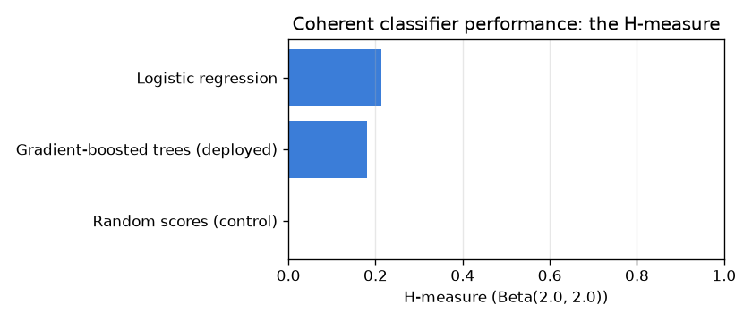

# NetSentry — The H-measure (a coherent alternative to ROC-AUC)

_Synthetic stand-in. Temporal/binary split; every classifier judged under the **same** Beta
severity prior, quadratured on a fine cost grid. H = 0 is the best trivial classifier, H = 1 is
perfect separation._

## Why this report exists

The suite already reports ROC-AUC with the imbalance caveat. Hand (2009) identified a subtler
flaw: averaging over all thresholds, AUC implicitly weights false-positive against
false-negative cost by a distribution that **depends on the classifier's own score
distribution**. Two models are therefore compared under two different cost assumptions — so an
AUC win can encode cost assumptions no one would hold. The H-measure removes the incoherence by
fixing an **explicit, shared** Beta prior on the cost parameter for every model, and reporting
the normalised expected minimum loss. Same prior, same yardstick, coherent comparison.

## ROC-AUC vs the coherent H-measure

| classifier | ROC-AUC | Gini | H (Beta(2.0, 2.0)) | H (cost-skewed Beta(2.0, 4.0)) |
|---|---|---|---|---|
| Gradient-boosted trees (deployed) | 0.668 | 0.336 | 0.180 | 0.174 |
| Logistic regression | 0.711 | 0.421 | 0.213 | 0.223 |
| Random scores (control) | 0.504 | 0.008 | 0.000 | 0.000 |

The H-measure lands well below ROC-AUC in absolute terms — expected, because it is the share of the *trivial-classifier loss* that is removed, a stricter scale than the rank-based AUC (Gradient-boosted trees (deployed) scores AUC 0.668 but H 0.180). ROC-AUC and the H-measure agree on the ranking here — reassuring, and the common case when the ROC curves do not cross. Shifting to the cost-skewed prior Beta(2.0, 4.0) — which puts mass where a missed attack costs more than a false alarm — moves the deployed model's H from 0.180 to 0.174 (a +0.006 change), making the SOC's actual cost stance an explicit input to the score. ROC-AUC has no such knob: its cost weighting is whatever the score distribution happens to imply, which is precisely the incoherence Hand names.

## Scope

The H-measure is a *coherence* fix, not a replacement for the operational metrics: the SOC still
ships at a fixed FPR budget, and PR-AUC + TPR@FPR remain the headline because they speak to that
operating point directly. The value here is comparison hygiene — when ranking model families
(the leaderboard's job) or accepting a challenger (the promotion gate's), the H-measure ensures
the comparison is not being made under a different, classifier-dependent cost assumption for
each candidate. The default Beta(2, 2) is Hand's symmetric recommendation; the cost-skewed prior
shows how the same machinery encodes a real SOC cost stance that ROC-AUC cannot express.