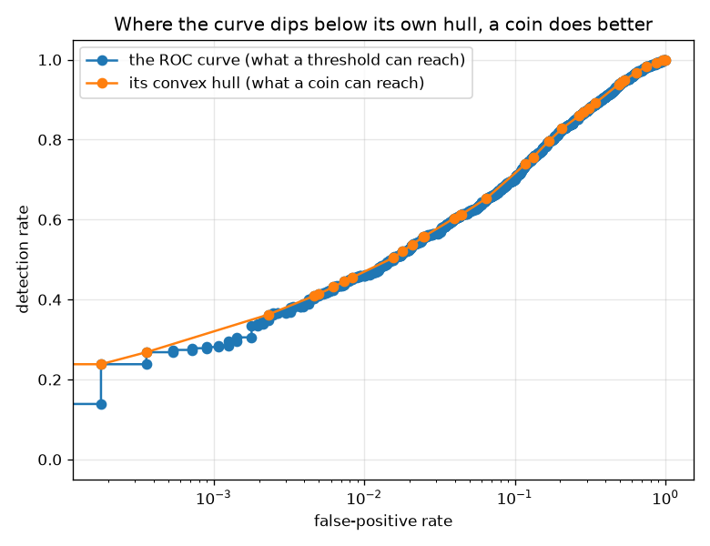
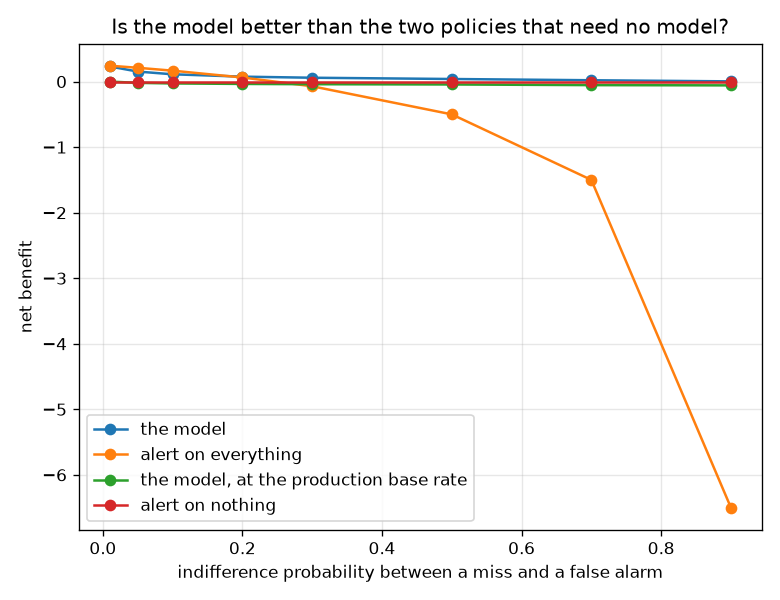

# NetSentry — Is the Operating Point on the Frontier?

_The deployed false-positive budgets against the ROC convex hull of the same scores, derived on
7,009 validation flows and carried to 24,957 later-day flows at a
25% attack rate. Regenerate with `netsentry hull`._

## Why this report exists

Every decision this project ships is a **threshold**: a score cut chosen on validation at a
false-positive budget, applied to everything after. That construction assumes something nobody
here had checked -- that a threshold is the best rule available at its own false-positive rate.

It need not be. The achievable operating points of a scoring classifier are the **convex hull**
of its ROC points, not the curve itself (Provost & Fawcett 2001). Wherever the curve dips below
its own hull, a randomised rule -- flip a biased coin, use one of two thresholds -- strictly
dominates every plain threshold at that false-positive rate.

**Every deployed operating point is dominated, and almost none of the gain is real.**

On validation -- where the thresholds are chosen -- 4 of 4 budgets sit strictly *below* the ROC convex hull. At the tightest one the gap is +1.81 points of detection: a coin that picks between two thresholds with weight 0.33 achieves a higher detection rate at the identical false-positive rate than any single cut can. Free detection, for a coin.

Then the rule is carried to the later days, and **1 of 4 gains survive**. The one that does is the tightest budget, where it delivers +1.23 points against a promised +1.81 -- detection at the 0.1% budget going 9.0% to 10.2%. Everywhere else the promised gain is a wobble in a finite ROC curve, and the randomised rule delivers nothing or slightly less than the threshold it replaced.

And the coin is not free. At the budget where the gain is real, 0.67% of flows get a different verdict from one run to the next -- roughly 166 of 24,957. That is not a metaphor for instability; it is the exact property the [metamorphic study](metamorphic.md) tests as a determinism relation and the [load-time canary](state_machine.md) checks by replaying fixed flows. **The dominance result is real and the thing it sells is an invariant two other parts of this system are built to enforce.**

## The frontier, on the split where the threshold is chosen

| false-positive budget | best plain threshold | best achievable (hull) | free detection | coin weight | verdict |
|---|---|---|---|---|---|
| 0.1% | 28.1% | 29.9% | **+1.81 pts** | 0.33 | **dominated** |
| 0.5% | 41.4% | 41.4% | **+0.01 pts** | 0.01 | **dominated** |
| 1.0% | 46.0% | 46.7% | **+0.68 pts** | 0.23 | **dominated** |
| 5.0% | 62.1% | 62.4% | **+0.32 pts** | 0.29 | **dominated** |

The coin-weight column is the thing an operator would have to implement: use the strict cut with
probability `1 - w` and the loose one otherwise, per flow. The interpolation is exact -- between
two hull vertices, the achievable set *is* the straight line joining them -- so the middle column
is not an estimate but the best any rule of this class can do.

Building this found its own bug worth recording: the first hull popped on the wrong turn and
returned the **lower** hull, which is the diagonal. The giveaway was a "frontier" whose detection
rate equalled its false-positive rate exactly, at every budget, which is what a coin with no
model achieves. A frontier that agrees with chance is not a subtle error.

## Does the gain survive the later days?

| budget | promised on validation | delivered on the later days | plain threshold | randomised rule | realised FPR | verdicts that are a coin flip |
|---|---|---|---|---|---|---|
| 0.1% | +1.81 pts | **+1.23 pts** | 9.0% | 10.2% | 0.11% | 0.67% |
| 0.5% | +0.01 pts | **+0.00 pts** | 17.8% | 17.8% | 0.46% | 0.00% |
| 1.0% | +0.68 pts | **-0.19 pts** | 20.7% | 20.6% | 0.84% | 0.37% |
| 5.0% | +0.32 pts | **-0.03 pts** | 29.3% | 29.3% | 4.51% | 0.69% |

This is the question the study exists for. A dip below the hull can be real structure in the
score distribution or a wobble in a finite sample, and the two look identical until the rule
derived from one split is applied to another.

At the 0.1% budget it is real: +1.23 points delivered against +1.81 promised.
That is the budget where the ROC is most jagged -- fewest positives above the cut, so the
largest genuine steps between adjacent operating points. At the looser budgets the promised
gains are hundredths of a point and arrive as nothing or slightly negative, which is what an
overfitted frontier looks like when it is asked to keep a promise.

The last column is the price. A randomised rule returns a different answer for the same flow on
a re-run, and the rate is not negligible at the budget where the gain is. Two other parts of
this system exist to prevent exactly that: the [metamorphic oracle](metamorphic.md) tests
determinism as a label-free correctness relation, and the [load-time canary](state_machine.md)
replays fixed flows and flips `/health` to degraded on a mismatch. **A randomised operating
point would fail both**, and it would fail them by design rather than by accident, which is a
much harder conversation to have with an auditor than a hundredth of a point is worth.

## Without a threshold at all: net benefit

| indifference probability | model | alert on everything | winner | model @ production rate | everything @ production rate | winner |
|---|---|---|---|---|---|---|
| 1% | +0.2304 | +0.2423 | alert on everything | +0.0003 | -0.0000 | **the model** |
| 5% | +0.1529 | +0.2104 | alert on everything | -0.0196 | -0.0421 | **alert on nothing** |
| 10% | +0.1113 | +0.1666 | alert on everything | -0.0283 | -0.1000 | **alert on nothing** |
| 20% | +0.0753 | +0.0624 | the model | -0.0358 | -0.2375 | **alert on nothing** |
| 30% | +0.0587 | -0.0716 | the model | -0.0401 | -0.4143 | **alert on nothing** |
| 50% | +0.0394 | -0.5002 | the model | -0.0442 | -0.9800 | **alert on nothing** |
| 70% | +0.0204 | -1.5003 | the model | -0.0541 | -2.3000 | **alert on nothing** |
| 90% | +0.0033 | -6.5009 | the model | -0.0578 | -8.9000 | **alert on nothing** |

Net benefit (Vickers & Elkin 2006) is the question clinical work always asks and machine
learning almost never does: at an operator's own exchange rate between a miss and a false alarm,
is the model better than *alerting on everything* or *alerting on nothing*? It needs no
currency, only the indifference probability.

The two halves of the table are the same question at two base rates, and they disagree. At the
split's own 25% attack rate the model wins only for indifference
probabilities between 20% and 90% -- below that, alerting on everything is better,
because one flow in four really is an attack. At the 1%
production rate the model wins from 1% to 1%, and alerting on everything is
never sensible.

That is the [base-rate study](base_rate.md) arriving from a different direction, and it is the
reason a fixed-FPR budget should never be quoted without the prevalence it assumes.

## Without a threshold at all: cost curves

| operating point | optimal over skew | share of the range |
|---|---|---|
| the 0.1% budget | 0.01 - 0.03 | 2.5% |
| the 0.5% budget | 0.03 - 0.10 | 7.0% |
| the 1.0% budget | 0.10 - 0.20 | 10.0% |
| the 5.0% budget | 0.20 - 0.71 | 51.2% |
| alert on everything | 0.71 - 1.00 | 28.9% |
| alert on nothing | 0.00 - 0.00 | 0.5% |

A cost curve (Drummond & Holte 2006) plots normalised expected cost against the
**probability-cost skew** -- prevalence and the cost ratio folded into one number -- so an
operating point owns a *range* of deployments rather than a point.

The the 5.0% budget owns 51% of the range.
The the 0.1% budget -- the tightest one this project ships -- owns 2%.
That is the honest reading of a fixed-FPR budget: it is optimal for a particular exchange rate
between a miss and a false alarm, and a deployment whose economics sit elsewhere on this axis
should be running a different cut. The [cost study](cost.md) picks one such point by assuming a
price; this says which range that price corresponds to.

## Scope and honest limits

- **The hull is computed on the same scores the threshold is chosen from**, which is the
  correct construction and also why the transfer test is the load-bearing part. Anything else
  would be reporting a fit as a result.
- **Randomisation here is per flow.** A rule that randomised per *host* or per *day* would keep
  determinism within a flow and reach a different point; that is a genuinely different design
  and this study does not price it.
- **Net benefit assumes the score is a probability.** The deployed scores are calibrated
  (isotonic, on validation) which is what makes the axis meaningful; on raw tree outputs the
  same curve would be a statement about the calibrator.
- **Cost curves fold two unknowns into one.** A skew is a prevalence and a cost ratio
  multiplied together, so the table says which *combinations* each cut owns and cannot separate
  a rare-and-cheap deployment from a common-and-expensive one.
- **Everything here is about one model's scores.** A dominated operating point is a statement
  about the ranking, not about the model; the [multiplicity study](multiplicity.md) covers the
  case where a different equally-good model would rank differently.