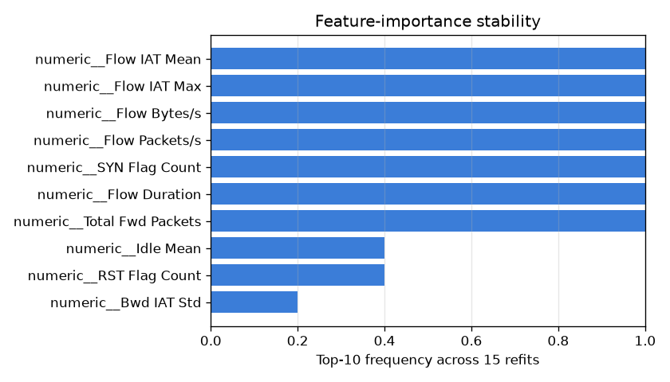

# NetSentry - Feature-Importance Stability

_Synthetic stand-in. The model is refit on **15** bootstrap resamples of
the temporal training split; global feature importance is recomputed each time, and the
ranking's movement is measured. Explainability is a product contract here (the API
returns SHAP top-features), so whether those attributions are **stable** is a question
worth answering, not assuming._

## Stability summary

- **Rank correlation (mean pairwise Spearman): 0.399** — how much
  the whole importance ordering agrees across refits (1.0 = identical).
- **Top-10 Jaccard overlap: 0.593** — how often the same
  features lead across refits.

The full ranking is only moderately reproducible (Spearman **0.40**), but the **top-10** leaders are comparatively stable (Jaccard **0.59**): the headline drivers a SOC reads off an explanation are reliable, while the long tail of near-zero importances reshuffles between refits. The honest read is *trust the head, not the tail* — and it is why the API returns only the top few features.

## Top features (by mean importance across refits)

| feature | mean importance | mean rank | rank std | top-k freq |
|---|---|---|---|---|
| numeric__Total Fwd Packets | 791.7 | 1.0 | 0.0 | 100% |
| numeric__Flow Bytes/s | 720.1 | 2.5 | 0.7 | 100% |
| numeric__Flow Packets/s | 700.7 | 3.2 | 0.7 | 100% |
| numeric__Flow Duration | 682.1 | 3.3 | 0.7 | 100% |
| numeric__SYN Flag Count | 509.9 | 5.6 | 0.8 | 100% |
| numeric__Flow IAT Mean | 492.9 | 6.3 | 0.8 | 100% |
| numeric__Flow IAT Max | 492.7 | 6.1 | 0.7 | 100% |
| numeric__RST Flag Count | 283.3 | 19.4 | 15.1 | 40% |
| numeric__Idle Mean | 282.5 | 16.3 | 7.7 | 40% |
| numeric__Bwd IAT Std | 273.5 | 22.4 | 13.3 | 20% |

## Why this matters

A single fit yields one importance ranking; resampling the training data reveals how
much of that ranking is signal versus sampling noise. Features that sit in the top-k in
**every** refit are the ones a SOC analyst can trust when the API explains a flagged
flow; features whose rank swings between refits are attributions to hedge on. This is
the companion to the SHAP global summary (which explains one model) and the feature-group
ablation (which measures each family's causal value): here we audit whether the
explanation itself is reproducible.
