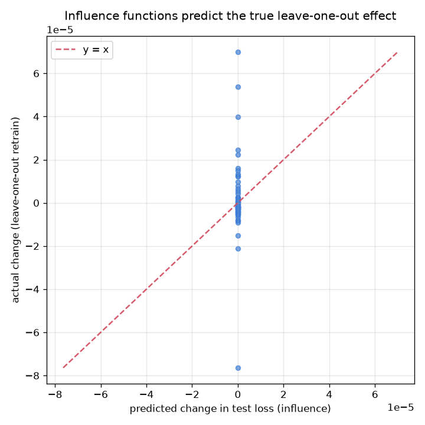

# NetSentry — Influence Functions (which training flows caused this verdict)

_Synthetic stand-in. Logistic surrogate on the stratified/binary split (6,000
training flows, 76 features). Influence is validated against real
leave-one-out retraining; explanations and the mislabel check use the same exact Hessian._

## Why this report exists

The [data-valuation study](data_value.md) scores each training flow's *global* worth; this
answers the *local* question an analyst asks of a surprising verdict — which specific training
flows drove it, and would removing them change it? Influence functions (Koh & Liang, ICML 2017)
estimate the leave-one-out effect of a training point on a test loss through the model's inverse
Hessian, with no retraining. They need a convex, twice-differentiable loss, so — like the
[distillation study](distill.md) — this runs on the **logistic** baseline, where the Hessian is
exact; the deployed gradient-boosted model is out of scope and that is stated, not smuggled past.

## Does the approximation hold? (validation against true leave-one-out)

The influence estimate is **validated, not asserted**: across 60 training flows actually removed and retrained, the predicted change in test loss correlates with the true leave-one-out change at Pearson **1.00** (Spearman 1.00). That is the Koh & Liang result reproduced on network-flow data — the closed-form inverse-Hessian estimate stands in for retraining the model thousands of times. The same machinery finds bad labels: ranking training flows by **self-influence** recovers planted label flips at AUC **0.89** (at a 5% flip rate), an independent second opinion next to the confident-learning label audit and the KNN-Shapley data valuation — three different first principles (loss curvature, confident learning, and game-theoretic value) converging on the same suspicious rows.

## Explaining individual verdicts

For each test flow, the training flows whose removal would most *raise* its loss (they support
the verdict) and most *lower* it (they oppose it):

### Test flow 1: true benign, model p(attack) = 1.000 (**wrong**)

| effect on the true-`benign` verdict | training flow label | capture day | influence |
|---|---|---|---|
| helps get it right | BENIGN | Friday | +1.49e-04 |
| helps get it right | BENIGN | Wednesday | +1.27e-04 |
| helps get it right | BENIGN | Monday | +5.01e-05 |
| helps get it right | BENIGN | Thursday | +4.69e-05 |
| helps get it right | BENIGN | Thursday | +3.43e-05 |
| helps get it right | BENIGN | Thursday | +3.42e-05 |
| pushes it wrong | DDoS | Friday | -4.17e-05 |
| pushes it wrong | DDoS | Friday | -4.14e-05 |
| pushes it wrong | PortScan | Friday | -3.94e-05 |
| pushes it wrong | DDoS | Friday | -3.60e-05 |
| pushes it wrong | DDoS | Friday | -3.57e-05 |
| pushes it wrong | DDoS | Friday | -3.57e-05 |

### Test flow 2: true benign, model p(attack) = 0.998 (**wrong**)

| effect on the true-`benign` verdict | training flow label | capture day | influence |
|---|---|---|---|
| helps get it right | BENIGN | Thursday | +3.09e-05 |
| helps get it right | BENIGN | Thursday | +2.88e-05 |
| helps get it right | BENIGN | Friday | +2.30e-05 |
| helps get it right | BENIGN | Wednesday | +2.14e-05 |
| helps get it right | BENIGN | Wednesday | +2.04e-05 |
| helps get it right | BENIGN | Tuesday | +1.69e-05 |
| pushes it wrong | SSH-Patator | Tuesday | -6.73e-06 |
| pushes it wrong | PortScan | Friday | -6.35e-06 |
| pushes it wrong | PortScan | Friday | -6.07e-06 |
| pushes it wrong | PortScan | Friday | -5.67e-06 |
| pushes it wrong | FTP-Patator | Tuesday | -5.67e-06 |
| pushes it wrong | PortScan | Friday | -5.38e-06 |

### Test flow 3: true benign, model p(attack) = 0.500 (correct)

| effect on the true-`benign` verdict | training flow label | capture day | influence |
|---|---|---|---|
| helps get it right | BENIGN | Monday | +5.17e-06 |
| helps get it right | BENIGN | Thursday | +4.77e-06 |
| helps get it right | BENIGN | Wednesday | +3.61e-06 |
| helps get it right | BENIGN | Friday | +3.36e-06 |
| helps get it right | BENIGN | Friday | +3.20e-06 |
| helps get it right | BENIGN | Thursday | +3.15e-06 |
| pushes it wrong | DoS slowloris | Wednesday | -3.25e-06 |
| pushes it wrong | DDoS | Friday | -3.10e-06 |
| pushes it wrong | Bot | Friday | -2.81e-06 |
| pushes it wrong | PortScan | Friday | -2.46e-06 |
| pushes it wrong | Bot | Friday | -2.41e-06 |
| pushes it wrong | Web Attack | Thursday | -2.18e-06 |

### Test flow 4: true attack, model p(attack) = 0.501 (correct)

| effect on the true-`attack` verdict | training flow label | capture day | influence |
|---|---|---|---|
| helps get it right | DoS slowloris | Wednesday | +2.63e-06 |
| helps get it right | SSH-Patator | Tuesday | +2.42e-06 |
| helps get it right | DoS GoldenEye | Wednesday | +1.50e-06 |
| helps get it right | DDoS | Friday | +1.44e-06 |
| helps get it right | BENIGN | Monday | +1.40e-06 |
| helps get it right | PortScan | Friday | +1.31e-06 |
| pushes it wrong | BENIGN | Thursday | -4.74e-06 |
| pushes it wrong | BENIGN | Thursday | -3.31e-06 |
| pushes it wrong | BENIGN | Friday | -2.43e-06 |
| pushes it wrong | BENIGN | Thursday | -2.30e-06 |
| pushes it wrong | BENIGN | Wednesday | -2.17e-06 |
| pushes it wrong | BENIGN | Friday | -2.08e-06 |

## Scope

Influence is a first-order (infinitesimal-up-weighting) approximation around the fitted
parameters, exact in the limit and validated above for how well it holds here; it is computed
on the logistic surrogate, so it explains that model's decision, not the gradient-boosted
model's (the surrogate's own fidelity to the deployed model is the [distillation
study](distill.md)'s subject). The training pool is capped for the Hessian solve and the LOO
retrains, and everything runs on the exchangeable stratified split so a training-point influence
estimated there transfers to the test flow. What this buys, that no other explanation in the
suite does: an answer in the units of the *training data* — "remove these labelled flows and the
verdict moves" — which is directly actionable when a verdict is wrong because a handful of
training flows were mislabelled.