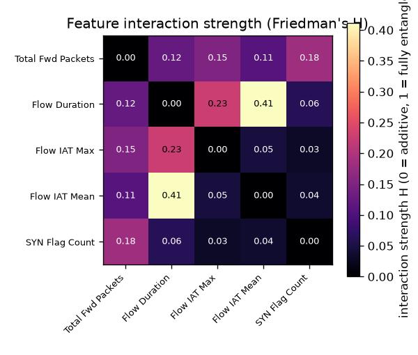

# NetSentry - Feature Interactions (Friedman's H-statistic)

_Synthetic stand-in. Pairwise H-statistic among the top 5 features
of the honest **temporal / binary** model, estimated over a background sample of
150 flows through the fitted pipeline — the same scorer the
partial-dependence study uses. H is a Monte-Carlo estimate; it ranges 0 (the pair acts
additively) to 1 (the effect of one feature fully depends on the other)._

## Why this report exists

The partial-dependence report shows the *shape* of each top feature's response but warns
that a PDP assumes the feature is independent of the others — where features move
together, the marginal curve hides **interaction**. This report measures that
interaction. Friedman's H (Friedman & Popescu, 2008) is the fraction of a feature pair's
joint-response variance that is *not* explained by adding the two marginal responses: a
model-agnostic, dimensionless interaction strength.

## Strongest interacting pairs

| feature pair | H (interaction) |
|---|---|
| Flow Duration x Flow IAT Mean | 0.411 |
| Flow Duration x Flow IAT Max | 0.226 |
| Total Fwd Packets x SYN Flag Count | 0.183 |
| Total Fwd Packets x Flow IAT Max | 0.151 |
| Total Fwd Packets x Flow Duration | 0.124 |
| Total Fwd Packets x Flow IAT Mean | 0.109 |
| Flow Duration x SYN Flag Count | 0.063 |
| Flow IAT Max x Flow IAT Mean | 0.047 |
| Flow IAT Mean x SYN Flag Count | 0.037 |
| Flow IAT Max x SYN Flag Count | 0.031 |

The strongest interaction the model has learned is **Flow Duration x Flow IAT Mean** (H = 0.41): a large share of that pair's joint effect on the attack score is non-additive, so neither feature's partial-dependence curve tells the whole story about it — the effect of one bends with the value of the other. That is the concrete form of the caveat the partial-dependence report raises: the steepest-response features here (flow rates, packet counts, byte totals) are also the ones that move together in real traffic, and the model has entangled them rather than treating them as independent dials.

## Per-feature interaction involvement

Each feature's strongest pairwise H — a cheap proxy for Friedman's total-interaction
statistic (which additionally requires the full complement partial dependence). A high
value means the feature's contribution is context-dependent; a low value means it acts
like an independent dial the SHAP/PDP summaries capture faithfully.

| feature | strongest interaction (H) |
|---|---|
| Flow Duration | 0.411 |
| Flow IAT Mean | 0.411 |
| Flow IAT Max | 0.226 |
| Total Fwd Packets | 0.183 |
| SYN Flag Count | 0.183 |

## How to read this (and what it is not)

A high H does not say the interaction is *large* in absolute terms — only that, relative
to the pair's own joint effect, the effect is non-additive; a feature with a tiny
marginal effect can still show a high H. So H complements, and does not replace, the SHAP
importances and the PDP effect sizes: importance says how much a feature moves the score,
the PDP says in what shape, and H says whether that shape is fixed or bends with another
feature. Like the PDP, the estimate is computed by perturbing features independently, so
in strongly correlated regions it evaluates the model off the data manifold — which is
precisely why a measured interaction there matters, since it is where an additive reading
would most mislead. The causal value of a whole feature family remains the ablation
study's question; this is a diagnostic of the learned response surface, not a causal claim.
