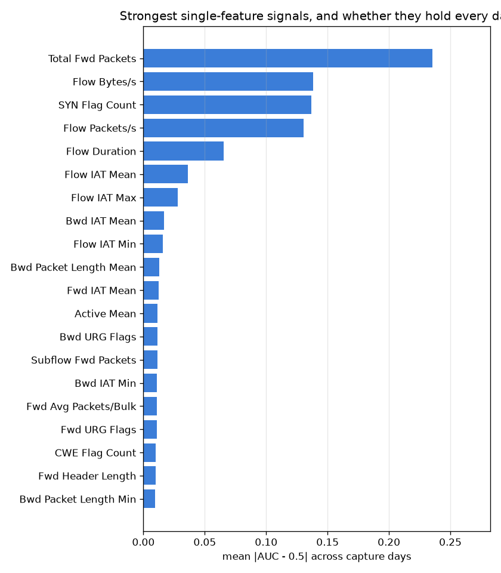
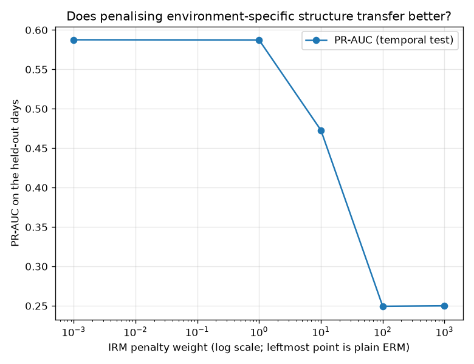

# NetSentry — Features That Mean the Same Thing Every Day

_Synthetic stand-in. Honest temporal/binary split; environments are the training capture days,
of which 2 contain both classes and can screen anything.
2 of 76 features pass the invariance screen._

## Why this report exists

The temporal split costs roughly half the PR-AUC the stratified split reports, and this
project has been careful to say *that* the gap exists without claiming much about why. Causal
machine learning offers a specific hypothesis worth testing: that the model leans on
correlations which held during the training days and did not survive the boundary, and that a
model forbidden to use them would transfer better.

Two methods attack that from opposite sides. **Invariant Causal Prediction** (Peters, Buhlmann
& Meinshausen 2016) keeps only features whose relationship to the label is stable across
environments. **Invariant Risk Minimization** (Arjovsky et al. 2019) penalises representations
on which different environments would prefer different classifiers. Both are implemented here
from scratch over capture days.

## First, does the premise hold?

| environment | flows | attack rate | attack classes present |
|---|---|---|---|
| Wednesday | 11,961 | 37.7% | DoS GoldenEye, DoS Hulk, DoS Slowhttptest, DoS slowloris, Heartbleed |
| Monday | 7,511 | 0.0% | _(none)_ |
| Tuesday | 8,562 | 12.7% | FTP-Patator, SSH-Patator |

**The 3 environments share no attack class at all.** Each capture day contains different attacks, so what varies across environments is not a nuisance correlation sitting alongside a stable label mechanism — it is the label mechanism. That matters before a single number is read, because both methods here assume the opposite: ICP looks for features whose relationship to the label is stable across environments, and IRM looks for a representation on which one classifier is simultaneously optimal in all of them. Neither is well posed when the thing being predicted changes identity between environments. The results are reported anyway, and read as what they are — a measurement of what these methods do when handed the wrong kind of shift, which is the situation a practitioner is actually most likely to be in, since nobody checks.

A second, more mundane problem sits underneath that one: **Monday contains no attacks at all**, so no feature has a defined relationship to the label there. That is not a weak environment, it is not an environment — and scoring it as zero strength (the obvious implementation) would drag every feature towards zero mean strength and infinite dispersion, rejecting almost the whole vector for a reason with nothing to do with invariance. Single-class days are dropped, leaving 2 usable environments. Two is the bare minimum an invariance argument can be built on, and it is worth knowing that the famous five-day capture supplies exactly that.

## Screening features for cross-day invariance

| feature set | features | PR-AUC | detection @ budget |
|---|---|---|---|
| all features (deployed) | 76 | 0.529 | 9.1% |
| cross-day invariant only | 2 | 0.212 | 0.1% |

Restricting the model to the 2 cross-day-invariant features costs -0.317 PR-AUC and -8.9% detection. The screen does **not** pay for itself: the features it discards were contributing to out-of-environment detection, not just to in-environment fit. That is the expected outcome once the premise above is taken seriously — a screen looking for stability across environments that differ in their *labels* will reject features that are genuinely predictive of the attacks it has seen, on the grounds that they say nothing about attacks that were not present. Stability and usefulness come apart when the environments are not the kind the theory assumes.

## Penalising environment-specific structure directly

| penalty weight | PR-AUC | detection @ budget | mean IRM penalty |
|---|---|---|---|
| 0 (plain ERM) | 0.588 | 13.3% | 1.111e-02 |
| 1 | 0.587 | 12.7% | 1.098e-02 |
| 10 | 0.473 | 10.7% | 1.911e-02 |
| 100 | 0.249 | 0.0% | 2.928e-03 |
| 1000 | 0.250 | 0.0% | 9.673e-05 |

On a linear head with the optimiser, the initialisation and the step count held fixed — only the penalty term switched on — **no penalty weight beats plain ERM, and the best of them merely ties it** (-0.000 PR-AUC). The penalty term itself does fall, from 1.11e-02 to 9.67e-05 at the strongest weight, so the optimiser is doing what it was asked to do; what it buys is the question, and the answer here is nothing. That is consistent with the premise check rather than surprising given it: IRM removes predictors that rely on structure varying across environments, and when the varying structure *is* the signal, removing it removes the signal. The method is not failing so much as being asked the wrong question, which is worth demonstrating precisely because the paper's framing invites exactly this misapplication.

## Why invariance is unattainable here

| outcome of the screen | features | share |
|---|---|---|
| passed | 2 | 3% |
| flipped sign | 32 | 42% |
| too weak | 40 | 53% |
| unstable magnitude | 2 | 3% |

**32 of 76 features (42%) point in opposite directions on different days.** Not weakly, not noisily — a feature that separates attack from benign one way on Tuesday separates it the other way on Wednesday. That single number explains everything else on this page, and it is the premise failure made concrete: Tuesday is brute-force traffic and Wednesday is denial of service, and those two things are abnormal in opposite directions. Patator floods are many short low-volume connections; DoS floods are sustained high-volume ones. A screen that requires 'this feature means the same thing in every environment' cannot survive that, and it should not — the requirement is correct and the data simply does not meet it. What the requirement rejects here is not spurious structure but genuine, class-specific structure that a detector trained on one attack family legitimately needs.

## The cross-check that would have been satisfying

| availability tier | features | kept by the invariance screen | share |
|---|---|---|---|
| complete | 40 | 1 | 2% |
| handshake | 3 | 0 | 0% |
| in_flight | 33 | 1 | 3% |

The screen kept 2 features, which is far too few to say anything about how they distribute across availability tiers. The [earliness](earliness.md) study found from a completely different direction that the *intensive* features are the ones surviving the temporal boundary, and it would be a satisfying cross-check if an invariance screen rediscovered that partition without knowing it existed. On this data it cannot: with one or two survivors the tier shares are noise, and reporting 2 features as agreement with anything would be reading a pattern into a coin flip. The table is left in place because the null result is the honest one, not because it supports the claim.

## Scope

Environments are capture days, which is the only environment variable this dataset
supplies and a poor one for the purpose: the days differ in which attacks ran, so the shift
between them is concept shift rather than the covariate-with-stable-mechanism shift both
methods assume. The [covariate-shift](covariate_shift.md) study reached the same diagnosis
from the density-ratio side. A dataset with the same attacks captured on different networks
would be the right test bed, and this project does not have one.

The IRM arm uses a **linear head** on the fitted feature matrix, because IRMv1's penalty is
defined through a differentiable predictor and the deployed gradient-boosted model is not one.
Its absolute numbers are therefore not comparable to the screening arm's or to the headline;
what is comparable is ERM against IRM *within* that arm, which shares an optimiser, an
initialisation, a step count and a seed. The penalty's gradient is taken by central
differences along the risk gradient rather than analytically — enough to steer the optimiser,
and it keeps the module free of a deep-learning dependency.

The screen's two thresholds (minimum mean strength, maximum dispersion) are config, and moving
them moves how many features survive. They were fixed before the transfer numbers were looked
at; a screen tuned until its subset won would be selecting on the outcome, which is the same
error as tuning on the test set with extra steps.