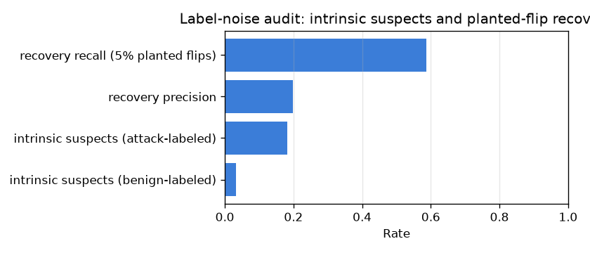

# NetSentry — Label-Noise Audit (confident-learning style)

_Synthetic stand-in. Out-of-fold model scores over the **temporal training split**
flag rows whose score is as extreme as the opposite class's mean — candidate label
errors. The audit then validates itself by planting 5% label flips and
measuring its own recovery. The test split is never touched._

## Why audit labels at all

CIC-IDS2017's label errors are documented well enough that a corrected re-release
exists (Engelen et al., WTMC 2021 — see `DATA_CARD.md`), and the poisoning study
shows corrupted labels quietly destroy the operating point while PR-AUC looks fine.
Rather than assume the labels are clean, the audit produces the candidate error list
— and proves it can find planted errors before asking anyone to trust it.

| quantity | value |
|---|---|
| training rows audited | 28,034 (5,593 attack / 22,441 benign) |
| out-of-fold folds | 3 |
| class thresholds (mean OOF attack score) | attack 0.617 / benign 0.090 |
| suspect benign-labeled rows (score like an attack) | 710 (3.16%) |
| suspect attack-labeled rows (score like benign) | 1,014 (18.13%) |
| planted flips (validation) | 279 (5% of attack rows) |
| planted-flip recovery recall | 58.8% |
| planted-flip recovery precision | 19.8% |

## Read

On the labels as recorded the audit flags **710** benign-labeled rows (3.2%) and **1,014** attack-labeled rows (18.1%). On this synthetic stand-in, whose labels are correct by construction, every one of these is a **false positive of the method** — its ambiguity floor. The generator's classes deliberately overlap, so the subtler attack families genuinely score like benign traffic (the same rows the per-class slices show being missed). On the real dataset the identical list is the candidate queue to reconcile against the Engelen et al. corrections; the floor measured here is what an empty queue looks like.

**The audit validates itself.** With 5% of attack rows deliberately flipped to benign, the audit recovers **58.8%** of the planted flips at **19.8%** precision. Precision must be read against its base rate: the planted errors are only 1.2% of benign-labeled rows, so the flag list concentrates true errors **16x** over inspecting rows at random — a triage multiplier, not an oracle. Every non-planted flag counts against precision, and on this stand-in those are known to be ambiguity rather than noise, so on data with real label errors the measured precision is a lower bound. A noise detector that was never tested against known noise is just an opinion.

The division of labour with the poisoning study: poisoning measures what corrupted labels *cost* (detection collapses via the poisoned validation threshold); this audit *finds* the corrupted rows so the cost need not be paid. Out-of-fold scoring is what keeps it honest — no row is judged by a model that trained on it, and the test split is never touched.

