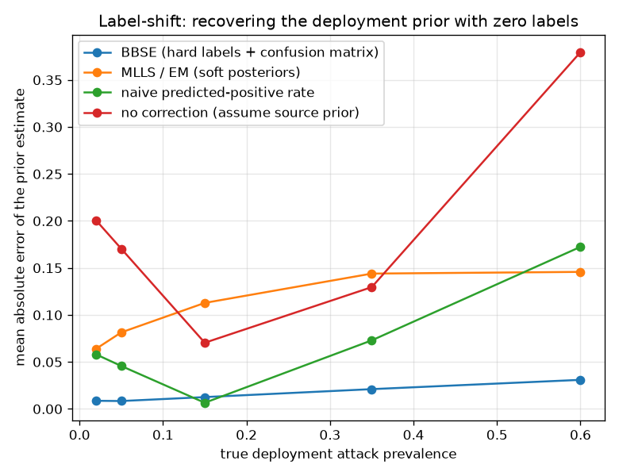

# NetSentry — Label-Shift Estimation & Correction (zero deployment labels)

_Synthetic stand-in. Stratified/binary model; the source (training) attack prevalence is
**0.220**. Each row resamples the 12,000-flow test set to a
target prevalence (preserving p(x | y), so it is a pure label shift) and averages over the
configured trials. MLLS/EM converged in ~35 iterations._

## Why this report exists

The [base-rate study](base_rate.md) shows the deployment prevalence governs what an
analyst's queue contains, and [PPI](ppi.md) estimates it from a few labels. Label shift is
the harder, label-free version: under the assumption that only the class prior changes
between training and deployment (the feature law ``p(x | y)`` fixed), the shifted prior is
recoverable from unlabelled traffic alone, and the classifier can be corrected for it. Two
cited estimators are run: **BBSE** (Lipton, Wang & Smola, ICML 2018) inverts the source
confusion matrix against the target's predicted-label distribution — hard labels only, so
robust to miscalibration — and **MLLS/EM** (Saerens et al. 2002) maximises the target
likelihood over the prior on soft posteriors — efficient when calibrated.

## Estimating the deployment prior (mean absolute error, lower is better)

| true prevalence | BBSE | MLLS/EM | naive pred-rate | no correction |
|---|---|---|---|---|
| 0.02 | 0.0087 | 0.0641 | 0.0580 | 0.2004 |
| 0.05 | 0.0084 | 0.0814 | 0.0457 | 0.1704 |
| 0.15 | 0.0126 | 0.1128 | 0.0066 | 0.0704 |
| 0.35 | 0.0211 | 0.1440 | 0.0730 | 0.1296 |
| 0.60 | 0.0309 | 0.1458 | 0.1724 | 0.3796 |

## Correcting the classifier (calibration, not ranking)

| true prevalence | Brier (uncorrected) | Brier (corrected) | ECE (uncorrected) | ECE (corrected) | PR-AUC |
|---|---|---|---|---|---|
| 0.02 | 0.0605 | 0.0157 | 0.1524 | 0.0187 | 0.480 |
| 0.05 | 0.0659 | 0.0326 | 0.1378 | 0.0281 | 0.587 |
| 0.15 | 0.0835 | 0.0752 | 0.0874 | 0.0507 | 0.734 |
| 0.35 | 0.1193 | 0.1282 | 0.0257 | 0.0748 | 0.851 |
| 0.60 | 0.1635 | 0.1473 | 0.1360 | 0.0779 | 0.927 |

With no deployment labels, BBSE recovers the attack prevalence to a mean absolute error of **0.0163** across the sweep — about **12x** tighter than assuming the training prior (0.1901), whose error just grows with the size of the shift. The naive predicted-positive rate (0.0711) sits between them: it moves in the right direction but inherits the model's own error, exactly the bias BBSE removes by inverting the confusion matrix. The two estimators separate sharply — MLLS/EM trails at 0.1096 — which is the textbook contrast, not a bug: MLLS assumes calibrated posteriors and this model is not calibrated enough for it, whereas BBSE reads only hard labels through the confusion matrix and is immune to exactly that. The moment estimator is the safer default, and this stand-in is why. Correction does not touch ranking — PR-AUC is identical corrected or not, because reweighting two classes by constants is monotone in the score — and the report shows that column unchanged so the point is explicit. What it repairs is **calibration**: averaged over the sweep the Brier score improves by 0.0188, and where correction helps most (prevalence 0.02, against the 0.22 the model was trained at) it falls 0.0605 -> 0.0157 and ECE 0.1524 -> 0.0187. That is the number every downstream decision depends on — a threshold, a cost calculation, the base-rate estimate itself — so a model whose probabilities are anchored to the wrong prior is quietly wrong everywhere it is trusted, and this is the zero-label repair. Correction is not free everywhere: at prevalences near the source prior (0.22) there is little shift to undo and the estimated weights add noise, so the 0.35 row(s) come out marginally worse — the honest signature of a correction that should be applied in proportion to the measured shift, not reflexively.

## Scope

Label shift is not covariate or concept drift: it assumes an attack still *looks* like an
attack and only their proportion changes, which is why this study lives on the exchangeable
stratified split and the [drift suite](drift.md) — where the feature law itself moves — is
the complement, not a duplicate. The correction is exact only to the extent the assumption
holds; a real deployment mixes label shift with covariate shift, so the honest use is BBSE
as a **prior monitor** (its estimate drifting from the training prior is itself an alert,
and unlike a raw predicted-positive rate it is not fooled by the model's own error) feeding
the base-rate and cost calculations, with the drift detectors watching the other axis. The
2x2 confusion matrix must be non-singular — a detector no better than random carries no
shift signal — which is the label-shift analogue of every other study's "the model has to be
worth correcting" precondition.