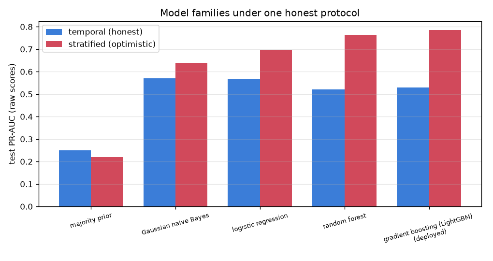

# NetSentry — Model-Family Leaderboard (one honest protocol)

_Synthetic stand-in. Every family runs through the identical harness: the same
persisted splits, the same leakage-safe pipeline fit on train only, thresholds
chosen on validation at the 0.1% / 1% FPR budgets, PR-AUC on
raw test scores (the headline's scale). Attack prevalence:
temporal 25.0%, stratified
22.1% (PR-AUC baselines)._

## Temporal split (the honest table)

| family | PR-AUC | TPR@0.1% FPR | TPR@1% FPR | fit (s) |
|---|---|---|---|---|
| Gaussian naive Bayes | 0.571 | 0.0% | 22.1% | 0.1 |
| logistic regression | 0.569 | 11.6% | 21.1% | 0.1 |
| gradient boosting (LightGBM) — deployed | 0.529 | 9.1% | 21.0% | 10.8 |
| random forest | 0.522 | 3.0% | 16.1% | 6.9 |
| majority prior | 0.250 | 0.0% | 0.0% | 0.0 |

## Stratified split (the optimistic reference)

| family | PR-AUC | TPR@0.1% FPR | TPR@1% FPR | fit (s) |
|---|---|---|---|---|
| gradient boosting (LightGBM) — deployed | 0.786 | 26.3% | 47.7% | 12.4 |
| random forest | 0.765 | 17.8% | 42.5% | 12.1 |
| logistic regression | 0.697 | 13.6% | 31.0% | 0.2 |
| Gaussian naive Bayes | 0.638 | 0.0% | 26.7% | 0.1 |
| majority prior | 0.221 | 0.0% | 0.0% | 0.0 |

## The gap, per family

| family | temporal PR-AUC | stratified PR-AUC | gap |
|---|---|---|---|
| Gaussian naive Bayes | 0.571 | 0.638 | **+0.067** |
| logistic regression | 0.569 | 0.697 | **+0.128** |
| random forest | 0.522 | 0.765 | **+0.243** |
| gradient boosting (LightGBM) — deployed | 0.529 | 0.786 | **+0.257** |

## Read

Every family — linear to boosted — pays a stratified-minus-temporal gap of at least **+0.067**, larger than the entire spread between families on the honest split (0.049). **Choosing the evaluation honestly matters more than choosing the model**: a leaky protocol would hand any of these architectures a better-looking number than the best architecture earns on the honest one. The gap is a property of the split (near-duplicate attack bursts landing on both sides), not a deficiency one more model family would fix. The two splits even crown different winners — **gradient boosting (LightGBM) — deployed** leads the optimistic table while **Gaussian naive Bayes** leads the honest one — the classic capacity trade under distribution shift: flexible models fit the training-day regime tightly and pay for it on later days (the gap column prices that capacity). A model selected on the optimistic split would have been the wrong model to ship.

## Scope

Families run at sensible defaults (config: `leaderboard.*`); only the deployed
gradient-boosted model carries tuned hyperparameters, so the comparison favors
it — the honest claim is about the *protocol*, not that these baselines were
tuned to their ceilings. Fit time is single-machine wall clock, an operational
input to the retraining-cadence studies rather than a benchmark.
