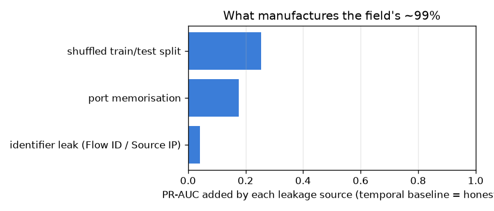

# NetSentry — Leakage Attribution

_Synthetic stand-in. Raw-score PR-AUC (attack vs benign), the same scale as the headline
evaluation. Each rung adds one leakage source on top of the honest temporal model and
reports the PR-AUC it buys — the field's ~99% reproduced and decomposed._

Most public CIC-IDS2017 projects report ~99% and it is almost always **manufactured**:
a shuffled split that straddles attack bursts, a `Destination Port` the model memorises,
and identifier columns that co-vary with the campaign. NetSentry avoids all three; this
study adds them back, one at a time, so the inflation is a decomposition rather than a
claim.

| rung | leakage source added | PR-AUC | Δ PR-AUC |
|---|---|---|---|
| honest (temporal, no port) | — | 0.529 | — |
| + shuffled split | shuffled train/test split | 0.783 | **+0.254** |
| + Destination Port | port memorisation | 0.958 | **+0.176** |
| + session identifier | identifier leak (Flow ID / Source IP) | 1.000 | **+0.042** |

## Read

The honest temporal model scores **0.529**; stacking the three leakage sources manufactures **1.000** — a gap of +0.471 PR-AUC that is entirely method, not skill. The largest single contributor is **shuffled train/test split** (+0.254). The identifier leak is the finisher: adding a per-campaign session id takes PR-AUC to **1.000** (+0.042), the near-perfect number the field reports — and it only works *because* the split is already shuffled, so the campaign's ids straddle train and test. On the temporal split the later-day campaigns carry ids the model never saw, and the same column is worthless: the identifier leak is a *consequence* of the split leak, not an independent one.

Read the other way: the ~99% that saturates this corner of the literature is not a strong model, it is a leaky protocol. Every rung here is something the rest of NetSentry deliberately refuses — the temporal split is the headline, `Destination Port` is dropped, and the `remainder="drop"` firewall discards any identifier that reaches the pipeline. This study is the price tag on each refusal.

## Scope

The session identifier is a **controlled injection** — a per-(day, class) code standing in
for the Flow ID / Source IP that leaks on the real captures — added only to demonstrate and
price the mechanism the leakage firewall exists to stop; the pipeline never lets such a
column through. On the real CIC-IDS2017 data the identifier leak is larger and the shuffled
split's advantage compounds it, so the honest-vs-leaky gap is wider still. The lesson is the
project's founding one: on this dataset a near-perfect score is overwhelmingly more likely to
be leakage than skill — which is why `netsentry gate` **fails** a PR-AUC above 0.999.
