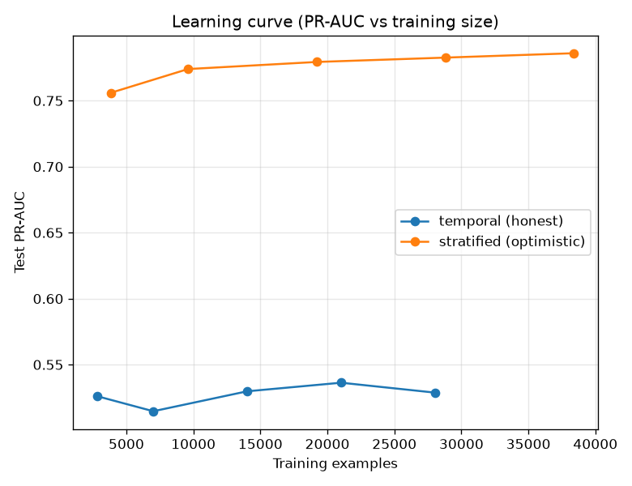

# NetSentry — Learning Curves

_Synthetic stand-in. Each point fits the full pipeline on a stratified subsample of
the training split and scores the fixed test split (binary attack vs benign)._

## Temporal (honest) split

| train examples | 2,803 | 7,008 | 14,016 | 21,026 | 28,034 |
|---|---|---|---|---|---|
| PR-AUC | 0.526 | 0.515 | 0.530 | 0.536 | 0.529 |

PR-AUC change from smallest to largest training size: **+0.003**.

## Stratified (optimistic) split

| train examples | 3,840 | 9,600 | 19,200 | 28,800 | 38,400 |
|---|---|---|---|---|---|
| PR-AUC | 0.756 | 0.774 | 0.779 | 0.783 | 0.786 |

PR-AUC change: **+0.030**.

## Read

The temporal curve is nearly flat at full size, so more data of the same kind would help little — the ceiling is the features/model and the cross-day shift, not the sample count. The gap between the two curves at every training size is the same
over-optimism the headline temporal-vs-stratified comparison exposes — it does not
close with more data, because it is a *validation-protocol* effect, not a sample-size one.
