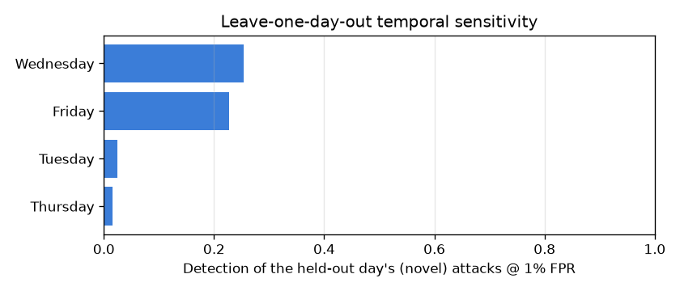

# NetSentry — Leave-One-Day-Out (temporal sensitivity)

_Synthetic stand-in. Every capture day takes a turn as the held-out "future": the
model trains on the other four days (validation carved from train; threshold chosen
there at the 1%-FPR budget) and is scored on the day it never
saw. This is the rotation-robustness check on the headline temporal split — the
project's own rules name it as the alternative honest split._

## Why rotate the held-out day

A single temporal cut is one draw from the space of honest evaluations. Rotating the
held-out day answers two questions the fixed cut cannot: **how much does the
conclusion depend on which days were chosen**, and **how does difficulty vary by
attack family** — since each CIC-IDS2017 attack class lives on exactly one day,
holding a day out removes its classes from training entirely, making every fold a
zero-shot class-detection test. Monday, having no attacks, contributes the one thing
attack days cannot: a pure false-alarm audit at the deployed threshold.

| held-out day | test flows | attacks | novel classes | PR-AUC | detection | FPR | est. alerts/day |
|---|---|---|---|---|---|---|---|
| Monday | 9,325 | 0 | — (benign only) | — | — | 0.94% | ~9,437 |
| Tuesday | 10,653 | 1,346 | FTP-Patator, SSH-Patator | 0.196 | 2.5% | 0.80% | ~7,951 |
| Wednesday | 15,065 | 5,645 | DoS GoldenEye, DoS Hulk, DoS Slowhttptest, DoS slowloris, Heartbleed | 0.711 | 25.4% | 1.07% | ~10,722 |
| Thursday | 9,657 | 330 | Infiltration, Web Attack | 0.041 | 1.5% | 0.86% | ~8,577 |
| Friday | 15,300 | 5,907 | Bot, DDoS, PortScan | 0.641 | 22.8% | 1.11% | ~11,072 |

## Read

**Monday is benign-only**, so its fold is the quiet-day false-alarm audit no other split provides: a model trained on every attack type raises 0.94% false positives on an uneventful day — roughly **9,437 alerts/day** at the assumed 1,000,000 flows/day. That number, not detection, is what a SOC pays on most days, since most days are Mondays.

Across the attack days, detection of the held-out (never-trained-on) classes ranges from **1.5%** (Thursday: Infiltration, Web Attack) to **25.4%** (Wednesday: DoS GoldenEye, DoS Hulk, DoS Slowhttptest, DoS slowloris, Heartbleed), mean 13.0% — a 24-point spread. Because each CIC-IDS2017 attack class was captured on exactly one day, every LODO fold is **zero-shot class detection**: the model has literally never seen the held-out day's attack types and can only catch them by behavioural resemblance to other families. The spread is therefore a per-family novelty-difficulty profile, not noise around one number.

The practical reading: the temporal conclusion does not hinge on the particular Mon-Wed/Thu-Fri cut — every rotation of the held-out day tells the same story (novel attack families are hard at a fixed FP budget), while *which* families are hard varies. An honest headline should be read with this range in mind, and the per-class slices report names the same hard families from the fixed cut.

This closes the splitting story the project is built on: the stratified split
overstates (twins and shared bursts), the fixed temporal cut is honest but single,
and LODO shows the honest number's *distribution*. Detection of genuinely novel
attack families at a fixed FP budget is the hard problem — every rotation agrees —
and it is why the benign-only anomaly detector is in the architecture at all.
