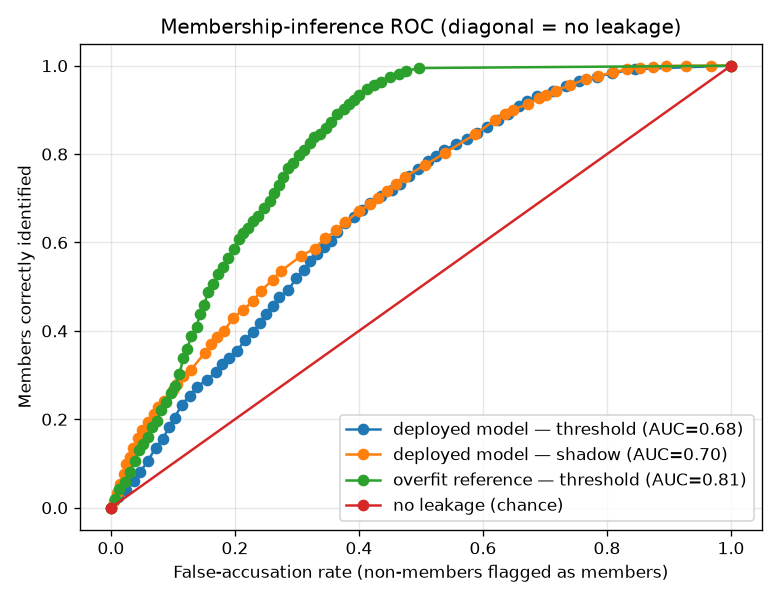

# NetSentry — Membership-Inference Privacy Audit

_Synthetic stand-in. Run on the exchangeable **stratified** split — the assumption
membership inference needs — with the multiclass model, 8 shadow models,
and 6,000 target-training rows. Members are the target's training
rows; non-members are held-out test flows from the same distribution._

Evasion is the inference-time adversary and poisoning the training-time one; this is
the third classic attack on an ML model and the one about **privacy**. With only query
access, can an attacker decide whether a specific flow was in the training set? On a
NIDS that is a genuine disclosure ("was this host's traffic used to train the model?"),
and it is the standard way to measure how much a model **memorises** its training data
(Shokri et al. 2017; Yeom et al. 2018).

## Attacks and leakage

Two attacks against the deployed model, plus a deliberately-overfit reference of the
same architecture on the identical rows:

- **Confidence-threshold** (Yeom): threshold the model's probability on each row's
  *true* class — a memorised member is over-confident on its real label.
- **Shadow-model** (Shokri): 8 shadows mimic the target on disjoint
  same-distribution data; an attack classifier learns member-vs-non-member from their
  confidence vectors, then is turned on the target.

| model | attack | attack AUC | advantage | TPR @ 1% FPR | gen. gap |
|---|---|---|---|---|---|
| deployed model | threshold | 0.680 | 0.274 | 1.9% | +14.2 pts |
| deployed model | shadow | 0.701 | 0.277 | 3.0% | +14.2 pts |
| overfit reference | threshold | 0.811 | 0.535 | 2.8% | +14.7 pts |

Attack **AUC 0.5** and **advantage 0.0** mean no leakage; **TPR @ 1% FPR**
is the worst-case metric (Carlini et al. 2022) — the fraction of members an attacker
recovers while almost never falsely accusing a non-member.

## Read

The deployed model **leaks membership above chance on this stand-in**: the confidence-threshold attack reaches AUC 0.680 (advantage 0.274) and the shadow-model attack AUC 0.701, so a query-only attacker separates training members from fresh traffic better than a coin flip. But the *worst-case* metric is reassuringly small — at a 1% false-accusation budget the attack recovers only 1.9% of members — so the average leak is real while the confidently-memorised tail that a *targeted* disclosure needs stays thin.

The **overfit reference** makes the mechanism visible. Refit un-regularised (deep trees, no early stopping) on the identical rows, and — the honest subtlety — even though its accuracy gap barely moves (+14.7 vs +14.2 points), its membership advantage nearly doubles to 0.535 (AUC 0.811) — because it is far more *confident* on the rows it memorised, which is exactly the signal the threshold attack reads. Privacy leakage is driven by memorisation, not accuracy alone, so **the regularisation and early stopping the deployed model already uses are its privacy control.** Same measure -> re-measure arc as the adversarial-hardening and poisoning-defense studies: name the weakness, show a control moves it, price the movement.

## Scope

Membership inference assumes members and non-members are exchangeable, which is why
this runs on the stratified split; under the temporal shift the two pools differ by
*distribution* as well as membership, which would confound the attack. The audit
measures privacy leakage of the *supervised* model only. The strong mitigation with a
formal guarantee is differentially-private training, which buys an (ε, δ) bound at a
measured detection cost — the natural next study, in the same spirit as this one:
name the risk, apply the control, re-measure.
