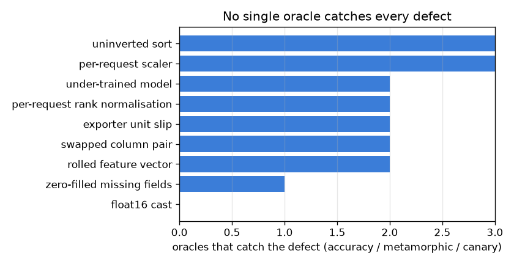

# NetSentry — Metamorphic Testing: a Correctness Oracle Without Labels

_Synthetic stand-in. Honest temporal split; 8,000 test flows used **unlabelled** for
the relation checks. Verdicts taken at the deployed threshold (0.9892, the
0.1%-FPR operating point picked on validation). Baseline PR-AUC
0.542._

## Why this report exists

Every other number in this repo is produced by comparing a prediction to a label. Production
has no labels, so a deployed detector can only notice the defects that happen to move an
aggregate — and a large class of real defect does not. A step that normalises per request, a
serialiser that drops digits, an exporter that switches units: each of these can be *correct on
average* and wrong on the specific request an analyst is looking at.

Metamorphic testing (Chen, Cheung & Yiu 1998; Xie et al. 2011 for ML) removes the label from the
loop by testing **relations between outputs** rather than outputs themselves. If a transformation
of the input cannot change the right answer, then the two answers must agree — and that is
checkable on traffic nobody has labelled. Each relation below is grounded in something an
exporter or a serving path actually does.

Two kinds of relation are checked, and conflating them is the mistake that makes this technique
look either trivial or unreliable. A **structural** relation transforms the input into *the same
input* — a different batch position, a different column order — so the scores must be
bit-identical and any deviation is a code defect. A **semantic** relation transforms the input
into a *different record of the same behaviour* — a different exporter clock, a lossier
serialiser — so a deviation is not a bug in the code but a statement about what the model has
learned to depend on.

## Structural relations: is the implementation computing a per-flow function?

| relation | the invariant | verdict flips | max score delta | holds? |
|---|---|---|---|---|
| batch permutation | a flow's verdict does not depend on its position in the batch | 0.00% | 0.00e+00 | yes |
| batch duplication | doubling the batch does not change the verdicts already in it | 0.00% | 0.00e+00 | yes |
| single vs batch | a flow scored alone gets the score it gets inside a full batch | 0.00% | 0.00e+00 | yes |
| column reorder | the feature contract is by name, not by position | 0.00% | 0.00e+00 | yes |

**Every structural relation holds exactly.** Across 8,000 unlabelled flows, permuting the batch, doubling it, splitting it down to single-flow requests and shuffling the column order all return **bit-identical** scores — max deviation 0.00e+00, not merely a small one. That is a real property of this design rather than luck: preprocessing lives inside one fitted pipeline that is bundled with the model and selects its columns by name, so the serving path has no opportunity to re-derive a statistic from the request or to assume a position. The single-vs-batch result is the one worth keeping: it is the direct evidence that the API and the offline evaluation are computing the same function.

## Semantic relations: what has the model learned to depend on?

| relation | the invariant | verdict flips | max score delta | holds? |
|---|---|---|---|---|
| clock rescale (x1.1) | re-timing a flow to a different exporter clock keeps its verdict | 0.36% | 4.31e-01 | **no** |
| clock rescale (x0.9) | re-timing a flow to a different exporter clock keeps its verdict | 0.65% | 4.71e-01 | **no** |
| precision rounding (6 s.f.) | a flow rounded to the precision a JSON payload survives keeps its verdict | 0.00% | 3.20e-02 | yes |

**The model is not invariant to its own exporter's clock.** Re-timing every flow by 0.9 — durations up, rates correspondingly down, not one byte or packet changed — flips 0.65% of verdicts, with individual scores moving as much as 0.47. This is not a code defect; the implementation is doing exactly what it was asked. It is a **modelling** finding, and an uncomfortable one: some of what the detector calls attack behaviour is a statement about wall-clock pacing rather than about traffic, so two sites running exporters with different timing resolution would not receive the same verdicts on the same flows. Roughly one alert in 154 is decided by the clock. That number is exactly the kind of thing an accuracy metric cannot report, because both verdicts are scored against the same label and only one of them is ever computed.

## The mutation study: what does each oracle actually catch?

A relation suite that never fires proves nothing on its own — it could be checking invariants no
realistic bug would break. So 9 defects are injected into the serving path, each
modelled on a failure that has shipped somewhere, and each is put in front of **three** oracles:

1. **labelled accuracy** — the check this project uses everywhere else; caught when PR-AUC drops
   by more than 0.010. Needs labels, so it cannot run in production.
2. **the metamorphic suite** — caught when any *structural* relation is violated. Needs nothing
   but traffic, so it can run continuously against the live stream.
3. **the canary** — the load-time behavioural self-test this repo already ships: scores on
   8 pinned flows compared against a recorded reference, caught above
   1e-06. Needs a prior trusted artefact.

| injected defect | PR-AUC (delta) | labelled accuracy | metamorphic | canary | structural relation broken |
|---|---|---|---|---|---|
| none (control) | 0.542 (+0.000) | missed | missed | missed | — |
| swapped column pair | 0.514 (-0.028) | caught | missed | caught | — |
| per-request scaler | 0.454 (-0.088) | caught | caught | caught | single vs batch |
| float16 cast | 0.542 (+0.000) | missed | missed | missed | — |
| rolled feature vector | 0.318 (-0.224) | caught | missed | caught | — |
| uninverted sort | 0.225 (-0.317) | caught | caught | caught | batch permutation |
| per-request rank normalisation | 0.542 (+0.000) | missed | caught | caught | batch duplication |
| zero-filled missing fields | 0.543 (+0.001) | missed | missed | caught | — |
| exporter unit slip | 0.198 (-0.344) | caught | missed | caught | — |
| under-trained model | 0.512 (-0.030) | caught | missed | caught | — |

Of 9 injected defects, 6 are caught by the labelled accuracy check, 3 by the metamorphic suite, and 8 by the canary. **No oracle catches them all, and each has a blind spot the others cover.** *The labelled oracle misses* **per-request rank normalisation**, and the metamorphic suite catches it — it moves PR-AUC by +0.000, and in the rank-normalisation case that is not an approximation but an identity: average precision and ROC-AUC are invariant to any monotone transform of the scores, so replacing a score with its percentile inside the batch is provably invisible to every ranking metric this project reports. The offline evaluation scores one batch of thousands; the API scores one flow, whose percentile is 0 or 1. The *batch duplication* relation reports it immediately. *The metamorphic suite misses* **exporter unit slip**: it costs 0.344 PR-AUC while breaking no relation at all, because it is a perfectly consistent function of its input — just a worse one. This is the boundary of the technique, and it is worth stating sharply: metamorphic testing establishes that a system is *self-consistent*, never that it is *right*. A uniformly wrong model satisfies every invariance here. *Only the canary catches* **zero-filled missing fields** (1.23e-03 deviation on 8 pinned flows): a consistent, accuracy-neutral corruption is invisible to both of the others, and can only be found by comparing against scores recorded from a build that was already trusted. That is the third oracle's whole value, and also its cost — it is the only one of the three that needs a prior artefact to compare against. **float16 cast** slips past all three, which is worth stating plainly: this is a lower bound on defect detection, not a proof of correctness.

Between them the three oracles cover 8/9 defects, and the reason to run all
three is visible in the table rather than argued: they fail on **disjoint** kinds of bug. Labels
find a model that is worse. Invariants find an implementation that is inconsistent. A recorded
reference finds a change that is neither — consistent, accuracy-neutral, and wrong. A deployment
that only ships the first of the three is blind to the other two categories for the whole time
it is running, which is precisely when it matters.

## Scope

Metamorphic relations are **necessary, not sufficient**, and the kill matrix shows exactly where
the boundary sits: they constrain self-consistency, never correctness. The clock-rescale relation
assumes re-timing is semantics-preserving, which holds for a change of exporter resolution and
would *not* hold for a large dilation — a flow slowed tenfold is arguably a different flow — so
the factors are deliberately kept near unity. The natural next family is directional rather than
invariant (adding bytes must not lower suspicion), which the [monotone-constraint
study](monotonic.md) enforces structurally instead of testing after the fact. The
[sensor-failure study](degradation.md) covers the complementary case where the input is genuinely
corrupt rather than merely re-expressed, and the [predictive-multiplicity
study](multiplicity.md) asks the adjacent question of how much the verdict depends on *which*
equally-good model was fitted rather than on how it was called.