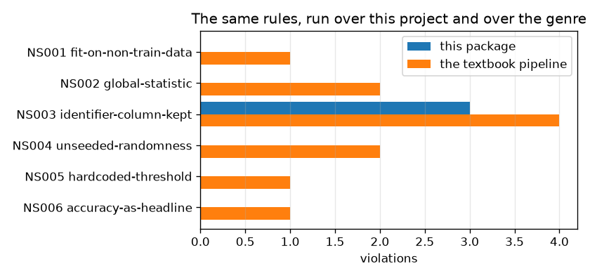

# NetSentry — The Rules, Enforced by a Parser

_6 static-analysis rules translated from `.claude/rules/ml.md`, run over
197 modules, graded by injecting 12 violations into real source
and 10 pieces of correct code that resemble them. Regenerate with
`netsentry mlint`._

## Why this report exists

This project's invariants are enforced three ways: by discipline, by review, and by tests that
assert the *behaviour* of code that already exists. All three act after the fact. None of them
reads the diff somebody writes next month, and the [leakage study](leakage.md) is the measure of
what that costs -- it reproduces the field's ~99% by leaking on purpose and prices each source.

A linter acts before the fact. Each rule below is a syntactic translation of a prose invariant,
so it fires when the mistake is *typed* rather than when the evaluation looks suspiciously good.

| code | rule | what it forbids, and why | what it cannot see |
|---|---|---|---|
| `NS001` | fit-on-non-train-data | A transformer or estimator fitted on anything but the training split leaks test statistics into training (`.claude/rules/ml.md` section 1). | Only sees the fit target's own name. A frame assigned from the test split earlier and passed under a neutral name is invisible without type inference. |
| `NS002` | global-statistic | A mean, std, min, max or category list computed over the full dataset -- or over the test split -- is the same leak as fitting on it, and is easier to write by accident. Validation is deliberately *not* forbidden here: choosing a threshold on it is the method this project prescribes. | Cannot tell a statistic used for a feature from one used for a log line; a report that prints `full.mean()` is flagged as though it fed the model. |
| `NS003` | identifier-column-kept | Flow IDs, addresses and timestamps identify the capture session rather than the behaviour, and let a model memorise the split. | Flags the literal wherever it appears outside a drop list; it cannot follow the column into or out of a frame it never sees. |
| `NS004` | unseeded-randomness | A run that cannot be reproduced from its config and seed cannot be audited (`.claude/rules/ml.md` section 7). | Only checks the call site. A seed threaded through a wrapper that itself defaults to `None` looks seeded here. |
| `NS005` | hardcoded-threshold | An operating point typed into a function body is a decision nobody can find, change or record (`.claude/rules/python.md`). | Compares names against a list, so a threshold held in a differently-named variable passes, and a genuinely structural comparison can be flagged. |
| `NS006` | accuracy-as-headline | Attacks are rare; a model that predicts benign always scores over 80% here. Accuracy without a precision-recall metric beside it is a misleading headline. | Module-scoped: accuracy computed in one module and reported beside PR-AUC assembled in another reads as a violation. |

Every rule ships with its blind spot in the same table, because a rule set that claims coverage
it does not have is worse than no rule set: it converts a clean report into false assurance.

## Does it fire?

A clean codebase makes a working linter and a broken one produce identical output -- zero. So the
rules are graded by **injection**: each violation is written into a real module's source in
memory, the rule set is rerun, and the new codes are compared against the expected one. The
negative controls are the same experiment for correct code that resembles the violation, which
is where a linter's real cost lives.

**12 of 12 injected violations caught; 10 of 10 negative
controls left alone.**

| injected | source | should fire | did fire | |
|---|---|---|---|---|
| fit a scaler on the test split | `scaler.fit(X_test)` | `NS001` | `NS001` | caught |
| impute using test statistics | `imputer.fit_transform(X_val)` | `NS001` | `NS001` | caught |
| take a threshold from the whole dataset | `cut = full_frame["Flow Duration"].quantile(0.999)` | `NS002` | `NS002` | caught |
| standardise against the combined mean | `center = combined_frame.mean()` | `NS002` | `NS002` | caught |
| keep the flow identifier as a feature | `columns = ["Flow ID", "Flow Duration"]` | `NS003` | `NS003` | caught |
| keep the source address as a feature | `columns = ["Source IP"]` | `NS003` | `NS003` | caught |
| split without a seed | `parts = train_test_split(frame, test_size=0.2)` | `NS004` | `NS004` | caught |
| an unseeded generator | `rng = default_rng()` | `NS004` | `NS004` | caught |
| an unseeded forest | `model = RandomForestClassifier(n_estimators=100)` | `NS004` | `NS004` | caught |
| a threshold typed into the code | `flagged = score > 0.87` | `NS005` | `NS005` | caught |
| an operating point in a branch | `alert = anomaly_score >= 0.65` | `NS005` | `NS005` | caught |
| accuracy as the headline | `headline = accuracy_score(y_true, y_pred)` | `NS006` | `NS006` | caught |
| fitting on the training split | `scaler.fit(X_train)` | _nothing_ | _nothing_ | left alone |
| fitting inside a train fold | `pipeline.fit(X_train_fold, y_train_fold)` | _nothing_ | _nothing_ | left alone |
| a training-split statistic | `center = train_frame.mean()` | _nothing_ | _nothing_ | left alone |
| a seeded split | `parts = train_test_split(frame, random_state=seed)` | _nothing_ | _nothing_ | left alone |
| a seeded generator | `rng = default_rng(seed)` | _nothing_ | _nothing_ | left alone |
| a seeded forest | `model = RandomForestClassifier(random_state=seed)` | _nothing_ | _nothing_ | left alone |
| a threshold from config | `flagged = score > settings.serving.threshold` | _nothing_ | _nothing_ | left alone |
| a structural comparison | `empty = n_rows > 0.0` | _nothing_ | _nothing_ | left alone |
| dropping the identifier columns | `frame = frame.drop(columns=["Flow ID"])` | _nothing_ | _nothing_ | left alone |
| accuracy beside PR-AUC | `pair = (accuracy_score(a, b), average_precision_score(a, b))` | _nothing_ | _nothing_ | left alone |

## What it finds here

| rule | this package | the textbook pipeline |
|---|---|---|
| `NS001` fit-on-non-train-data | 0 | 1 |
| `NS002` global-statistic | 0 | 2 |
| `NS003` identifier-column-kept | 3 | 4 |
| `NS004` unseeded-randomness | 0 | 2 |
| `NS005` hardcoded-threshold | 0 | 1 |
| `NS006` accuracy-as-headline | 0 | 1 |

The right-hand column is the control that makes the left-hand one mean something. It is the same
rule set run over a CIC-IDS2017 pipeline written the way the public repositories write it --
scaler fitted on everything, `Flow ID` kept as a feature, an unseeded shuffled split, accuracy as
the headline. It trips **11 violations across 6 of the
6 rules**, in twenty-six lines. That file is a string constant in this module: it is
never imported and never executed, and it exists so the rules have something to be right about.

## The findings that are left

| code | where | source | finding |
|---|---|---|---|
| `NS003` | `C:/Users/conno/Downloads/netsentry/netsentry/features/store_report.py:44` | `ENTITY_COLUMN = "Source IP"` | identifier column 'Source IP' named outside a drop list |
| `NS003` | `C:/Users/conno/Downloads/netsentry/netsentry/features/store_report.py:45` | `TIME_COLUMN = "Timestamp"` | identifier column 'Timestamp' named outside a drop list |
| `NS003` | `C:/Users/conno/Downloads/netsentry/netsentry/features/store_report.py:46` | `DEST_HOST_COLUMN = "Destination IP"` | identifier column 'Destination IP' named outside a drop list |

All three are the feature store's join keys, and they are the most interesting output this study
has. The rule says an identifier column must not reach the model; the feature store names three
of them because an as-of join *has* to key on the entity and on time. That is legitimate -- and
it is also exactly where [the point-in-time study](feature_store.md) measured this repository's
sharpest leak, the one-line `groupby` that scores 1.000 offline and 0.583 in production.

The linter cannot tell those two situations apart, and it does not need to. It points at the
three lines in the model path where an identifier legitimately enters, which is precisely the set
of lines a reviewer should be made to look at. They are left standing rather than silenced, and
the CI budget is set at exactly three, so a fourth fails the build.

## What the first run found, and what it changed

The rule set did not start clean, and the first run is the reason to trust the second.

- **The rules had a substring bug that a linter is uniquely prone to.** Matching `val` inside an
  identifier flags `values.mean()` as a statistic over the validation split. Twenty-odd hits
  disappeared when matching moved to whole words -- and that bug is the archetype of why
  engineers disable linters, so it is recorded rather than quietly patched.
- **A negative control failed, and found a real gap.** `frame.drop(columns=["Flow ID"])` fired
  NS003, because the exemption lived in the file walker rather than in the rule. It is now scoped
  to the *enclosing construct* -- an assignment to `IDENTIFIER_COLUMNS`, a function named
  `drop_identifiers`, a call to `.drop(...)` -- which is narrow enough that a stray literal three
  lines later still fires.
- **NS003 was scoped to the packages where a column can become a feature.** Addresses and ports
  are routing metadata in `intel/`, `capture/` and `serving/watch.py` by design: the beaconing
  analytics key on them, the incident report prints them. Thirty-five hits in that code were the
  rule asking the wrong question, not the code answering it wrongly.
- **Five hits led to code changes, which is the number that matters.** A narrative threshold in
  the uncertainty report (`if score_auc > 0.7`), two more in the PU-learning report, and a
  deterministic-sampling rounding cut were bare literals inside render functions -- findable by
  nobody, now named constants with the reason attached. Two `>= 0.5` hard-label conventions
  became a shared `HARD_LABEL_CUT`, whose docstring says the thing worth saying: this is
  sklearn's convention and it is **not** an operating point, because every deployed decision here
  comes from a threshold calibrated at a false-positive budget.

Nine hits, five changes. A linter whose precision was never measured is a linter that will
eventually be turned off; this one's is stated, and the four hits that led to no change are in
the table above rather than deleted from the rule set.

**Then it failed the build on code written the same week**, which is a better argument for it
than anything above. The [online-triage study](bandit.md) standardised its context by the
*stream's own* mean and standard deviation -- handing a learner that is supposed to be online a
statistic of flows it has not seen yet -- and NS002 caught it during the release check, after
that study's report had already been generated and read. The context now comes from validation.

The same hit showed a rule mis-specified in the other direction, and it is worth stating because
it is the difference between a rule people keep and one they switch off. NS002 had been treating
*validation* statistics as leaks; but a transformer must be **fitted** on training data only
(which NS001 enforces, validation included), while a threshold is **chosen** on validation --
that is this project's prescribed method, not a leak. NS002's token set is now the narrower one,
and two tests pin the asymmetry in both directions.

## Scope and honest limits

- **These rules are syntactic and therefore incomplete.** `scaler.fit(X_test)` is caught;
  `scaler.fit(frame)` where `frame` came from the test split three functions earlier is not,
  because that needs type inference and a call graph. The injected probes measure that the rules
  fire on the patterns they claim, not that the patterns cover leakage.
- **A clean run is evidence about this codebase, not about the rules.** The injection harness
  exists precisely because zero violations is what a broken linter also reports.
- **The naive comparison is a fixture, not a survey.** It is one file written to resemble the
  genre, not a sample of public repositories, so it says what the rules would catch rather than
  how often the mistake occurs in the wild.
- **The exemptions are the attack surface.** Every one of them -- the drop-context scope, the
  non-feature receivers, the hard-label functions -- is a place where a real violation could hide
  behind the right name. They are module constants for exactly that reason.
- **A budget is not a guarantee.** `mlint.max_violations` ratchets the count so that new
  violations fail CI; it cannot notice that an existing one got worse.