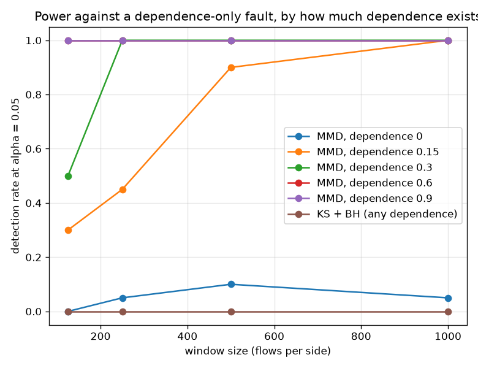
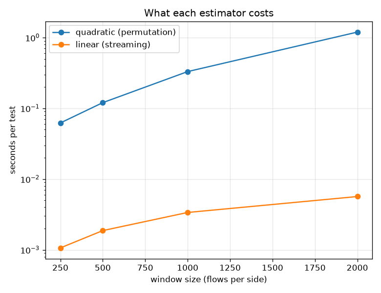

# NetSentry — Multivariate Drift: the Change the Marginals Cannot See

_Kernel two-sample testing (MMD, Gretton et al. 2012) against the deployed per-feature monitors.
Windows of 1,000 flows over 76 features, 200
permutations, level alpha = 0.05._

## Why this report exists

The deployed drift monitor is a **marginal** one. PSI bins each feature on its own; the KS suite
tests each feature on its own and controls the false-discovery rate across the family. Both
answer "did any single feature's distribution move?" — and that question has a blind spot with a
proof attached to it rather than a probability. A change that re-pairs values *between* rows
leaves every column's multiset exactly as it was, so every per-feature statistic takes exactly
the value it would have taken with no fault at all. The sensor-failure study met this already: a
collector that mis-assembles records moved PSI by nothing. That was recorded as a limitation.
This is the instrument that removes it.

The **maximum mean discrepancy** embeds each sample as a mean in a reproducing-kernel Hilbert
space and measures the distance between the two embeddings. With a characteristic kernel — the
Gaussian RBF used here — that distance is zero **if and only if** the distributions are equal,
so the test is consistent against any alternative, dependence structure included. Nothing in it
is specific to the moments a human thought to check.

## The null, before anything else

A monitor's false-alarm rate is the first thing an operator needs and the last thing most drift
reports measure. Two windows are drawn from the *same* distribution, 30 times, and
every monitor is asked whether it fires.

| monitor | fires on stationary traffic | target |
|---|---|---|
| MMD (permutation) | 0% | 5% |
| MMD (linear) | 7% | 5% |
| KS + BH | 3% | n/a (no level) |
| PSI | 0% | n/a (no level) |

The permutation test is exact by construction, so its rate should sit at the level; the linear
estimator leans on a normal approximation and is the one that could misbehave. PSI and the KS
suite have no calibrated level at all — PSI's 0.1/0.2 thresholds are convention, not a test —
which is precisely why their rates belong in the same table as the tests that do.

## What each monitor sees

| window pair | MMD^2 | MMD p | linear-MMD p | KS features flagged | max PSI | verdict |
|---|---|---|---|---|---|---|
| none (stationary) | -0.0001 | 0.716 | 0.528 | 0 / 76 | 0.044 | neither fires |
| marginal shift | 0.0020 | 0.005 | 0.677 | 6 / 76 | 7.522 | both fire |
| dependence only | -0.0001 | 0.826 | 0.693 | 0 / 76 | 0.044 | neither fires |
| real temporal shift | 0.0008 | 0.005 | 0.198 | 3 / 76 | 0.148 | both fire |

The marginal shift is the easy case and both families see it: KS flags 6 of 76 features, PSI reads 7.52, and MMD returns p = 0.005. The dependence-only fault permutes the *same* 6 features across rows, so each column's multiset of values is unchanged and no per-feature statistic can move. The KS statistics under this fault are **bit-identical** to the ones from the unfaulted window pair -- `np.allclose` over the full vector of per-feature statistics returns `True`. PSI reads 0.044 against a 0.2 threshold and KS flags 0 features -- not because the fault is small, but because the statistic they compute is mathematically constant under it. No threshold change closes that gap.

## The stand-in has no dependence to destroy

**And the joint test does not fire either** (p = 0.826), which is the right answer and worth understanding before reading anything else here. Across the 76 modelled features of the synthetic stand-in, the mean absolute pairwise correlation is **0.005** and the strongest single pair reaches **0.229**. The features are very nearly independent, and under independence, re-pairing one block of columns with different rows produces a sample from *the same joint distribution* -- the fault is not merely invisible, it is a no-op. A test that fired here would be reporting an error. This is a property of the generator, not of CIC-IDS2017, where `Flow Duration`, the IAT statistics and the packet counts are mechanically coupled -- a duration is a sum of inter-arrival times. The same absence turned up when the feature store looked for repeat hosts and found one address per flow: the stand-in reproduces the dataset's *marginals*, not its structure. So the reach of the joint test is measured below on controlled windows whose dependence is a dial, which also answers a better question than a single fault would: not *can* it see this fault, but *how much structure must exist* before it can.

## How much structure does the joint test need?

Controlled windows of 20 features whose pairwise dependence is a dial and
whose marginals are **identical at every setting** (one shared factor plus idiosyncratic noise),
so the sweep varies exactly one thing. Half the columns are then re-paired across rows — the
same fault as above.

| pairwise dependence | MMD (permutation) | MMD (linear) | KS + BH | PSI |
|---|---|---|---|---|
| 0 | 5% | 5% | 0% | 0% |
| 0.15 | 100% | 10% | 20% | 0% |
| 0.3 | 100% | 10% | 5% | 0% |
| 0.6 | 100% | 65% | 0% | 0% |
| 0.9 | 100% | 90% | 0% | 0% |

At zero dependence the joint test fires 5% of the time -- its false-alarm rate, correctly, because there the fault changes nothing. By a pairwise dependence of 0.15 it reaches 100% detection on windows of 1,000 flows. The marginal monitors stay at their own false-alarm rate throughout — KS peaks at 20% and PSI at 0%, with no trend in the dependence they are being shown, because the numbers they compute do not depend on it. Those cells are noise on a null, not detection, and no amount of extra dependence will turn them into detection: the invariance is algebraic. The gap between the two curves is the entire argument for carrying a joint test alongside the per-feature ones.

## Power against a marginal shift, on the real features

| window | MMD (permutation) | MMD (linear) | KS + BH | PSI |
|---|---|---|---|---|
| 125 | 60% | 5% | 100% | 100% |
| 250 | 75% | 5% | 100% | 100% |
| 500 | 95% | 5% | 100% | 100% |
| 1,000 | 100% | 20% | 100% | 100% |

Window size is the operational variable: a monitor on hourly windows sees a few hundred flows,
one on daily windows sees tens of thousands, and the price of the second is latency — a day of
serving a model the data has moved away from. On the fault the deployed monitors *can* see, they
are not merely adequate but better than the joint test at small windows, which is what a
seventy-six-dimensional kernel test costs you: it spends its samples on the whole joint law
rather than concentrating them on the six coordinates that moved.

## The marginal view of each fault

| fault | features with the largest *marginal* MMD |
|---|---|
| marginal shift | `Flow Packets/s` (0.3600), `Flow Bytes/s` (0.3032), `Total Fwd Packets` (0.2450), `Flow Duration` (0.2286), `Flow IAT Mean` (0.1597) |
| dependence only | `ECE Flag Count` (0.0134), `Fwd Avg Bulk Rate` (0.0085), `FIN Flag Count` (0.0054), `Packet Length Variance` (0.0045), `Flow Duration` (0.0039) |

Per-feature MMD, computed on the same windows the joint test judged. Under the marginal shift
the faulted features rank at the top, which is what attribution is for. Under the
dependence-only fault the largest marginal discrepancy is indistinguishable from the null —
there is nothing for a per-feature dashboard to rank.

## The real shift

On the real temporal shift every monitor agrees -- MMD^2 = 0.0008 at p = 0.005, 3 of 76 features BH-significant, max PSI 0.148. That agreement is worth stating plainly: the joint test is not a replacement for the deployed monitor on the shift the project already knows about. It is insurance against the class of change the deployed monitor cannot represent. And it is worth remembering what *any* input-distribution test can and cannot say -- the covariate-shift study diagnosed this same temporal gap as **concept** shift, where the inputs move far less than the input-output relationship does. A test on inputs alone will fire on harmless seasonality and stay silent while the labels rot. Drift detection buys an alarm, not a diagnosis.

## Cost

| window (per side) | kernel memory | quadratic test | linear test | ratio |
|---|---|---|---|---|
| 250 | 2.0 MB | 62 ms | 1.1 ms | 58x |
| 500 | 8.0 MB | 120 ms | 1.9 ms | 64x |
| 1,000 | 32.0 MB | 331 ms | 3.4 ms | 98x |
| 2,000 | 128.0 MB | 1196 ms | 5.7 ms | 211x |

The quadratic estimator holds an entire pooled kernel in memory: 128 MB at 2,000 flows per side against 2.0 MB at 250 -- it is the memory, not the 1196 ms, that decides how large a window a monitor can afford. Batching the permutations into one matrix product is what keeps the time affordable at all: the null distribution costs a single GEMM against the pooled kernel instead of one kernel rebuild per permutation. The linear-time estimator removes the quadratic term entirely (5.7 ms, O(n) memory) and pays in power -- at the strongest dependence level it reaches 90% detection against the permutation test's 100%. The operational reading: run the linear estimator continuously as a cheap tripwire and spend the quadratic test on the windows it flags, or on a schedule.

## Scope and honest limits

- **A characteristic kernel is consistent, not omniscient at finite n.** MMD detects any
  difference *given enough samples*; on a window of a few hundred flows it detects the ones that
  are large relative to the kernel bandwidth. The median heuristic is a default, not an optimum
  — a kernel trained to maximise test power (Sutherland et al. 2017) would do better, and would
  need its own held-out split to stay honest.
- **It fires on harmless change too.** Consistency cuts both ways: a benign traffic-mix shift is
  a distributional change and will be flagged. This is a tripwire feeding triage, not an
  automatic retraining trigger — the retrain-policy study already showed what happens when a
  drift signal is wired straight to an action.
- **It says nothing about labels.** Input-only tests cannot see concept shift, which is what the
  covariate-shift study found this dataset's temporal gap actually is.
- **The dependence sweep is synthetic, deliberately.** Its value is that the invariant is exact:
  marginals fixed, dependence dialled, so the curve measures the monitor rather than the data.
  The real-feature diagnostic above is what says which regime CIC-IDS2017 would sit in.