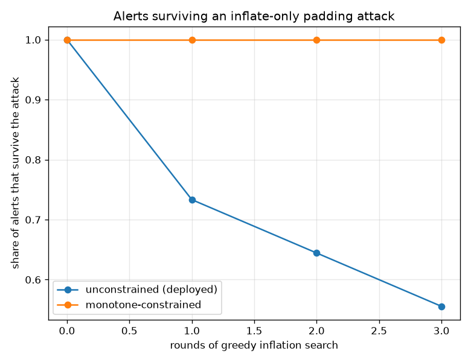
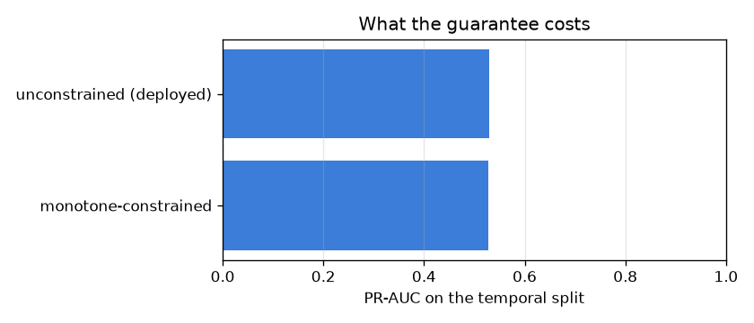

# NetSentry — A Defence the Attacker Cannot Route Around

_Synthetic stand-in. Honest temporal/binary split, 0.1% false-positive
budget. 39 of 76 features constrained non-decreasing; the
verifier's inflation box is unbounded in the attacker's direction._

## Why this report exists

The evasion study attacks this detector by padding: add bytes, add packets, stretch the
timing, and walk the flow toward the benign region until the score drops under the threshold.
Adversarial training makes that harder. Verification measures how much harder, and finds only
about half of alerts provably safe against an attacker who can inflate but not deflate. Half
is a measurement, and it will move the next time anybody retrains.

There is a structural alternative. Constrain the model to be **non-decreasing** in every
feature the attacker can inflate, and padding cannot lower the attack score — not usually,
never. Gradient-boosted trees enforce this at split time, so the property holds for every
input in the domain, including inputs no training row resembles. This report measures the
security that buys, twice and independently, and what it costs.

## The three measurements

| model | PR-AUC | detection @ budget | provably inflation-robust | detection lost to the attack | probe violations |
|---|---|---|---|---|---|
| unconstrained (deployed) | 0.529 | 9.1% | **0.0%** | 44.4% | 375 |
| monotone-constrained | 0.527 | 12.6% | **100.0%** | 0.0% | 0 |

**Every alert the constrained model raises is provably immune to inflation** (100.0%), against 0.0% for the deployed one, and the box the verifier searches is unbounded in the attacker's direction — the attacker may add as much as it likes. That is the difference between a measurement and a guarantee. The deployed model's number is a property of how it happened to fit this training data and will move the next time anybody retrains; the constrained model's is a property of the hypothesis class, and the only way to lose it is to remove the constraint. Note also that the verifier is *sound but incomplete* — it sums per-tree extrema and so under-reports robustness — which means the constrained arm reaching a total is not the bound being loose, it is the constraint holding so exactly that even a pessimistic bound cannot find a gap.

## The attack, run against both

The greedy inflation search confirms the proof from the other side: it destroys **44.4% of the deployed model's alerts** — padding alone, no feature ever decreased — and **none at all** of the constrained model's, at any search depth tried. The two arms check each other rather than agreeing by construction: the proof reasons about a flattened copy of the ensemble while the attack drives the deployed object, so a defence passing only one of them would deserve very little confidence. The random probe is the third, cheapest check and says the same thing: 375 flows where a single random addition lowers the deployed model's score, and zero for the constrained one.

## What it costs

The guarantee is **better than free**: -0.001 PR-AUC — a wash — and +3.6% detection at the operating budget, for constraining 39 of 76 features (51% of the vector). Getting *more* detection from a strictly smaller hypothesis class is not a paradox, it is what a correct prior looks like: 'more bytes is never less suspicious' is true of network traffic, the unconstrained model had to learn it from data that only covers three capture days, and on the fourth and fifth it had not finished learning it. The constraint supplies the knowledge for free and spends the model's capacity elsewhere. This also lines up with what the [earliness](earliness.md) and [invariance](invariance.md) studies found from their own directions — what fails to cross the day boundary is the volumetric structure, and this is a constraint on exactly that structure.

## Scope

The constraint is applied in the **transformed** feature space, which is the space
the model sees. The pipeline standardises with a positive scale and a strictly increasing
transform preserves monotonicity, so "non-decreasing in standardised bytes" and "non-decreasing
in bytes" are the same claim here. A pipeline with a sign flip or a non-monotone transform
would break that equivalence and the guarantee would silently become a statement about a
quantity no attacker cares about.

The threat model is inflation only, and it is a real restriction rather than a convenient one:
an attacker who can *remove* bytes or packets from its own traffic is outside it. That is the
right restriction for padding-style evasion — a scan probe cannot un-send a packet, and a
flood cannot be a flood with fewer of them — but an attacker who can slow down, split a flow,
or drop optional payload is doing something this defence does not address. The
[verification study](verify_trees.md) prices the same three threat models against the
unconstrained model and is the right place to read what each one is worth.

The proof is **sound but incomplete**: summing per-tree extrema can describe a leaf
combination no real input realises, so a flow reported as unprovable may still be safe. The
error runs in the safe direction for a security claim. The proof is also gated on the
flattened trees reproducing LightGBM's own raw scores to 1e-6, and is withheld entirely rather
than approximated when the backend is the scikit-learn fallback.