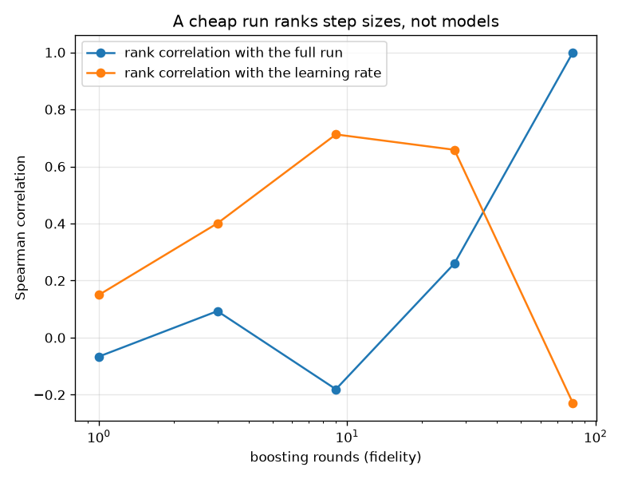
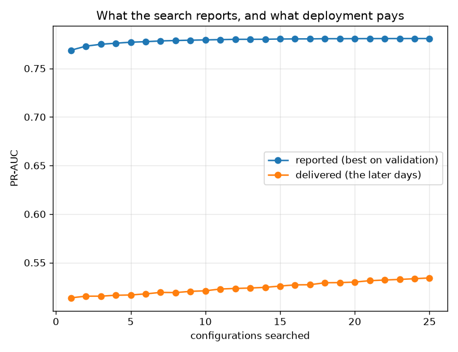

# NetSentry — Budgeted Hyperparameter Search, and the Premises Underneath It

_25 random configurations of the boosted model across a 5-rung
fidelity ladder, then four search methods at an identical budget of 810 boosting
rounds, averaged over 2 repeats. Trained on 12,000 rows; selection is
on validation, and the later days are never used to choose anything. Regenerate with
`netsentry hyperband`._

## Why this report exists

`netsentry train tune` runs TPE over the boosted model's hyperparameters and keeps whatever
scores best on validation. That is standard practice, and it rests on two assumptions that are
almost never measured before the search starts: that a validation ranking predicts deployment,
and -- for anything multi-fidelity -- that a cheap evaluation ranks configurations the way an
expensive one does.

Both are cheap to check. Neither usually is.

**Both premises fail, and the consequence is measurable: every search method here loses to the configuration nobody searched for.**

Hyperparameter search assumes a validation ranking predicts deployment. Over 25 configurations evaluated at full fidelity, the rank correlation between validation PR-AUC and the later days is **+0.23** (p = 0.277) -- indistinguishable from no relationship at all. The quantity every tuner in this repository maximises is close to uncorrelated with the quantity the project reports.

Multi-fidelity search assumes a cheap run ranks configurations like an expensive one. At 1 round the ranking correlates -0.07 with the full run, and the cheap rungs correlate up to +0.71 with the **learning rate**. A short boosting run does not rank models, it ranks step sizes -- a bias rather than noise, which no amount of averaging removes.

The table below is what those two failures cost. The shipped configuration, which nobody searched for, scores 0.530 on the later days; the best of the four searches is Hyperband at 0.527; 4 of 4 searches finish *below* the unsearched default. The best configuration in the entire random pool, chosen with full hindsight, reaches 0.534 -- so the whole prize on offer is **+0.004 PR-AUC**, and no method that has to choose on validation can collect it.

There is a third assumption underneath the accounting, and it is also wrong. Fitting time is `0.12s + 24.8ms per round`, so a full-fidelity fit is 6% fixed cost and the cheapest rung is **68% fixed cost**. Budgeting in rounds while paying in fits is how a theoretical saving of 81x becomes a wall-clock saving of very little.

## Premise one: does a cheap run rank like an expensive one?

| rounds | share of full fidelity | seconds per fit | rank correlation with the full run | correlation with the learning rate | best config survives the first cut |
|---|---|---|---|---|---|
| 1 | 1.2% | 0.17 s | -0.07 | +0.15 | yes |
| 3 | 3.7% | 0.21 s | +0.09 | +0.40 | yes |
| 9 | 11.1% | 0.34 s | -0.18 | +0.71 | **no** |
| 27 | 33.3% | 0.73 s | +0.26 | +0.66 | yes |
| 81 | 100.0% | 2.15 s | +1.00 | -0.23 | yes |

This is the table successive halving and Hyperband depend on, and it is the table nobody
prints. **Not one cheap rung ranks configurations the way the full run does** -- the
correlations sit around zero and change sign, which is what "no information" looks like when it
is measured rather than assumed.

The next column says why, and it is the difference between noise and a defect. **A short
boosting run rewards whatever climbs fastest**, which is a property of the step size rather
than of the model, so the cheap rungs rank by learning rate. That is a *bias*: averaging over
more configurations does not remove it, and a halving schedule built on it will
systematically discard the patient configurations that would have won.

The last column is the operational consequence -- whether the configuration that eventually
wins at full fidelity would have survived the first cut at each rung -- and the answer is that
it is a coin toss.

## Premise two: does validation predict the later days?

The pool of 25 configurations, all evaluated at full fidelity, gives this
directly: Spearman **+0.23** (p = 0.277)
between validation PR-AUC and later-day PR-AUC.

That is the premise every hyperparameter search in every project rests on, and on a temporal
split it is not obviously true -- the validation rows come from the *training days*, and the
[glass-box study](gam.md) has already shown that split systematically overstating what capacity
delivers.

At **+0.23** with p = 0.277, it does not hold here. The relationship is indistinguishable from none, on the very quantity every tuner in this repository maximises.

It is worth being precise about what this does and does not say. It does not say the model is
bad, or that validation is useless -- the [glass-box study](gam.md) found validation perfectly
capable of locating the *turn* in a capacity curve. It says that among configurations which are
already near each other, validation cannot tell which will transfer, and a search that ranks
them is ranking noise. The correct response to a premise this weak is to stop tuning, not to
tune harder, which is the opposite of what a budget usually buys.

## The methods, at an equal budget

| method | configurations tried | rounds fitted | wall clock | validation PR-AUC | later-days PR-AUC |
|---|---|---|---|---|---|
| Hyperband | 49 | 552 | 23 s | 0.775 | **0.527** +/- 0.001 |
| successive halving | 67 | 750 | 29 s | 0.770 | **0.527** +/- 0.000 |
| TPE (the deployed tuner) | 10 | 810 | 20 s | 0.780 | **0.524** +/- 0.005 |
| random search | 10 | 810 | 19 s | 0.780 | **0.521** +/- 0.012 |
| _the shipped configuration (no search)_ | _1_ | _81_ | _--_ | _0.776_ | _0.530_ |
| _the best of the 25 random configurations, chosen with hindsight_ | _25_ | _--_ | _--_ | _0.781_ | _0.534_ |

Budgets are equal in **rounds fitted**, which is the resource the methods actually consume, and
the searches are floored at 3 rounds -- because the cost model above says the
cheapest rung is nearly all overhead, and a bracket that evaluates hundreds of configurations
for one round each would spend its budget proving that.
Comparisons in the literature are usually in *trials*, which flatters multi-fidelity methods by
construction, because most of their trials are the cheap ones -- successive halving here tries
67 configurations against random search's 10 for the same rounds.

Hyperband leads on the later days at 0.527, and the whole field spans 0.006. The reference rows are what the table is for: the shipped configuration, which
nobody searched for, scores 0.530, and the best of the random pool chosen
with full hindsight scores 0.534. **The entire span from "no search at all"
to "perfect hindsight" is 0.004 PR-AUC**, which
bounds what any tuner in this comparison could have won.

The wall-clock column is where the resource model shows up. Rounds are not what a machine
charges for: with a fixed cost of 0.12s per fit against
24.8ms per round, the cheap rungs cost far more than their
round count suggests, and a method that spends its budget on many tiny fits pays a toll the
accounting does not show.

## What searching harder buys, and what it only appears to buy

| configurations searched | reported (validation) | gained by searching | delivered (later days) | gained by searching | optimism |
|---|---|---|---|---|---|
| 1 | 0.769 | +0.000 | 0.514 | +0.000 | 0.255 |
| 2 | 0.773 | +0.004 | 0.515 | +0.002 | 0.257 |
| 5 | 0.777 | +0.008 | 0.517 | +0.003 | 0.260 |
| 10 | 0.779 | +0.011 | 0.521 | +0.007 | 0.258 |
| 20 | 0.781 | +0.012 | 0.530 | +0.016 | 0.251 |
| 25 | 0.781 | +0.012 | 0.534 | +0.021 | 0.246 |

Selecting the best of many configurations on validation is itself an estimator, and a biased
one -- the winner is partly whichever configuration's validation noise was most flattering. The
curve is built by resampling the order in which the pool arrives, so "searching harder" means
"drawing more candidates" rather than "using a better method".

Searching 25 configurations rather than one raises the *reported* score by +0.012 and the *delivered* score by +0.021. The two move together, which is the honest reading: at this pool size the selection bias is
small next to the gap that was already there.

There is a tension between this table and the previous one worth naming rather than smoothing
over. Here, choosing on validation among the pool lands on the configuration that also happens
to be best on the later days; there, four searches choosing on validation among *fresh*
configurations all finished below the unsearched default. Both are what a rank correlation of
+0.23 produces: a relationship this weak makes a lucky pick and an
unlucky search equally unsurprising, and neither outcome is evidence about the method. That is
the practical content of a failed premise -- not that searching is harmful, but that its
outcome is not information.

**The optimism does not come from searching. It comes from the split.** The reported score
overstates the delivered one by 0.255 at a single
configuration, before any selection has happened at all, and searching barely moves it. Every
number a tuner prints on this data is a number about the training days.

## Scope and honest limits

- **This is a study about search, not about the shipped model.** Training uses
  12,000 rows and caps boosting at 81 rounds so that a few
  hundred fits are affordable; the deployed configuration trains longer on more data. The
  comparison between methods is internally consistent, and none of these numbers should be
  read against the headline.
- **The budget is one point on a curve.** Every method's ranking can change with the budget --
  that is the entire content of the Hyperband paper -- and this measures one budget, three
  times, on one dataset.
- **Fidelity is boosting rounds.** Training-set size is the other natural choice and behaves
  differently: it changes what the model can learn rather than how far it got. A study that
  swept both would be able to say which fidelity dimension is more faithful, and this one
  cannot.
- **The pool is random, so the oracle row is a *reachable* best, not the best.** A better
  configuration certainly exists outside 25 draws; what the row bounds is what
  this comparison could have found.
- **Nothing here is tuned against the later days**, which is the only reason the last column
  means anything. The moment a search is run against it, that column becomes a validation
  column with extra steps.