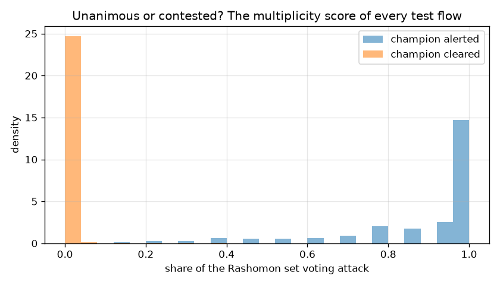
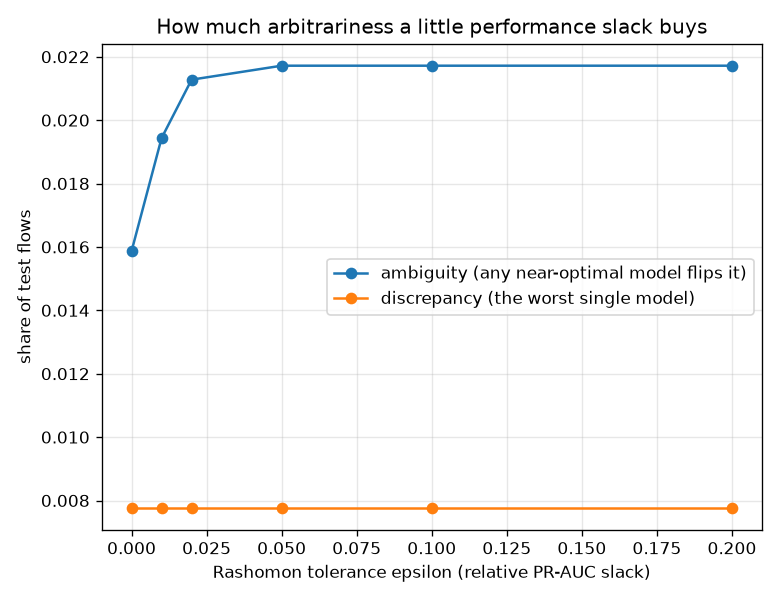

# NetSentry — Predictive Multiplicity: How Arbitrary Is the Verdict?

_Synthetic stand-in. Honest temporal/binary split, 24,957 test flows.
12 alternative models trained by varying only the modelling choices no
metric adjudicates (seed, row/column subsample, leaf count, learning rate); every model
decides at its own validation-calibrated 0.1%-FPR threshold, so no model
can win the comparison by simply alerting more._

## Why this report exists

Every other number in this project describes **one** model. But the training protocol
contains free choices — the seed, how much data to bag, how many leaves, how fast to learn —
and no metric adjudicates between them. Vary them and you get a family of models that are
statistically indistinguishable on the honest split. Breiman called it the Rashomon effect;
Marx, Calmon & Ustun (ICML 2020) made it measurable. The measurement matters because a flow
whose verdict flips across that family was not decided by evidence — it was decided by an
arbitrary choice made months earlier, and an analyst acting on that alert deserves to know.

## The Rashomon set

The set is every candidate whose test PR-AUC is within **5%** (relative) of
the deployed model's. 12 of 12 candidates qualify.

| model | modelling choice | PR-AUC | delta | in Rashomon set |
|---|---|---|---|---|
| **deployed** | seed=42, rows=0.80, cols=0.80, leaves=63, lr=0.050 | **0.529** | — | anchor |
| alt-01 | seed=43, rows=0.70, cols=1.00, leaves=63, lr=0.050 | 0.528 | -0.001 | yes |
| alt-02 | seed=44, rows=0.80, cols=1.00, leaves=31, lr=0.080 | 0.521 | -0.008 | yes |
| alt-03 | seed=45, rows=0.70, cols=0.60, leaves=63, lr=0.080 | 0.521 | -0.008 | yes |
| alt-04 | seed=46, rows=0.90, cols=1.00, leaves=127, lr=0.080 | 0.535 | +0.006 | yes |
| alt-05 | seed=47, rows=0.90, cols=0.60, leaves=127, lr=0.050 | 0.533 | +0.005 | yes |
| alt-06 | seed=48, rows=0.90, cols=0.80, leaves=31, lr=0.080 | 0.525 | -0.004 | yes |
| alt-07 | seed=49, rows=1.00, cols=0.80, leaves=63, lr=0.080 | 0.518 | -0.011 | yes |
| alt-08 | seed=50, rows=0.90, cols=0.80, leaves=63, lr=0.030 | 0.531 | +0.002 | yes |
| alt-09 | seed=51, rows=0.70, cols=0.80, leaves=127, lr=0.030 | 0.532 | +0.003 | yes |
| alt-10 | seed=52, rows=1.00, cols=1.00, leaves=31, lr=0.050 | 0.528 | -0.001 | yes |
| alt-11 | seed=53, rows=0.70, cols=1.00, leaves=127, lr=0.050 | 0.537 | +0.008 | yes |
| alt-12 | seed=54, rows=0.70, cols=1.00, leaves=63, lr=0.080 | 0.520 | -0.009 | yes |

## Ambiguity and discrepancy

| measure | value | reading |
|---|---|---|
| **ambiguity** | 2.17% | flows some near-optimal model flips |
| **discrepancy** | 0.78% | flows the worst single model flips |
| ambiguity among the alerts raised | 41.25% | at a 2.31% alert rate |
| ambiguity among the flows cleared | 1.25% | |
| ambiguity among true attacks | 8.40% | |
| ambiguity among true benign flows | 0.10% | |

2.17% of test flows are **ambiguous** — at least one of the 12 models that match the deployed model's PR-AUC to within 5% decides them differently, at the same validated 0.1% false-positive budget. The worst single competitor differs on 0.78% of flows (**discrepancy**), which is what a deployment swap would actually churn. Ambiguity is small in absolute terms and it is **concentrated on the alerts**: 41.2% of the flows the deployed model flags are contested, against 1.25% of the flows it clears — roughly 33x. That is the uncomfortable direction. Ambiguity sitting in the benign bulk would be academic; ambiguity sitting in the queue means the analyst's work is partly determined by a seed.

## How much slack buys how much freedom

| epsilon | models in set | ambiguity | discrepancy |
|---|---|---|---|
| 0.00% | 5 | 1.59% | 0.78% |
| 1.00% | 8 | 1.94% | 0.78% |
| 2.00% | 11 | 2.13% | 0.78% |
| 5.00% | 12 | 2.17% | 0.78% |
| 10.00% | 12 | 2.17% | 0.78% |
| 20.00% | 12 | 2.17% | 0.78% |

Multiplicity is only meaningful relative to how much performance you would trade for a different answer. At a 0% tolerance the set holds 5 models and 1.59% of flows are contested; widen it to 20% and the set grows to 12 models and 2.17%. The curve is monotone by construction — a wider set can only add disagreement — so the honest reading is the *shape*: a steep climb means the performance you would sacrifice buys a lot of freedom to re-decide individual flows, which is precisely the situation in which citing a single model's verdict as fact is indefensible.

## Turning the measurement into a lever

| review band | sent to review | residual ambiguity | auto-alert rate | auto-alert precision | auto-alert recall | attacks in review |
|---|---|---|---|---|---|---|
| [0.40, 0.60] | 0.22% | 1.96% | 2.23% | 98.6% | 8.8% | 0.8% |
| [0.20, 0.80] | 1.14% | 1.04% | 1.77% | 98.6% | 7.0% | 4.4% |
| [0.01, 0.99] | 2.17% | 0.00% | 1.36% | 98.5% | 5.4% | 8.4% |

Measuring arbitrariness is only useful if it can be acted on. The vote fraction is a ready-made abstention signal: auto-decide the flows the family agrees on, route the contested band to a human. At the strictest setting ([0.01, 0.99] — abstain on *any* disagreement) 2.17% of the stream goes to review, 0.00% arbitrariness survives in the decisions still taken automatically, and the auto-alerts that remain run at 98.5% precision — a queue with nothing arbitrary in it. The cheap setting ([0.40, 0.60]) reviews only the near-tied flows: 0.22% of the stream, leaving 1.96% residual. Either way the cost lands where it should — 8.4% of true attacks are routed to review rather than auto-alerted, which is not a miss: a human still sees them. This is the same trade the [conformal](conformal.md) study makes with a coverage guarantee, arrived at from the opposite direction — conformal abstains when the *data* is ambiguous, this abstains when the *model family* is.

## Scope

Multiplicity is measured over a *sampled* Rashomon set, not the true one — the real set is
every near-optimal model in the hypothesis class, which is not enumerable, so
12 draws from a plausible neighbourhood of the deployed configuration
give a **lower bound** on ambiguity and discrepancy. Both are reported on the honest
temporal split at the deployed operating point; a different false-positive budget moves
every threshold and therefore the disagreement set. The candidates share one feature
pipeline and one training split, so this measures multiplicity from *modelling* choices
only — data-collection multiplicity (which days, which capture) would be measured by
re-running the [leave-one-day-out](lodo.md) study across model families, and the
[seed-variance](seed_variance.md) report already isolates the seed's own contribution as
the training-noise floor beneath every metric here. The decision-level companion to
[importance stability](importance_stability.md): stable explanations of an arbitrary verdict
are not much comfort.