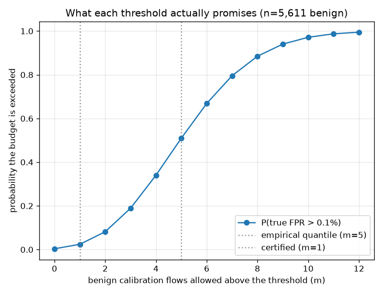
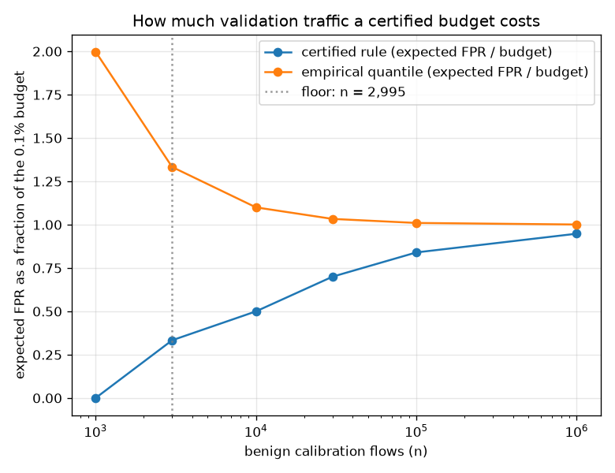

# NetSentry — Neyman-Pearson Thresholds: Certifying the False-Positive Budget

_Synthetic stand-in. Honest temporal/binary split; thresholds calibrated on the
5,611 benign validation flows and applied to the 24,957-flow later-day test
set (18,720 benign). Confidence level delta = 5%: the certified
rule may exceed its budget with probability at most 5%._

## Why this report exists

Every operational claim in this project rests on one sentence — *"the threshold is chosen on
validation at a 0.1% false-positive budget."* That sentence describes a **procedure**,
not a promise. The threshold is an empirical quantile of a finite benign sample, so the rate it
achieves on traffic it has not seen is a random variable. Worse, it is a *biased* one: the
quantile lands on the order statistic that just fits the sample, and the population is bigger
than the sample.

Neyman-Pearson classification (Cannon et al. 2002; Rigollet & Tong 2011; Tong, Feng & Li,
JMLR 2018) replaces the procedure with a guarantee. If the threshold lets exactly `m` of `n`
benign calibration flows through, the fraction of the benign *population* above it is
`Beta(m + 1, n - m)` distributed, whose upper tail is exactly a binomial CDF:

```
P( true FPR > alpha )  =  P( Binomial(n, alpha) <= m )
```

Choose the largest `m` whose tail sits under `delta` and the resulting classifier satisfies
`P(FPR > alpha) <= delta` for a finite sample, with no distributional assumption beyond a
continuous score. Everything below follows from that one identity.

## What the deployed threshold actually promises

| rule | budget | m | threshold | P(FPR > budget) | expected FPR | test TPR | test FPR |
|---|---|---|---|---|---|---|---|
| empirical quantile @ 0.1% | 0.1% | 5 | 0.98754 | **51.0%** | 0.1069% | 9.2% | 0.0588% |
| certified @ 0.1% | 0.1% | 1 | 0.99455 | **2.4%** | 0.0356% | 6.0% | 0.0321% |
| empirical quantile @ 1.0% | 1.0% | 56 | 0.86700 | **53.0%** | 1.0157% | 21.0% | 0.8761% |
| certified @ 1.0% | 1.0% | 43 | 0.88553 | **4.1%** | 0.7840% | 20.1% | 0.7265% |

On 5,611 benign validation flows, the empirical-quantile threshold this project reports its headline detection rate at lets 5 of them through — and the probability that its **true** false-positive rate exceeds the 0.1% budget is **51.0%**. That is not a rounding concern. Its expected false-positive rate is 0.1069%, which is 1.07x the budget: the empirical quantile is biased over budget by construction, because the order statistic it lands on is the one that *just* fits the sample, and the population is larger than the sample. The certified rule admits only 1 benign calibration flows, which pins the violation probability at 2.41% — inside the 5% promise — and holds an expected false-positive rate of 0.0356%, 36% of budget. The guarantee is not free: detection on the later days falls from 9.2% to 6.0%, a 3.2%-point price for knowing the budget holds.



The curve is the whole argument in one line: violation probability rises steeply with how many
benign calibration flows the threshold admits, the empirical quantile sits near the middle of
that rise, and the certified rule is the last point under `delta`.

## Buying confidence: the delta sweep

| delta (tolerated violation) | certified m | expected FPR | actual P(FPR > budget) | test TPR | test FPR |
|---|---|---|---|---|---|
| 20% | 3 | 0.0713% | 18.93% | 8.5% | 0.0534% |
| 10% | 2 | 0.0535% | 8.16% | 8.2% | 0.0481% |
| 5% | 1 | 0.0356% | 2.41% | 6.0% | 0.0321% |
| 1% | 0 | 0.0178% | 0.36% | 2.5% | 0.0053% |

Confidence is not free and it is not linear. Tightening `delta` moves the threshold up a small
number of order statistics, and each step costs detection on the later days. The table is the
honest menu — an operator who needs 99% confidence that the alert budget holds can read the
detection they are giving up to get it, rather than discovering it after the queue overflows.

## The floor nobody states: how much benign traffic a guarantee needs

Even the most conservative rule — a threshold above *every* benign calibration score, `m = 0` —
still exceeds the budget with probability `(1 - alpha)^n`. Setting that equal to `delta` gives a
hard sample-size floor below which the budget **cannot be certified at any threshold**:
0.1% needs 2,995 benign flows, 1.0% needs 299 benign flows.

| benign calibration flows | certified m | certified expected FPR | quantile expected FPR | quantile P(over budget) |
|---|---|---|---|---|
| 1,000 | — | **cannot certify** | 0.1998% | 73.6% |
| 3,000 | 0 | 0.0333% (33% of budget) | 0.1333% | 64.7% |
| 10,000 | 4 | 0.0500% (50% of budget) | 0.1100% | 58.3% |
| 30,000 | 20 | 0.0700% (70% of budget) | 0.1033% | 54.8% |
| 100,000 | 83 | 0.0840% (84% of budget) | 0.1010% | 52.7% |
| 1,000,000 | 947 | 0.0948% (95% of budget) | 0.1001% | 50.8% |



Both rules converge on the budget from opposite sides as `n` grows — the quantile from above
(it is biased over budget) and the certified rule from below (it pays for its confidence). The
gap between them is the price of the guarantee, and it closes like `1/sqrt(n)`. This turns a
vague instinct ("more validation data is better") into a sizing requirement: to certify a
0.1% budget at 5% confidence while giving up less than a tenth of the
budget in detection, read across the table for the `n` where the certified column reaches ~90%
of budget.

## Does the closed form survive contact with a measurement?

| budget | rule | m | closed form | rank simulation (population FPR) | finite-holdout measurement |
|---|---|---|---|---|---|
| 0.1% | empirical quantile | 2 | 46.8% | 47.2% | 47.8% |
| 1.0% | empirical quantile | 28 | 54.6% | 54.9% | 46.5% |
| 1.0% | certified | 19 | 4.6% | 4.5% | 6.0% |

Two checks, deliberately different. The **rank simulation** draws 20,000 replicate calibration samples of 2,805 flows and reads the *population* false-positive rate exactly. It is legitimate to simulate this with uniform draws rather than real scores because the rule touches the data only through its order statistics, so its violation probability is invariant to any strictly increasing transform of the score — that invariance is exactly what "distribution-free" means here. The rank simulation reproduces the closed form to within 0.4% on every row. That is the self-validation that counts: an off-by-one in the order statistic would appear as a systematic offset, not as Monte-Carlo noise.

The **finite-holdout measurement** is the check a practitioner would actually run: split the benign pool 400 times, calibrate on one half, and count how often the other half's *measured* FPR lands over budget. It disagrees — and the direction is the point. For the certified rule at 1.0% it reads 6.0% against a true 4.5%, an inflation of 1.5% that would look like the guarantee failing its 5% promise. It is not failing. A 2,806-flow holdout carries only 28.1 expected false positives, so its FPR estimate is noisy, and a certified rule sits *below* budget by design — which means holdout noise can only push the estimate across the line, never back. **A finite holdout cannot validate a finite-sample bound**, because it is the same finite-sample regime the bound exists to handle. The empirical-quantile rows show the mirror image: their true rate straddles the budget, so the same noise is roughly symmetric and the measurement reads close to the truth. This is worth stating plainly because the wrong check is the natural one to run, and it condemns the correct method. The 0.1% budget has no certified row at all: this arm calibrates on 2,805 flows, below the 2,995 the floor demands, so there is nothing to validate. The floor is not a formality.

## The guarantee meets the temporal gap

Applied to Thursday-Friday the certified threshold realizes 0.0321% against a 0.1% budget, so the guarantee survives the day boundary here — the benign score distribution is stable enough across the temporal gap that a bound proved on Monday-Wednesday still binds. That is a stronger statement than the guarantee itself makes, and it is contingent on the data, not on the method: the [covariate-shift](covariate_shift.md) study measures how far the benign distribution actually moves, and a deployment whose benign traffic moves more would need the threshold re-certified on fresher flows ([refresh](refresh.md) prices exactly that).

## Scope

The guarantee is **distribution-free but not assumption-free**: it needs the benign calibration
scores to be i.i.d. draws from the same distribution as the benign traffic being judged, and a
continuous score so no two flows tie on the threshold (raw model scores are used throughout for
this reason — the isotonic calibrator is monotone, so it cannot change *which* flows a threshold
selects, but it creates ties that would corrupt an order statistic). Flows within one attack
burst are not independent, so the effective sample size is below the nominal one and the true
violation probability is somewhat higher than the number printed here — a caveat this dataset
shares with every finite-sample bound applied to network traffic. The rule certifies the
false-positive rate only; detection is whatever falls out, which is the correct asymmetry for a
SOC (the budget is the binding constraint) and the wrong one for a setting where misses dominate
— [cost.md](cost.md) takes the other side and optimises the decision economics directly, and
[conformal.md](conformal.md) gives the complementary guarantee on the *label set* rather than on
the error rate. The certified thresholds here are computed, reported and priced, but not wired
into the served bundle's threshold profiles: swapping the deployed operating point is a decision
about how much detection the operator will trade for a guarantee, and the point of this report
is to put that trade on the table with a number attached rather than to make it silently.
20,000 rank-space replicates and 400 calibration/holdout re-draws stand behind
the validation section.