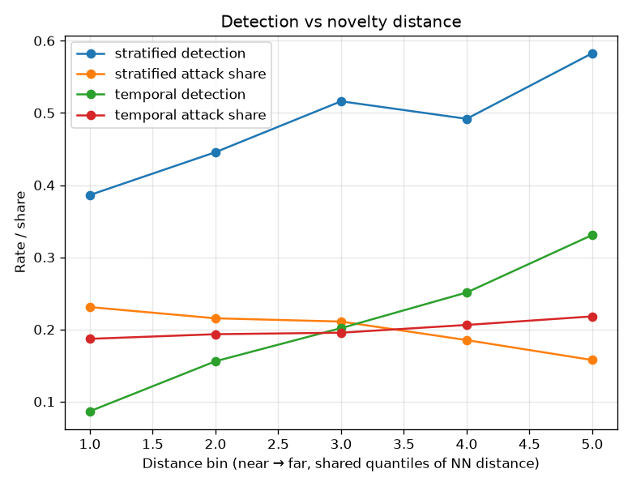

# NetSentry — Novelty Distance (why shuffled splits flatter)

_Synthetic stand-in. For every test attack, the Euclidean distance to its **nearest
training attack** in the pipeline's standardized feature space — the model's own
geometry — profiled for both split strategies on shared quantile bins, with detection
at the 1%-FPR operating point (threshold chosen on each split's
validation set)._

## The question

The headline result is the temporal-vs-stratified gap. This study asks *why*: is the
shuffled split flattered because its test attacks sit next to training near-twins
(a **composition** effect over one decay curve), or does the temporal split also
underperform **at matched distance** (the later days shift the context, not just the
mix)? Nearest-neighbour distance to the training attacks makes the question
measurable.

| split | test attacks | median NN distance | near-twins (< 0.5) | detection |
|---|---|---|---|---|
| stratified | 2,646 | 6.87 | 0.0% | 47.7% |
| temporal | 6,237 | 7.15 | 0.0% | 21.0% |

## Detection by distance (shared bins)

| distance bin | stratified share | stratified detection | temporal share | temporal detection |
|---|---|---|---|---|
| [3.88, 5.96) | 23% | 38.6% | 19% | 8.7% |
| [5.96, 6.69) | 22% | 44.6% | 19% | 15.6% |
| [6.69, 7.47) | 21% | 51.6% | 20% | 20.2% |
| [7.47, 8.61) | 19% | 49.2% | 21% | 25.1% |
| [8.61, 87.68) | 16% | 58.3% | 22% | 33.1% |

## Read

The two distance profiles are nearly identical (median 6.87 vs 7.15): the temporal test attacks are *not* systematically farther from training on this stand-in, so nearness/composition cannot carry the headline gap here. That is a property of the generator, not of the method — see the twin note below.

Near-twins (distance < 0.5) are essentially absent (0.0% / 0.0%): the synthetic generator draws flows independently, so it does not reproduce the real dataset's burst near-duplicates. On the real CIC-IDS2017 this bar is exactly where shuffled-split leakage lives — same-burst, near-identical flows landing on both sides of a random split (exact duplicates are already dropped in cleaning), pulling the stratified distances toward zero and detection on them toward memory. The instrument is built to expose that; the stand-in simply has none to expose.

Detection **rises with distance** in both splits (+20 pts stratified, +24 pts temporal, first to last bin) — the honest and initially surprising reading. L2 novelty is not this model's difficulty axis: the far-from-training attacks are the volumetric extremes (DDoS-style rate blow-ups) that are easy to flag *because* they are extreme, while the hard attacks are the near ones sitting close to the benign manifold. That is the same geometry the evasion study exploits — mimicry drags attack features *toward* benign and detection collapses — and it is why the dangerous end of the curve is the near end, not the far one.

**Decomposing the gap.** At the shared 1%-FPR operating point the stratified split detects 47.7% and the temporal split 21.0% (gap +26.7 pts). Applying the stratified per-bin detection rates to the *temporal* distance mix predicts 48.8%: essentially **none** of it is composition (-1.1 pts — the two mixes nearly coincide) and +27.8 pts is **at-distance shift**: at every matched novelty level the temporal split detects far less, because the later days change the attack *classes* and the benign context (what the drift report measures), not merely the distances. The decomposition is approximate (shared quantile bins, renormalized over bins both splits populate), but it makes the two flavours of shuffled-split optimism separately measurable — and on the real data, where twins exist, the composition share is the leakage.

The value of the instrument is that it turns "shuffled splits leak" from a slogan
into two measurable quantities — how much of the gap is *composition* (near-twins and
nearness, the leakage proper) and how much is *at-distance shift* (the world actually
changing). The per-class slices name the missed attacks, the drift report shows the
days moving, and this report says which mechanism the headline gap is made of on the
data at hand.