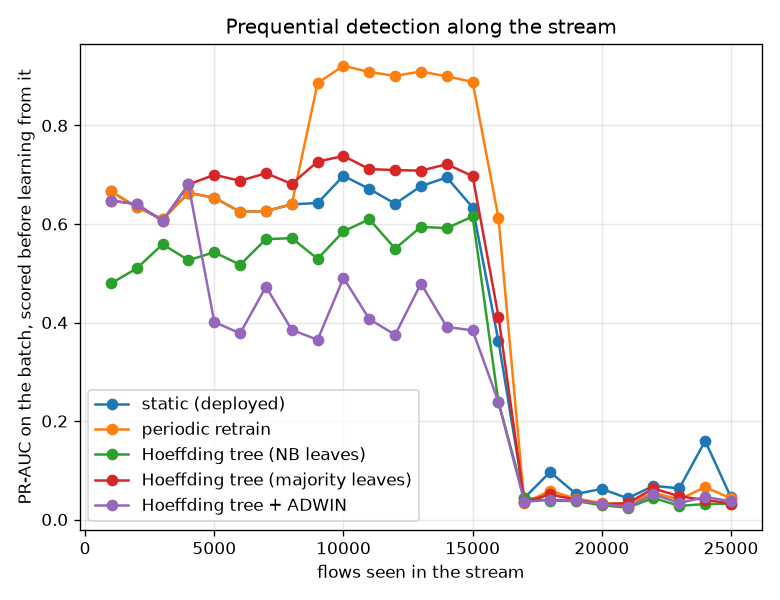
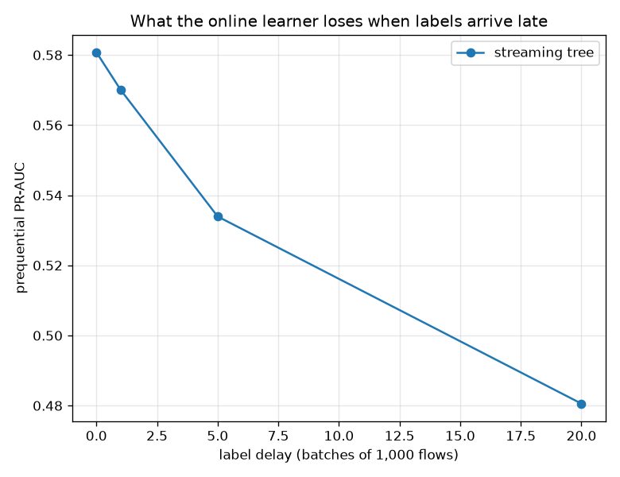

# NetSentry — Learning at Line Rate: a One-Pass Detector Against the Batch Pipeline

_Prequential (test-then-train) over 24,957 later-day flows in arrival order, in
batches of 1,000, after a 20,000-flow warm-up on the training days.
Stream prevalence 25.0%. Every arm sees the same batches in the same order and
scores each one **before** it is allowed to learn from it._

## Why this report exists

The deployed detector is a batch model: fitted on the training days, frozen, shipped. Between
two retrains, every flow is scored by a model that has already seen its last example. The
streaming study measured what that costs and answered it with periodic retraining, which works
and is expensive — the cost grows with the history, the whole history has to still exist, and
the freshest the model can ever be is one retrain interval old.

There is a third option this project had never tried: a learner that updates **per flow**, in
bounded memory, in one pass. `netsentry/models/hoeffding.py` implements one from scratch — a
**Hoeffding tree** (VFDT, Domingos & Hulten 2000) and **ADWIN** (Bifet & Gavalda 2007) — and
this report puts it in the field against the two batch policies.

The Hoeffding tree's idea is worth stating because it is the reason a streaming tree can be
principled rather than merely fast. A batch tree examines every example to choose a split. A
streaming tree cannot, so it asks instead: *how many examples do I need before the ranking of
candidate splits is settled?* The Hoeffding bound answers without assuming a distribution —
after `n` observations a mean of a range-`R` variable is within `sqrt(R^2 ln(1/delta) / 2n)` of
its true value with probability `1 - delta`. When the best candidate beats the runner-up by more
than that, the decision will not change with more data, so it can be taken now and never
revisited.

## The protocol

Prequential evaluation is the streaming analogue of a held-out split: score the batch, *then*
learn from it. Every prediction scored below was made on flows the model had never seen, which
is what makes these numbers comparable with the batch pipeline's. All five arms consume the same
batches in the same order from the same fitted preprocessing, so the only thing that varies is
the learning policy.

## What each learner achieves and what it costs

| learner | what it is | prequential PR-AUC | TPR @ 0.1% FPR | learn | score | flows/s | memory | structure |
|---|---|---|---|---|---|---|---|---|
| **static (deployed)** | trained once on the training days, then frozen -- the incumbent | 0.529 | 0.103 | 0.0 s | 0.8 s | 32,473 | 0.61 MB | 600 trees, never updated |
| **periodic retrain** | refit from scratch on the full history every 8,000 flows | 0.646 | 0.176 | 63.4 s | 0.6 s | 390 | 27.95 MB | 3 refits, 44,957 rows retained at the end |
| **Hoeffding tree (NB leaves)** | one pass, per-flow updates, Gaussian naive Bayes at the leaves | 0.456 | 0.000 | 12.4 s | 3.2 s | 1,603 | 0.11 MB | 29 splits, 30 leaves |
| **Hoeffding tree (majority leaves)** | the same tree predicting the leaf's majority class -- the ablation | 0.581 | 0.027 | 12.3 s | 0.6 s | 1,943 | 0.11 MB | 29 splits, 30 leaves |
| **Hoeffding tree + ADWIN** | the same tree, rebuilt whenever ADWIN says its own error rate has moved | 0.491 | 0.035 | 13.3 s | 0.5 s | 1,810 | 0.03 MB | 6 splits, 7 leaves |

The one-pass learner beats the frozen incumbent by +0.052 PR-AUC, and neither comes close to periodic retraining at 0.646. The streaming tree gives up **0.065 PR-AUC** against refitting, and buys three things with it: it spent 12.3 s learning against the retrainer's 63.4 s (5x), it holds 0.11 MB of sufficient statistics instead of 28 MB of retained history, and it is never more than one flow out of date, where the retrainer is up to a retrain interval stale by construction. That is the trade in one line: **freshness and bounded memory, bought with detection**. Which side of it a deployment wants is a question about its retrain cadence and its storage, not about which algorithm is better.

## The operating point a coarse score cannot reach

| learner | distinct scores emitted | TPR @ 1% FPR | TPR @ 0.1% FPR |
|---|---|---|---|
| static (deployed) | 24,952 | 0.205 | 0.103 |
| periodic retrain | 24,957 | 0.336 | 0.176 |
| Hoeffding tree (NB leaves) | 13,825 | 0.000 | 0.000 |
| Hoeffding tree (majority leaves) | 527 | 0.105 | 0.027 |
| Hoeffding tree + ADWIN | 110 | 0.118 | 0.035 |

The ranking metric and the operating metric disagree here, and the reason is structural. The streaming tree ends the stream with 29 splits, 30 leaves: at any instant it can emit one score per leaf, and across the whole run -- during which it grew, so early and late flows were scored by different trees -- it produced 527 distinct values in total, against the boosted model's 24,952 (one per flow, essentially). A threshold can only be placed *between* two distinct scores, so an alert budget finer than the gaps between them is unreachable by construction: at the deployed 0.1% budget the tree detects 2.7% against the frozen model's 10.3%, having *beaten* it on PR-AUC. This is the kind of thing that only shows up when a study reports the operational metric next to the ranking one. A SOC does not deploy an average precision; it deploys a threshold, and a model whose scores come in thirty buckets cannot be asked for a one-in-a-thousand false-alarm rate. Naive-Bayes leaves are one fix (they emit a continuum, and the ablation below shows what else they cost); more leaves, or a small ensemble of trees fed different feature subsets, are others.

## The leaf rule is most of the model

The two leaf rules share every split -- same tree, same stream, same order -- and differ by **0.125 PR-AUC** (majority leaves at 0.581 against 0.456). That is the opposite of the textbook expectation, and the reason is the assumption in the name: naive Bayes multiplies per-feature likelihoods as if the features were independent given the class. CICFlowMeter's are anything but -- a duration is a sum of inter-arrival times, and a rate is a count divided by that duration -- so the product counts the same evidence many times over, the log-posterior saturates, and the scores collapse onto the ends of the interval where a ranking metric has nothing left to rank. It is worth keeping the losing arm in the table: an ablation that only ever confirms the choice already made is not an ablation.

## The change detector

**ADWIN fired 6 times**, each time discarding the tree and starting over from the recent window. That is worth -0.090 PR-AUC against the same tree left alone. Resetting is the crude end of the response spectrum -- Bifet's Hoeffding Adaptive Tree grows an alternate subtree and swaps it in only once it wins, which keeps the parts of the model the drift did not invalidate -- and the gap between this arm and that one is the cost of the simplification, not of the idea.

## The assumption every online learner rests on

| label delay | prequential PR-AUC | change |
|---|---|---|
| none (labels arrive with the flow) | 0.581 | +0.000 |
| 1 batches (1,000 flows) | 0.570 | -0.011 |
| 5 batches (5,000 flows) | 0.534 | -0.047 |
| 20 batches (20,000 flows) | 0.481 | -0.100 |

Holding labels back 20 batches (20,000 flows) costs **0.100 PR-AUC** (0.581 to 0.481). That is the number an online-learning proposal has to survive, because the immediate label it assumes does not exist in a SOC: an analyst confirms an alert hours later, and confirms only the ones that were alerted on. Every arm here is therefore an upper bound on its deployable version, and the label-efficiency studies -- active learning, weak supervision, PU learning -- are what a real streaming deployment would have to be built on top of.

## Scope and honest limits

- **This tree is pure NumPy and pure Python.** Its throughput is an asymptotic argument, not a
  benchmark of the technique: MOA and river implement the same algorithm in compiled code an
  order of magnitude faster. What transfers is the *shape* — constant memory, per-example
  updates, no stored history — not the absolute flows per second.
- **A Gaussian summary is an approximation.** Split points are estimated from per-class normal
  fits rather than from the values themselves, which is what keeps a leaf's memory independent
  of the stream length. On heavy-tailed flow features that approximation is doing real work, and
  it is the first thing to suspect when the tree splits somewhere strange.
- **The reset policy is the crude version of adaptation.** Bifet's Hoeffding Adaptive Tree grows
  an alternate subtree and promotes it only when it wins; rebuilding from scratch throws away
  the parts of the model the drift did not invalidate.
- **Prequential PR-AUC pools predictions made by different models.** The score at flow 1 came
  from a different tree than the score at flow 20,000 — that is inherent to the protocol and is
  why the per-batch curve is shown alongside the pooled number rather than instead of it.