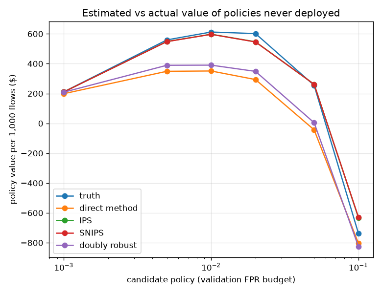
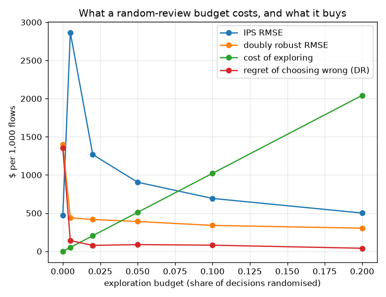

# NetSentry — Off-Policy Evaluation: Valuing a Triage Policy You Never Deployed

_Synthetic stand-in. Honest temporal/binary split; the later-day test stream is re-mixed from
its generator-convenient 25.0% attack rate down to the
[cost study's](cost.md) production prior of 1.00%, giving 18,909
flows. It is replayed under a logging policy that follows the deployed
0.1%-FPR threshold with 5% of decisions randomised.
120 replicate logs per estimate. Rewards use the
[cost study's](cost.md) economics: $25 per review,
$500 averted per attack caught, and exactly zero for a
flow nobody looked at._

## Why this report exists

Every other threshold study here has labels for every flow. A SOC does not. It has a log:
the score, the decision, and — only for the flows an analyst actually reviewed — what was
found. Nobody labels what was auto-cleared, because nobody looked.

So the operator's real question is counterfactual. *If we lowered the threshold, what would we
have caught, and what would it have cost?* Scoring a candidate policy on the log answers a
different question, because the labels in the log exist **because the old policy selected
those flows**. That is selection bias with a mechanism, and it has a mature answer: treat
triage as a contextual bandit, the deployed threshold as a logging policy, and estimate the
candidate's value off-policy.

This dataset does have every label, which makes the study a measurement rather than a
demonstration — the **true** value of each candidate is computable, so every estimator can be
scored against it, and so can the policy each estimator would have *chosen*.

## The candidate policies, and what they are actually worth

| candidate policy | threshold | flows reviewed | true value / 1,000 flows | unsupported flows | effective sample |
|---|---|---|---|---|---|
| review @ 0.1% FPR | 0.98780 | 0.11% | $212 | 0.0% | 20 |
| review @ 0.5% FPR | 0.92611 | 0.62% | $559 | 0.0% | 20 |
| review @ 1.0% FPR **(best)** | 0.86717 | 1.04% | $612 | 0.0% | 20 |
| review @ 2.0% FPR | 0.77990 | 1.82% | $602 | 0.0% | 20 |
| review @ 5.0% FPR | 0.53149 | 4.69% | $255 | 0.0% | 20 |
| review @ 10.0% FPR | 0.34064 | 9.61% | $-738 | 0.0% | 20 |

The best available policy is **review @ 1.0% FPR**, worth $612 per
1,000 flows against $212 for the deployed operating
point — an uplift of $401 per 1,000 flows that is invisible from the log
unless it can be estimated. Note the last two columns: they are the diagnostics that decide
whether any of the estimates below mean anything.

## Four estimators, scored against the truth

| candidate policy | truth | direct method | IPS | SNIPS | doubly robust |
|---|---|---|---|---|---|
| review @ 0.1% FPR | $212 | $199 (RMSE 16) | $211 (RMSE 12) | $211 (RMSE 12) | $209 (RMSE 9) |
| review @ 0.5% FPR | $559 | $349 (RMSE 219) | $548 (RMSE 688) | $548 (RMSE 685) | $389 (RMSE 223) |
| review @ 1.0% FPR | $612 | $351 (RMSE 278) | $597 (RMSE 780) | $597 (RMSE 777) | $390 (RMSE 285) |
| review @ 2.0% FPR | $602 | $294 (RMSE 343) | $547 (RMSE 900) | $546 (RMSE 896) | $348 (RMSE 377) |
| review @ 5.0% FPR | $255 | $-43 (RMSE 419) | $262 (RMSE 1,060) | $262 (RMSE 1,055) | $5 (RMSE 490) |
| review @ 10.0% FPR | $-738 | $-804 (RMSE 512) | $-632 (RMSE 1,201) | $-629 (RMSE 1,195) | $-825 (RMSE 600) |

By root-mean-square error the ranking is **direct method** first ($298 per 1,000 flows) and **IPS** last ($774) — and taking that at face value would be the mistake this section exists to prevent. Look at the columns instead of the summary. IPS tracks the truth almost exactly in the mean ($32 of average absolute bias) and scatters wildly around it, because a handful of flows the logging policy was unlikely to review arrive carrying weights in the hundreds and between them decide the estimate. The direct method is the mirror image: steady, and systematically $193 adrift, understating every policy more permissive than the one that generated the log. That is not bad luck — its reward model was fitted on exactly the flows the logging policy chose to show an analyst, so it is most confident and most wrong precisely where the candidate differs most from the incumbent. Doubly robust is not a compromise between them but an insurance policy: the reward model carries the bulk of the signal and the importance weights only have to carry its residual, which is both smaller and better behaved than the reward itself.

### The metric that actually decides

Accuracy is not the goal; **choosing the right policy** is. An estimator wrong about every
candidate by the same amount still ranks them correctly and costs nothing, while one that is
close on average but reorders the top two costs real money. So the yardstick is regret: pick
the policy each estimator scores highest, then ask what that choice was actually worth.

| estimator | mean RMSE | mean absolute bias | policy it picks | regret of that choice |
|---|---|---|---|---|
| direct method | $298 | $193 | review @ 1.0% FPR **(correct)** | $55 |
| doubly robust | $331 | $164 | review @ 1.0% FPR **(correct)** | $70 |
| SNIPS | $770 | $33 | review @ 1.0% FPR **(correct)** | $245 |
| IPS | $774 | $32 | review @ 1.0% FPR **(correct)** | $277 |

**direct method** picks the best available policy and gives up $55 per 1,000 flows; **IPS** gives up $277, a $222 spread that comes entirely from which estimator an engineer happened to reach for. The two yardsticks happen to agree here, which is worth noticing rather than assuming: an estimator can be accurate and still choose badly, and the reason they coincide is that the bias in this study is *monotone* in how permissive the policy is, so it shifts the whole curve rather than tilting it.

The direct method's narrow win ($55 against doubly robust's $70) should not be read as a recommendation. It wins *because* its bias here happens to be monotone in permissiveness, and that is a property nobody can check in deployment — checking it is precisely the thing the missing labels make impossible. A reward model that is wrong in a way that tilts the curve rather than shifting it would reorder the top candidates and the direct method would have no signal that anything had gone wrong. Doubly robust gives up $16 here to be protected against that case, which is a cheap premium. The advice that survives both tables: report doubly robust, print the support diagnostic beside it, and never let a low RMSE talk you out of checking which policy the number actually selects.

## The finding is about the log, not the estimator

| exploration | unsupported flows | effective sample | IPS RMSE | DR RMSE | cost of exploring | regret of choosing wrong (DR) | total |
|---|---|---|---|---|---|---|---|
| 0.0% | 77.3% | 20 | $472 | $1,396 | $0 | $1,350 | **$1,350** |
| 0.5% | 0.0% | 13 | $2,866 | $438 | $51 | $141 | **$192** |
| 2.0% | 0.0% | 12 | $1,267 | $417 | $204 | $77 | **$282** |
| 5.0% | 0.0% | 19 | $905 | $390 | $511 | $88 | **$599** |
| 10.0% | 0.0% | 33 | $693 | $340 | $1,021 | $80 | **$1,102** |
| 20.0% | 0.0% | 62 | $501 | $303 | $2,043 | $40 | **$2,083** |

At zero exploration — a plain deployed threshold, which is what almost every SOC actually runs — **77% of the flows a candidate policy would review carry propensity zero**. The log contains no evidence about them, so the question is not hard, it is *unanswerable*: any estimator that returns a number there is extrapolating, and the doubly-robust estimator's $1,396 RMSE is the price of that silence, not a failure of the method. This is the row that matters most, because it is the row describing production. Exploration fixes identification, and it is not free — randomising decisions means reviewing flows that did not need reviewing and skipping ones that did. Both sides are in the table. Cost rises with the budget, estimator error falls, and the total is minimised at **0.5% exploration** ($51 spent to avoid $141 of expected loss from choosing the wrong policy). That is the actionable result: a small, permanent random review budget is not wasted analyst time, it is what makes every future threshold change answerable offline instead of by deploying it and watching.

## Scope

The reward model is deliberately simple — a logistic regression on the same features, refitted
per replicate on whatever the logging policy happened to review — because the direct method's
weakness here is *which flows it was trained on*, not which family fitted them; a stronger
reward model trained on the same censored sample inherits the same bias. Rewards assume an
analyst verdict is correct and immediate; a real queue returns verdicts late and sometimes
wrong, which widens every interval here without changing the ordering. The skip arm is
assigned exactly zero rather than a miss cost, which is what makes the formulation honest
under partial feedback (nothing was spent, nothing was found) but does mean the values below
are *review economics*, not total risk — [cost.md](cost.md) prices the miss side directly, and
[alert_queue.md](alert_queue.md) prices the capacity constraint. Only the actions are
resampled across replicates; the traffic is held fixed, so the spreads measure logging noise
rather than a change of population. Candidate policies are deterministic thresholds, so only
the *logging* policy needs stochasticity — which is exactly the asymmetry that makes a small
exploration budget so cheap relative to what it buys.