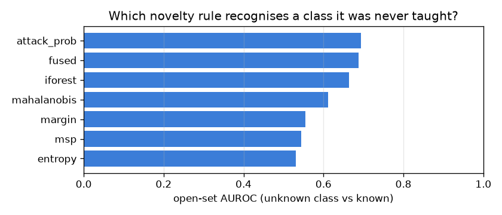
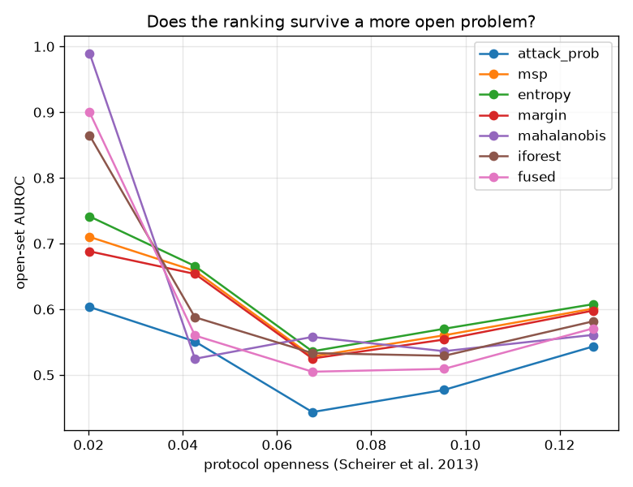

# NetSentry — Open-Set Recognition on the Temporal Split

_Synthetic stand-in. Honest temporal/multiclass split. Known classes (in training):
`BENIGN`, `DoS GoldenEye`, `DoS Hulk`, `DoS Slowhttptest`, `DoS slowloris`, `FTP-Patator`, `Heartbleed`, `SSH-Patator`. Classes appearing **only** at test:
`Bot`, `DDoS`, `Infiltration`, `PortScan`, `Web Attack`. Protocol openness
0.127 (Scheirer et al. 2013); 18,720 known-class and
6,237 unknown-class test flows._

## Why this report exists

The temporal split's own class table says something the closed-set metrics elsewhere in this
repo quietly assume away: **no attack class in the test days appears in the training days**.
Train has the DoS family and the patators; test has `PortScan`, `DDoS`, `Bot`, `Web Attack` and
`Infiltration`. Every attack the model meets at evaluation time is formally an *unknown class*,
which makes this an **open-set recognition** problem, not a classification one. That reframing
changes the question from "can it separate the classes it was taught" to "can it tell that
something is not one of them" — and it puts the deployed decision rule, `1 - P(BENIGN)`, into a
field of alternatives instead of leaving it as the only option on the table.

Closed-set accuracy on the known-class flows is 95.4%. That number is
reported first precisely because it is **not** the thing that matters here; it is the constraint
the open-set rules have to respect while doing the actual job.

## The rule field

Every rule is computed from artefacts the deployment already builds — the multiclass
probability vector, the fitted feature pipeline, and the benign-only Isolation Forest. Nothing
here needs a label from the test days. `UDR` is the unknown-detection rate: the share of
never-seen-class attack flows caught with the threshold fixed on known-class traffic at the
stated false-alarm budget.

| rule | family | open-set AUROC | OSCR-AUC | UDR @ 1.0% FPR | UDR @ 0.1% FPR |
|---|---|---|---|---|---|
| `attack_prob` | label space (deployed) | 0.693 | 0.682 | 21.8% | 12.4% |
| `fused` | fusion | 0.688 | 0.670 | 15.2% | 7.4% |
| `iforest` | feature space | 0.663 | 0.640 | 7.2% | 1.6% |
| `mahalanobis` | feature space | 0.611 | 0.584 | 4.1% | 0.7% |
| `margin` | label space | 0.554 | 0.547 | 1.8% | 0.3% |
| `msp` | label space | 0.544 | 0.536 | 1.7% | 0.1% |
| `entropy` | label space | 0.531 | 0.523 | 0.9% | 0.1% |

The deployed rule holds its own field: `1 - P(BENIGN)` reaches 0.693 open-set AUROC and 21.8% unknown-detection at the 1.0% budget. That is the comfortable outcome, and it is worth stating why it was not guaranteed — the rule asks a classifier to express surprise in the vocabulary of the classes it already knows, which is exactly the failure mode the open-set literature exists to document. An AUROC of 0.693 against a 0.5 coin flip is also a reminder of the absolute standard here: the best available rule misses roughly 78% of never-seen attacks at a 1.0% false-alarm budget. The ranking does **not** separate it from `fused` (0.688), though, and the per-class table below shows why that near-tie matters more than the ordering does.

## Rejecting the unknown without breaking the known (OSCR)

Open-set AUROC has a blind spot: a rule that rejects nearly everything scores well on it while
destroying the closed-set task. The OSCR curve (Dhamija, Günther & Boult 2018) closes that hole
by counting a known-class flow only when the classifier both accepts it *and* labels it
correctly, and sweeping that against the share of unknowns wrongly accepted.

OSCR agrees with AUROC here: `attack_prob` leads on both (0.682 OSCR-AUC), so its advantage is not bought by wrecking the closed-set task — the classifier still resolves 95.4% of known-class flows correctly under the same threshold.

## Which unknown class does each rule find?

Detection at the 1.0% false-alarm budget, broken out by the class the model
was never trained on. A rule can lead on aggregate AUROC while being blind to a specific
family — this is where that shows up.

| rule | `Bot` | `DDoS` | `Infiltration` | `PortScan` | `Web Attack` |
|---|---|---|---|---|---|
| `attack_prob` | 2.6% | 54.9% | 4.8% | 0.2% | 1.0% |
| `fused` | 4.0% | 33.5% | 2.4% | 3.6% | 1.4% |
| `iforest` | 1.4% | 15.8% | 0.0% | 1.7% | 2.1% |
| `mahalanobis` | 2.0% | 7.5% | 0.0% | 2.0% | 1.7% |
| `margin` | 1.7% | 2.2% | 0.0% | 1.4% | 2.1% |
| `msp` | 1.4% | 0.7% | 0.0% | 2.3% | 3.1% |
| `entropy` | 1.4% | 0.7% | 0.0% | 0.8% | 3.5% |

`attack_prob`'s aggregate lead is **carried by one family**: it catches 54.9% of `DDoS` and 0.2% of `PortScan` at the same 1.0% budget — a 285x spread across classes that a single AUROC number cannot show. On `PortScan` it detects at or below the 1.0% false-alarm rate itself, which means that on those flows the score carries **no usable signal at all** — the rule is not weak there, it is blind. Another rule does better on at least one of them: `msp` reaches 2.3% on `PortScan`. That is the practical argument for keeping the whole field rather than the winner — the rules fail on *different* families, which is precisely the condition under which fusing them is worth the complexity.

## Does the ranking survive a more open problem?

The temporal split offers exactly one level of openness. Withholding attack classes from the
*stratified* split turns openness into a dial: rarest classes are withheld first, since that is
the order a real deployment meets attacks it was never trained on.

| classes withheld | openness | `attack_prob` | `msp` | `entropy` | `margin` | `mahalanobis` | `iforest` | `fused` |
|---|---|---|---|---|---|---|---|---|
| 1 (Heartbleed) | 0.020 | 0.603 | 0.710 | 0.741 | 0.688 | 0.990 | 0.865 | 0.900 |
| 2 (Heartbleed, Infiltration) | 0.043 | 0.551 | 0.658 | 0.666 | 0.654 | 0.525 | 0.588 | 0.560 |
| 3 (Heartbleed, Infiltration, Web Attack) | 0.067 | 0.443 | 0.528 | 0.536 | 0.525 | 0.558 | 0.533 | 0.505 |
| 4 (Heartbleed, Infiltration, Web Attack, Bot) | 0.095 | 0.477 | 0.560 | 0.570 | 0.554 | 0.536 | 0.529 | 0.509 |
| 5 (Heartbleed, Infiltration, Web Attack, Bot, DoS Slowhttptest) | 0.127 | 0.543 | 0.601 | 0.608 | 0.598 | 0.561 | 0.582 | 0.571 |

The ranking **changes with openness** — `mahalanobis` leads at 0.020 openness and `entropy` at 0.127. That is a warning about single-operating-point comparisons: a novelty rule chosen on one holdout configuration is not guaranteed to be the right one when the next unknown family arrives. The rule that gives up the most as the problem opens is `mahalanobis`: 0.990 AUROC at 0.020 openness down to 0.561 at 0.127, a drop of 0.429.

## Scope

The Mahalanobis scorer uses a single pooled within-class covariance with shrinkage toward a
scaled identity (Lee et al. 2018); a per-class covariance would be more expressive and much
less stable at this dataset's rare-class counts. OpenMax (Bendale & Boult 2016) fits a Weibull
tail to the activation distances and is the natural next rung — it needs penultimate-layer
activations, which a boosted-tree ensemble does not have in the same sense, so the feature-space
distance stands in for it. The openness sweep withholds *whole classes* but keeps the stratified
split's optimistic row-level mixing, so its absolute numbers sit above the temporal protocol's
by construction; it is there to test the **ranking**, not to restate the headline. This report
is the label-space complement of the [novelty-distance study](novelty.md), which measures the
same gap geometrically, and of the [uncertainty decomposition](uncertainty.md), which asks
whether the model *knows* it is out of its depth.