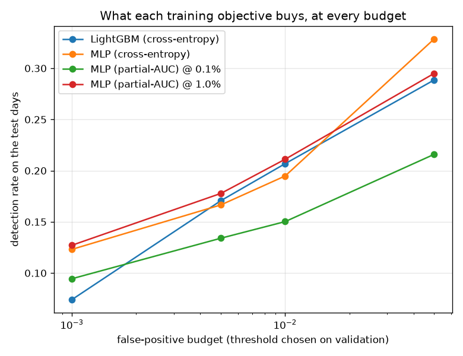

# NetSentry — Training for the Operating Point

_12,000 training rows, judged on 24,957 later-day flows at
25.0% prevalence. Every threshold is chosen on validation and applied to test.
Minibatch 4,096 — which is part of the objective's specification here, not a
performance knob._

## Why this report exists

Every evaluation in this project leads with detection at a fixed false-positive budget, because
that is what a SOC deploys. Every model in this project is trained to minimise cross-entropy,
which is a different objective — log-loss spends capacity on being right about the obviously
benign majority, while the operating point is decided entirely by the handful of benign flows
that score highest, the ones the threshold has to clear. Nothing in the training objective knows
those flows are special.

The **partial AUC** does know. Where ROC-AUC integrates the ROC curve over all false-positive
rates, partial AUC integrates it only over `[0, alpha]` — the region the budget allows — and
maximising it means caring only about how positives rank against the *top-scoring* negatives
(Narasimhan & Agarwal 2013). The surrogate used here takes the `ceil(alpha * n_negatives)`
highest-scoring negatives in each minibatch and penalises every positive that fails to outrank
them, with the step function relaxed to a sigmoid so it has gradients.

## Detection at every budget

| model | PR-AUC | TPR @ 0.1% | TPR @ 0.5% | TPR @ 1.0% | TPR @ 5.0% |
|---|---|---|---|---|---|
| LightGBM (cross-entropy) | 0.537 | 7.4% | 17.1% | 20.7% | 28.9% |
| MLP (cross-entropy) | 0.559 | 12.3% | 16.7% | 19.5% | **32.9%** |
| MLP (partial-AUC) @ 0.1% | 0.425 | 9.4% | 13.4% | 15.0% | 21.6% |
| MLP (partial-AUC) @ 1.0% | 0.505 | **12.7%** | **17.8%** | **21.1%** | 29.5% |

**Training for the budget wins at the budget it trained for.** At 1.0% FPR the partial-AUC network detects +1.6% more than the identical network trained on cross-entropy -- same architecture, same data, same seed, same early stopping, one term of the loss different. **And training for the *tightest* budget does not.** The arm trained at 0.1% lands -2.9% against the same control at its own target -- worse, not better -- and the reason is in the table below rather than in the idea: at that budget a minibatch supplies 4 negatives to define the loss, which is not an estimate of the population's hardest negatives, it is a coin flip. The surrogate needs the batch to contain enough of the tail to see it, and the tighter the budget the larger that batch has to be. This is the sort of failure that looks like a bad technique and is really a sampling constraint, so it is worth naming precisely.

The incumbent tree remains the reference: 0.537 PR-AUC against the cross-entropy network's 0.559, and the two disagree most where it matters least. What the matrix above shows that a single number cannot is the *shape* of each objective's competence: cross-entropy spreads it across the whole curve, and the partial-AUC surrogate concentrates it -- which is the point, and also the risk, because a budget is a policy decision that changes with headcount.

## Does the objective have enough of the tail to see?

| trained for | negatives per batch defining the loss | TPR at its own budget | cross-entropy control | difference |
|---|---|---|---|---|
| 0.1% | 4 | 9.4% | 12.3% | **-2.9%** |
| 1.0% | 33 | 21.1% | 19.5% | **+1.6%** |

The surrogate ranks positives against the top `ceil(alpha * n_negatives)` negatives in each minibatch. With 4,096 rows per batch and 80% of them benign, a 1.0% budget supplies 33 negatives to learn from and a 0.1% budget supplies 4. Wanting ten of them at the tightest budget would take a batch of roughly 12,515 rows -- a substantial fraction of the training set, which is to say the objective stops being a minibatch objective. That is the real constraint on this technique, and it is a property of the budget rather than of the model.

## The same models, scored by partial AUC

| model | pAUC @ 0.1% | pAUC @ 0.5% | pAUC @ 1.0% | pAUC @ 5.0% |
|---|---|---|---|---|
| LightGBM (cross-entropy) | 0.538 | 0.567 | 0.581 | 0.610 |
| MLP (cross-entropy) | 0.527 | 0.551 | 0.568 | 0.615 |
| MLP (partial-AUC) @ 0.1% | 0.527 | 0.547 | 0.555 | 0.575 |
| MLP (partial-AUC) @ 1.0% | 0.527 | 0.557 | 0.572 | 0.608 |

Partial AUC normalised so a perfect ranker scores 1 and a random one 0.5, which makes the columns
comparable across budgets in a way raw TPR is not.

## What it costs elsewhere

The cost is off the target budget, and it is visible: at the widest budget measured (5.0%) the MLP (partial-AUC) @ 0.1% arm gives up -11.3% against the cross-entropy control, and its overall PR-AUC moves -0.134. That is the technique working as designed rather than misbehaving -- a partial AUC is a *partial* objective, and the region it ignores is the region it will be worst in. The operational reading is that this is only worth doing when the budget is genuinely fixed by headcount, and that changing the budget means retraining rather than re-thresholding.

## Scope and honest limits

- **The minibatch's hardest negatives are not the population's.** At a 0.1% budget the surrogate
  looks at one negative per batch, and that flow is the hardest in a random thousand rather than
  the hardest in the day. The bias is toward easier negatives than the deployed threshold will
  meet, and the honest fix is a bigger batch — which is why the batch size is reported next to
  the objective rather than buried in a config.
- **One architecture, one seed.** The comparison isolates the objective by holding the network
  fixed, which is the right control, but it does not tell you whether the same objective helps a
  different model family. The seed-variance study's noise floor applies here as everywhere.
- **The budget is a policy, not a constant.** A model trained for 0.1% is a model that must be
  retrained if the SOC hires. Cross-entropy's spread-out competence is worth something precisely
  because it survives that decision.