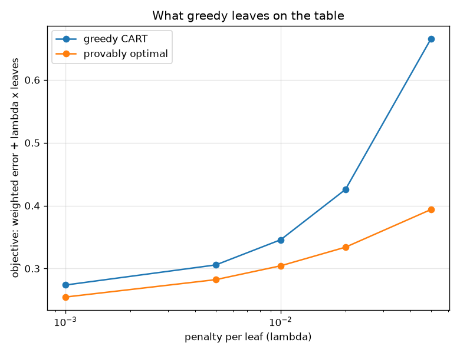
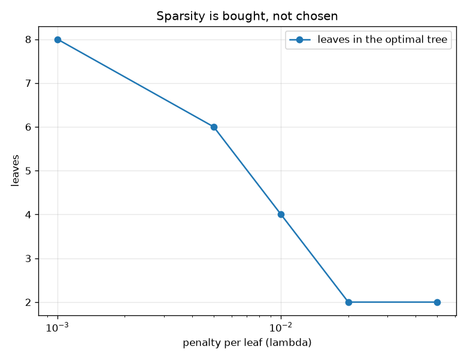

# NetSentry — How Far From Optimal Is the Readable Model?

_Synthetic stand-in. Honest temporal/binary split. 24 binary predicates over
8,000 training rows, depth limit 3, headline penalty
lambda = 0.01. Class weights balanced._

## Why this report exists

The [distillation study](distill.md) fits a shallow tree as the deployed model's auditable
approximation. That tree comes from CART, which is greedy: it takes the split that looks best
now and never reconsiders. Nobody usually asks what greediness costs, because finding the
optimal decision tree is NP-hard and the field settled for greedy decades ago.

At interpretable sizes it is no longer necessary to settle. Branch and bound over a binarised
feature set (Hu, Rudin & Seltzer 2019; Lin et al. 2020) returns the tree that minimises

```
weighted misclassification + lambda x (number of leaves)
```

**exactly**, with a certificate that the space was exhausted. So the question becomes
answerable: when this project ships a small tree and calls it auditable, how much accuracy did
greediness quietly throw away?

## The certified gap

| lambda | optimal leaves | optimal objective | greedy objective | greedy's excess | certified |
|---|---|---|---|---|---|
| 0.001 | 8 | 0.2546 | 0.2738 | **+7.5%** | proved |
| 0.005 | 6 | 0.2823 | 0.3058 | **+8.3%** | proved |
| 0.01 | 4 | 0.3043 | 0.3458 | **+13.6%** | proved |
| 0.02 | 2 | 0.3339 | 0.4258 | **+27.5%** | proved |
| 0.05 | 2 | 0.3939 | 0.6658 | **+69.0%** | proved |

Greedy CART is provably suboptimal at 5 of 5 certified penalty settings, worst at lambda = 0.05 where it sits **69.0% above the proven optimum**. The word 'proven' is doing real work: the search space was exhausted, so this is not 'the best tree anybody found' but the best tree that exists for this predicate set, depth limit and penalty. Every interpretable-surrogate result in this repository — and in most others — is quoted without that number, and the honest reading is that a greedy surrogate is a *lower bound* on how good an auditable model could be.



## Sparsity as a price, not a hyperparameter

The penalty is doing the work a depth limit usually does, and doing it better. At lambda = 0.001 the optimal tree has 8 leaves; at lambda = 0.05 it has 2. Nobody chose those sizes — they are what the objective bought at each price, which is the right way round. Choosing 'a tree of depth 3' and then reporting its accuracy is choosing an answer and then measuring it; choosing what a leaf is worth and letting the search decide how many to buy is a statement about the trade-off itself.



## The trees, and what they detect

| model | leaves | training objective | detection | false-positive rate | accuracy |
|---|---|---|---|---|---|
| optimal (branch and bound) | 4 | 0.3043 | 37.7% | 19.2% | 70.0% |
| greedy CART | 8 | 0.3458 | 12.2% | 20.6% | 62.6% |
| the deployed model (for scale) | n/a | n/a | 9.1% | 0.1% | 77.2% |

The optimal tree also transfers better than the greedy one, and by more than the training objective suggested: 37.7% detection against 12.2% on days neither of them saw, with **half the leaves** (4 against 8). Smaller and better is the combination sparsity regularisation is supposed to produce and greedy growth routinely fails to: CART spends its depth budget on splits that looked good locally, and the exhaustive search spends it on splits that pay off jointly.

The deployed model's row is there for scale and must be read carefully, because the tree and the ensemble are **not at the same operating point**. The tree has no threshold to move: it alerts at a 19.2% false-positive rate, which is 326 times the 0.1% budget the ensemble is held to, and detection is trivially bought with false alarms. Comparing the two numbers as though they were commensurable would be exactly the sleight of hand this repository exists to avoid. What is legitimate to say is that the readable model's shortfall has now been decomposed into two parts that used to be one: some is the price of being readable at all, and some was greedy search, and the 24-predicate certificate says how much of it was which.

The optimal tree at the headline penalty, in full — which is the entire point of building a
small one:

```
if Total Fwd Packets > -0.00384:
  predict ATTACK
else:
  if Flow Packets/s > -0.0584:
    if Flow Bytes/s > -0.0335:
      predict ATTACK
    else:
      predict benign
  else:
    predict benign
```

## Scope

The optimum is optimal **for a binarisation**, and the binarisation is a modelling
choice that sits outside the proof. Features are ranked by a single-feature separation score
and cut at fixed quantiles rather than at thresholds chosen to maximise purity, because a
purity-optimal threshold is a greedy split smuggled into the exhaustive search — but a
different candidate set would give a different optimum, and the certificate says nothing about
that. The honest phrasing is the one used throughout: optimal for this predicate set, this
depth limit and this penalty.

Search is bounded by a node budget and the report states, per penalty setting, whether the
space was exhausted. An uncertified row is a valid upper bound and nothing more. The two
prunes are both sound — the leaf bound follows from error being non-negative and a split
costing at least one extra leaf; the incumbent bound from every subtree containing at least
one leaf — so pruning never discards the optimum, only work.

Weights are balanced, which is not cosmetic: with raw counts the optimal tree on this data is
a single leaf predicting benign, at an objective no split can beat, and the whole exercise
returns nothing. The search runs on a subsample of the training rows for tractability; the
comparison against greedy is on the same rows, so the gap is a like-for-like statement even
though its absolute objective is not the full-data one.