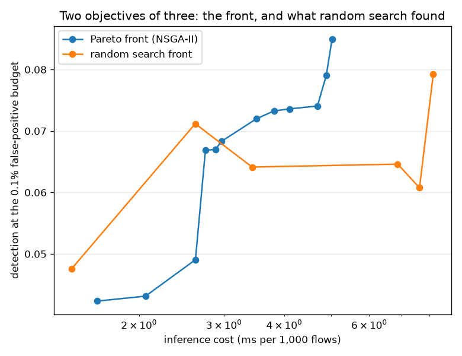

# NetSentry — Choosing on the Front, Not on a Weighted Sum

_NSGA-II (Deb et al. 2002) implemented from scratch over six boosted-forest hyperparameters,
50 evaluations per search arm, against a random-search control of the same
budget. Objectives: detection at the 0.1% false-positive budget, inference cost,
and detection surviving a padding attack. Total runtime 18.9 minutes._

## Why this report exists

Every model choice here has been made by collapsing several things into one number and sorting
on it — the [leaderboard](leaderboard.md) on PR-AUC, the [gate](gate.md) on floors, the
[cascade](cascade.md) along one compute axis. The real decision has at least three axes that
move against each other, and a single ranking either hides two of them or hard-codes an
exchange rate somebody invented.

## The front

| detection @ budget | inference (ms/1k) | detection under evasion | trees | leaves | learning rate | reachable by a weighted sum |
|---|---|---|---|---|---|---|
| 8.5% | 5.02 | 5.4% | 226 | 17 | 0.203 | yes |
| 7.9% | 4.89 | 6.2% | 227 | 16 | 0.207 | yes |
| 7.4% | 4.69 | 4.7% | 226 | 15 | 0.132 | **no** |
| 7.4% | 4.10 | 5.7% | 281 | 9 | 0.067 | **no** |
| 7.3% | 3.81 | 5.9% | 282 | 9 | 0.068 | yes |
| 7.2% | 3.50 | 5.4% | 173 | 17 | 0.088 | **no** |
| 6.8% | 2.96 | 5.2% | 110 | 35 | 0.277 | yes |
| 6.7% | 2.88 | 5.5% | 135 | 36 | 0.253 | yes |
| 6.7% | 2.74 | 5.0% | 226 | 17 | 0.181 | yes |
| 4.9% | 2.62 | 4.9% | 123 | 46 | 0.037 | **no** |
| 4.3% | 2.06 | 4.2% | 75 | 55 | 0.051 | **no** |
| 4.2% | 1.64 | 4.5% | 58 | 36 | 0.020 | yes |

The front has **12 models** on it, and no two of them are the same answer to the question. The one that detects most at the operating point (8.5%) costs 5.02 ms per thousand flows and keeps 5.4% of its detection under the padding attack. The cheapest (1.64 ms/1k) detects 4.2%. The most evasion-resistant keeps 6.2% while detecting 7.9% on clean traffic. Each of those is optimal; which one is *right* depends on a trade nobody in this repository has been asked to state explicitly before.

## Did the algorithm earn its complexity?

| search | evaluations | front size | hypervolume |
|---|---|---|---|
| NSGA-II (10 x 4 generations) | 50 | 12 | 0.3082 |
| random search (same budget) | 50 | 6 | 0.2944 |

The control matters more than the algorithm. Non-dominated sorting, crowding distances, tournament selection and simulated-binary crossover are a lot of machinery to put between an engineer and a model, and the question is whether they beat drawing the same number of random configurations. By exact hypervolume, NSGA-II earns its complexity here: 0.3082 against 0.2944, a ratio of 1.05.

At this budget that is the expected shape of the answer. Evolutionary search pays off when evaluations are cheap enough to run thousands of them and the space has structure worth exploiting; with a few dozen fits of a boosted forest over six hyperparameters, random sampling covers the space nearly as well and costs nothing to implement. The honest recommendation from this table is to use the *front*, not necessarily the algorithm that found it.

## What a weighted sum cannot reach

**5 of the 12 front members are unreachable by any weighted sum.** 20,000 weight vectors drawn from the simplex select only 7 distinct models between them, and no amount of further sampling would change that — it is geometry, not sampling. A weighted sum is a linear functional, its minimiser over a set is always a vertex of that set's convex hull, and a Pareto-optimal point sitting in a concave stretch of the front is optimal for no weighting whatsoever.

One of the unreachable models detects 7.2% at 3.50 ms per thousand flows while keeping 5.4% under evasion. It exists, it is on the front, and every tuning procedure in this repository — the leaderboard's single metric, the gate's floors, a cost-weighted objective — is structurally incapable of returning it. That is the argument for computing a front instead of a score, and it is a proof rather than a preference.

## Where the deployed model sits

The deployed configuration detects 6.4% at 15.80 ms per thousand flows and keeps 4.4% under evasion. **9 front members dominate it** — better or equal on all three objectives at once. The best of them detects 8.5% (+2.1%) at 5.02 ms/1k with 5.4% under evasion. Domination is a strong claim and it is made on the test split, so the right reading is 'the incumbent's hyperparameters were never chosen against these objectives' rather than 'swap it today'; promoting any of them would go through the [release gate](gate.md) and the [promotion test](promotion.md) like anything else.

## Scope and honest limits

- **Three objectives, chosen and not derived.** Detection, cost and evasion-resistance are the
  three this project can measure cheaply enough to put inside an evolutionary loop. Calibration
  quality, per-class parity and training cost are equally legitimate axes and are absent.
- **The evasion objective is the cheap attack, not the strong one.** Inflating volume features
  by a fixed factor is one perturbation applied identically to every candidate; the
  [robustness study](robustness.md) runs a query-search attacker that is far more effective and
  far too slow to evaluate hundreds of times. This ranks candidates, it does not certify them.
- **The front is measured on the test split**, which is the one place this project spends
  carefully. It is used here to *compare* candidates rather than to report a headline, and any
  model taken from it would have to be re-validated before deployment — otherwise the front is
  a hyperparameter search on the test set, which is the leak this whole repository exists to
  avoid.
- **Hypervolume depends on the reference point**, taken here as 5% beyond the worst observed
  value on each axis. A different reference changes the absolute numbers; it does not change
  the ordering between two fronts measured against the same one, which is all it is used for.
- **Training rows are capped** so a few hundred fits stay affordable, and the cap applies to
  every candidate including the incumbent, so the comparison is fair even though the absolute
  detection numbers are below the headline model's.