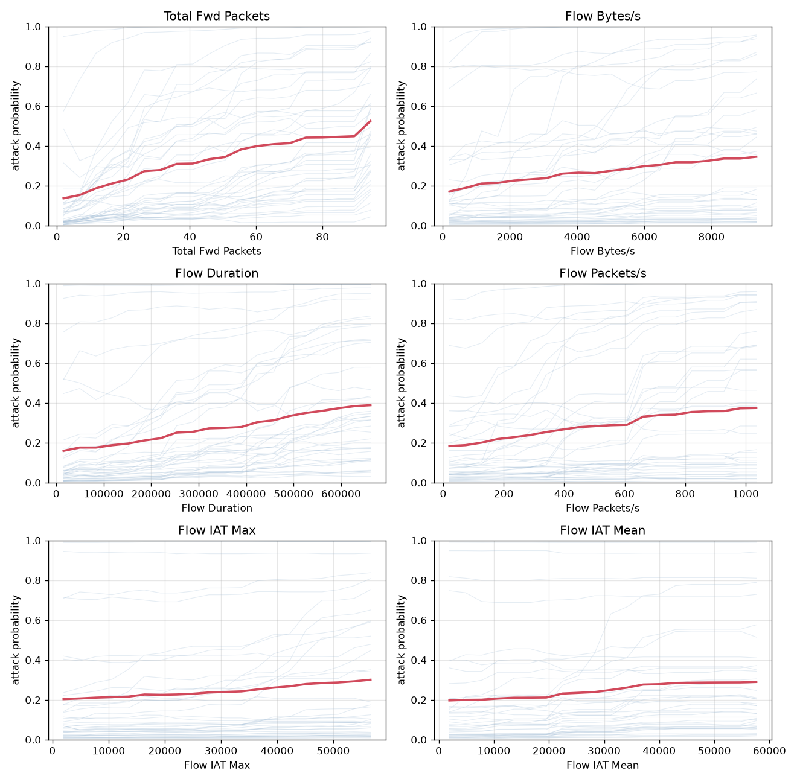

# NetSentry - Partial Dependence & ICE

_Synthetic stand-in. Partial dependence (Friedman) for the top model features on the
honest **temporal / binary** model. Each feature is swept across a grid of its own
data quantiles while every other column stays at its real value, and every perturbed
flow is scored through the **fitted pipeline + model** — the same transform the API
applies, so the x-axis is in raw units and there is no train/serve skew._

## Marginal response of the top features

| feature | shape | marginal effect (Δp) | model importance |
|---|---|---|---|
| Total Fwd Packets | increasing | 0.388 | 1135 |
| Flow Bytes/s | non-monotone | 0.175 | 1040 |
| Flow Duration | non-monotone | 0.229 | 1020 |
| Flow Packets/s | increasing | 0.191 | 1014 |
| Flow IAT Max | non-monotone | 0.097 | 751 |
| Flow IAT Mean | increasing | 0.093 | 735 |

The bold line is the **partial dependence** (mean predicted attack probability as the
feature sweeps its range); the faint lines are **individual conditional expectation
(ICE)** curves — one flow each — whose spread is the heterogeneity the average hides.

## How to read this (and what it is not)

A partial dependence plot shows the *shape* of the model's learned response — rising,
falling, saturating, or turning over — which the SHAP global summary (a single
importance number) and the ablation study (a family's causal value) do not. The
features with the steepest curves are the ones the model's score is most sensitive to,
and they line up with the attacker-controllable features the evasion and recourse
studies exploit — the response shape *is* the surface an adversary shapes traffic along.

**The standard caveat, stated plainly:** PDP assumes the swept feature is independent of
the others. Where features are correlated (flow rates, packet counts, and byte totals
move together here), sweeping one alone pushes the frame into traffic that does not
occur, and the curve extrapolates. The **ICE spread** is the honest signal of that: when
the individual curves fan out or cross, the average is hiding interaction, and the PDP
should be read as the model's *marginal* response, not a causal effect — the causal
reading is the feature-group ablation's job.
