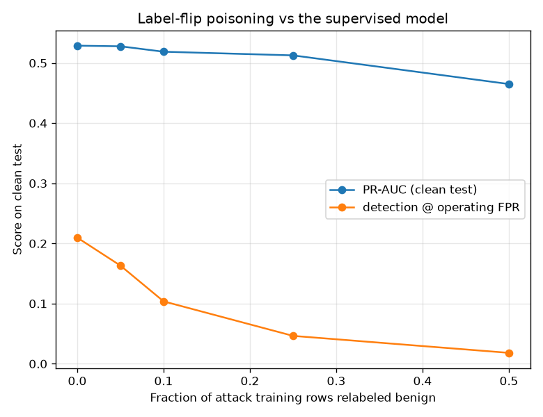
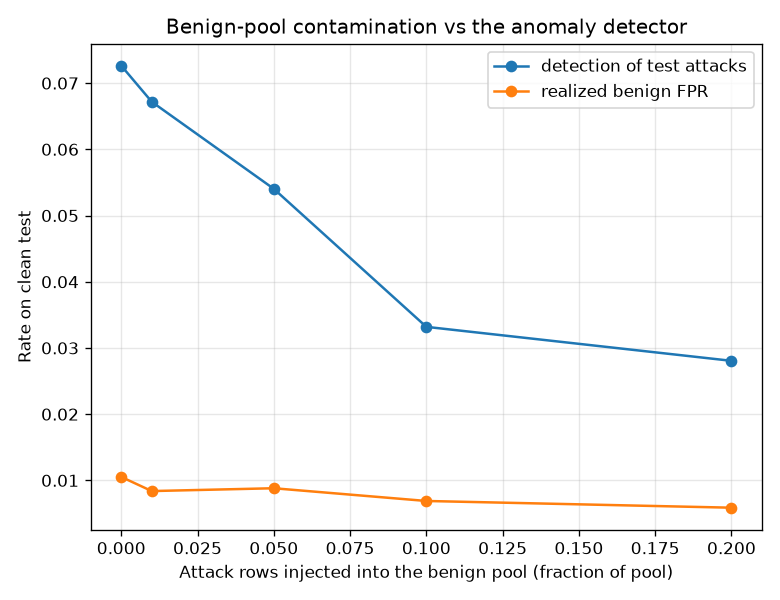

# NetSentry — Training-Set Poisoning Study

_Synthetic stand-in. Temporal split; degradation is always measured on the **clean**
test ground truth, while training and validation (and therefore threshold
selection) see the poisoned labels — the operator's actual position._

Evasion (see the robustness report) is the inference-time adversary; poisoning is
the training-time one. A NIDS pipeline ingests labels from sources an attacker can
influence — sandbox verdicts, blocklists, "known-clean" capture windows — so "how
fast does detection decay as the labels rot" is a measurable property, not a
hypothetical.

## Label flips vs the supervised model

A fraction of attack training rows is relabeled benign (attacker hides their class
in the labeling source). Detection threshold: chosen on the poisoned validation set
at the 1% FPR budget, as the operator would.

| flip rate | rows poisoned | PR-AUC (clean test) | detection @ operating FPR |
|---|---|---|---|
| 0% | 0 | 0.529 | 21.0% |
| 5% | 348 | 0.528 | 16.3% |
| 10% | 698 | 0.519 | 10.4% |
| 25% | 1,747 | 0.513 | 4.6% |
| 50% | 3,495 | 0.465 | 1.8% |

## Benign-pool contamination vs the anomaly detector

Attack rows are injected into the "benign-only" pool the Isolation Forest fits on
and calibrates against (target benign FPR 1%).
This is the standing weakness of benign-baseline training: the baseline is only as
clean as its labels.

| contamination | rows injected | detection of test attacks | realized benign FPR |
|---|---|---|---|
| 0% | 0 | 7.3% | 1.05% |
| 1% | 280 | 6.7% | 0.84% |
| 5% | 1,402 | 5.4% | 0.88% |
| 10% | 2,805 | 3.3% | 0.69% |
| 20% | 5,610 | 2.8% | 0.59% |

## Read

Label flips cost the supervised model **0.064 PR-AUC** and drop detection 21.0% → 1.8% by a 50% flip rate — the attack signal is diluted and the benign class is polluted at once, and the poisoned-validation threshold drifts on top.

Benign-pool contamination degrades the anomaly detector's detection by **4.5 points** at a 20% injection rate. The mechanism is double: injected attacks widen the learned normal, and the calibration quantile (computed on the contaminated 'benign' validation pool) inflates the threshold on top.

Defences follow from the mechanism, and two are already in this pipeline: the
**data-quality gates** (`netsentry validate`) catch gross label anomalies before
training, and **drift monitoring** compares production scores against a reference —
a poisoned retrain shifts the score distribution, which is exactly what the PSI
gauge watches. The honest caveat: a patient adversary who poisons *slowly* stays
under both, which is why provenance on training data matters as much as provenance
on models.
