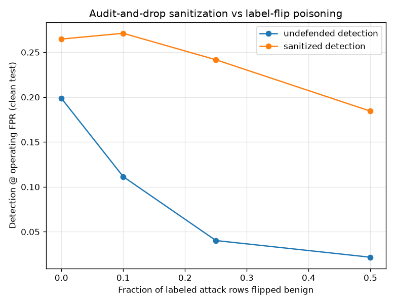

# NetSentry — Poisoning Defense (audit-and-drop, re-measured)

_Synthetic stand-in. Temporal split; flips are planted across the operator's whole
labeled pool (train + validation), the confident-learning audit (3-fold
out-of-fold scores, shared knob with `netsentry labelaudit`) flags suspects in
both directions, every flag is dropped, and the model is refit. Detection is at
the 1% FPR budget with the threshold chosen on the poisoned
(or sanitized) validation labels — the operator's actual position. Only the test
ground truth stays clean._

## Why this report exists

The poisoning study ends with the damage: label flips leave PR-AUC nearly intact
while detection at the shipped threshold collapses, because the operating point
is chosen on the poisoned validation labels. The label audit proved it can find
planted flips. This study is the third step of the arc the hardening report walks
for evasion — **measure, fix, re-measure** — for the training-time adversary: the
audit is wired in as an automated sanitizer and the same decay curve is run with
the defense on.

## Defense mechanics

Both suspect directions are dropped — benign-labeled rows scoring like attacks
(where flips land) and attack-labeled rows scoring like benign — because an
operator cannot know which way the labels rot. Rows are dropped, never relabeled:
relabeling with the auditing model's own opinion would bootstrap its errors back
into training.

| flip rate | flips planted | rows dropped | flips caught | clean rows lost | flip recall |
|---|---|---|---|---|---|
| 0% | 0 | 1,829 | 0 | 1,829 | — |
| 10% | 595 | 2,058 | 305 | 1,753 | 51.3% |
| 25% | 1,488 | 2,322 | 773 | 1,549 | 51.9% |
| 50% | 2,976 | 2,650 | 1,324 | 1,326 | 44.5% |

## Outcomes on the clean test split

| flip rate | detection (undefended) | detection (sanitized) | PR-AUC (undefended) | PR-AUC (sanitized) |
|---|---|---|---|---|
| 0% | 19.9% | 26.5% | 0.523 | 0.535 |
| 10% | 11.1% | 27.1% | 0.516 | 0.525 |
| 25% | 4.0% | 24.2% | 0.462 | 0.508 |
| 50% | 2.2% | 18.4% | 0.479 | 0.525 |

## Read

**The defense works, and the mechanism is visible in the mechanics table.** At a 50% flip rate the audit catches 44.5% of the planted flips, so the refit model trains on mostly-clean labels and — just as important — the operating threshold is chosen on a mostly-clean validation set again. Detection at the operating point recovers from **2.2% to 18.4%** (+16.3 points). The poisoning study showed the damage rides through the poisoned threshold; the defense heals exactly that channel.

The zero-poison row carries its own finding: with nothing planted, dropping the audit's ambiguity floor (**1,829 rows**) *raises* detection by +6.6 points. The flagged clean rows are the class-overlap residue — the same families the per-class slices show being missed — and removing them sharpens the boundary the threshold is chosen on. Do not bank on that sign: it is a property of this generator's overlap, and the honest expectation on real data is a small cost, not a bonus.

## What this defense does not cover

- It defends the noise model it audits for: **random** flips, which land far from
  the class boundary and are exactly what out-of-fold scoring can see. An adaptive
  poisoner who flips only near-boundary flows sits inside the audit's measured
  ambiguity floor and is not caught — the label audit's own report quantifies that
  floor.
- Benign-pool contamination against the anomaly detector (the poisoning study's
  second attack) is untouched: this defense reasons over *labels*, and
  contamination corrupts an unlabeled pool.
- The clean-data tax recurs on every retrain. A deployment that runs this
  continuously is buying insurance with training data — the premium is the
  measured zero-poison row, not zero.
