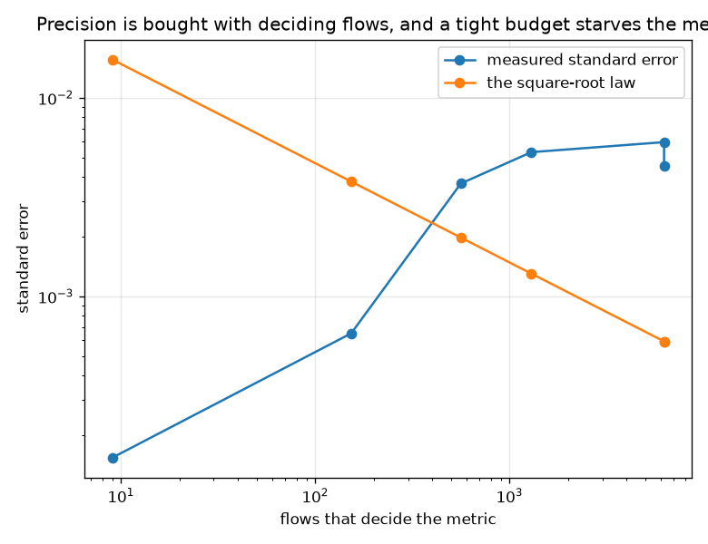

# NetSentry -- How Big Does a Difference Have to Be?

_Percentile bootstrap over 24,957 later-day flows (6,237 attacks, 18,720 benign), a paired variant, and an exact permutation null. Regenerate with `netsentry power`._

## Why this report exists

This project reports differences constantly -- a model against a baseline, a defence against an attack, this wave against the last -- and almost always as a point estimate. A number like "+1.2 points of detection" is a finding only if it is larger than the wobble a second sample of the same traffic would produce, and nobody had measured that wobble.

The [seed-sensitivity study](seed_variance.md) measured the other half: the noise from *training* the same configuration twice. This is the half from *evaluating* -- the test split is one finite sample, and every metric read off it is a random variable whose spread depends on the sample size and on the metric's own construction, not on the model.

**The false-positive budget this whole project is organised around is decided by 9 flows.**

At the tightest budget the deployed threshold lets 9 benign flows through out of 18,720. That is what the realised false-positive rate is measured from, so its 95% interval is [0.021%, 0.080%] around a value of 0.048% -- an uncertainty of **90% of the quantity itself**. Every claim in this repository that a budget was respected rests on a count small enough to fit in a sentence.

Detection at the same budget is better but not by as much as its four decimal places suggest: 561 of 6,237 attacks clear the cut, so a difference in that number has to reach **1.0%** before a two-sided 5% test would find it four times in five. ROC-AUC, which integrates over every threshold and therefore uses all 6,237 attacks, resolves to 0.0127 -- 2% of its value against 12%. **Tightening a false-positive budget does not only lower the detection rate; it lowers the precision with which the detection rate is known.**

**Put this repository's own published differences against that bar and 1 of 5 do not clear the bar at all, the smallest being -0.190% from [hull.md](hull.md) at 13% of what would be needed; 2 clear it only just -- +0.0170 from [deep_tabular.md](deep_tabular.md) against a bar of +0.0168, a margin of 1.01 to one.** None of those numbers is wrong. They are simply at or below the resolution of the instrument that produced them, and they are quoted elsewhere in this repository without that qualification. The remedy is to say so, which is what the last table does.

One methodological result falls out along the way and is worth more than the rest. Comparing the deployed forest against a logistic-regression challenger on PR-AUC, the **paired** interval around the difference is **2.6 times narrower** than the unpaired one, because two models scored on the same flows share almost all of their sampling noise and it cancels in the difference. Reading two overlapping marginal intervals and concluding 'no significant difference' is the most common way to get this wrong, and the table below measures the factor by which it is wrong.

## What each metric can resolve

| metric | value | 95% interval | standard error | smallest detectable difference | as a share of the value | flows that decide it |
|---|---|---|---|---|---|---|
| PR-AUC | 0.5276 | [0.5178, 0.5402] | 0.0060 | **0.0168** | 3% | 6,237 |
| ROC-AUC | 0.6666 | [0.6584, 0.6749] | 0.0045 | **0.0127** | 2% | 6,237 |
| TPR at a 0.1% budget | 9.0% | [8.3%, 9.7%] | 0.0037 | **1.0%** | 12% | 561 |
| FPR at a 0.1% budget | 0.048% | [0.021%, 0.080%] | 0.0002 | **0.043%** | 90% | 9 |
| TPR at a 1.0% budget | 20.7% | [19.8%, 21.8%] | 0.0053 | **1.5%** | 7% | 1,294 |
| FPR at a 1.0% budget | 0.817% | [0.699%, 0.947%] | 0.0007 | **0.182%** | 22% | 153 |
| alert rate | 5.8% | [5.5%, 6.1%] | 0.0015 | **0.432%** | 7% | every flow |

The last column explains the rest of the table. PR-AUC and ROC-AUC integrate over every threshold, so all 6,237 attacks contribute and the estimate concentrates. A rate at a fixed budget is a proportion over whichever flows clear the cut -- 561 attacks, and only 9 benign flows -- and a proportion estimated from a small numerator is noisy no matter how large the dataset around it is. That is a property of the operating point rather than of the model, and it applies to every fixed-budget number this project publishes.

'Smallest detectable difference' is the minimum effect a two-sided 5% test finds 80% of the time at this sample size: 2.80 standard errors, the sum of the two normal quantiles. It is the number to hold a claim against.

## Paired versus unpaired: the same comparison, two answers

| comparison | difference | paired 95% interval | unpaired 95% interval | how much narrower | permutation p | verdict |
|---|---|---|---|---|---|---|
| PR-AUC | -0.0413 | [-0.0470, -0.0351] | [-0.0569, -0.0260] | **2.6x** | 0.000 | **real** |
| detection at a 0.1% budget | -2.6% | [-3.4%, -1.9%] | [-3.8%, -1.5%] | **1.6x** | 0.000 | **real** |
| detection at a 1.0% budget | -0.353% | [-1.0%, +0.419%] | [-1.8%, +1.1%] | **2.0x** | 0.390 | inside the noise |

Both columns describe the same two models on the same flows. The unpaired interval is what you get by bootstrapping each model separately and subtracting -- which reintroduces exactly the noise that pairing removes, because most of the variation in either model's score is variation in *which flows were drawn*, and that part is common to both. The paired interval is the honest one, and it is the one this project should quote whenever two scorers are compared on a shared split.

The challenger is not a strawman: on this stand-in a plain logistic regression **beats** the deployed forest on PR-AUC, which is a finding the [leaderboard study](leaderboard.md) reports independently and a caveat the model card carries. That makes it a better test of the machinery here than a challenger built to lose would be, because both intervals sit clearly away from zero and the question is how much narrower pairing makes them.

The permutation column is a check on the bootstrap rather than a duplicate of it. It assumes nothing about the shape of the sampling distribution, which matters here: a detection rate at a tight budget is a step function of a handful of order statistics and is not remotely normal. Where the two agree, the interval can be trusted; the comparison of detection rates is done on the models' **alert decisions** rather than their scores, because each model's threshold is calibrated to its own score scale and swapping a score without its threshold would compare nothing.

## This project's own published differences, against the bar

| report | difference | what it claims | bar at 80% power | verdict |
|---|---|---|---|---|
| [evaluation.md](evaluation.md) | +0.2570 | the over-optimism gap: stratified split minus temporal | +0.0168 | clears it |
| [operating_point.md](operating_point.md) | +5.3% | MLP trained on partial AUC vs the deployed tree, at the 0.1% budget | +1.0% | clears it |
| [hull.md](hull.md) | +1.2% | the randomised rule's delivered gain at the 0.1% budget | +1.0% | clears it |
| [deep_tabular.md](deep_tabular.md) | +0.0170 | the tree's PR-AUC gain from 1,800 to 12,000 training rows | +0.0168 | clears it |
| [hull.md](hull.md) | -0.190% | the randomised rule's delivered loss at the 1% budget | +1.5% | **inside the noise** |

This is the section the study was built for, and the uncomfortable rows are the point. A difference smaller than the bar is not necessarily absent -- an underpowered test failing to detect an effect is not evidence the effect is zero -- but it is not established either, and quoting it as a result without that caveat is the thing this repository spends most of its effort not doing elsewhere.

The [held-out reuse study](reuse.md) reaches the same conclusion from the other side and in the same wave: it measured a selection cost of +0.0093 PR-AUC against a bootstrap half-width of 0.0211 on the third of the split it used, and said so in its own report. Two studies built a week apart, both concluding that an effect they measured is smaller than the instrument measuring it, is a sign the instrument deserved measuring.

## Scope and honest limits

- **This is sampling noise only.** Refitting the model on the same data with a different seed moves the numbers too, and that is the [seed-sensitivity study](seed_variance.md). The two sources add; neither report claims to bound the other.
- **The bar assumes the published difference was measured on this split at this size.** A claim measured on a subset -- the reuse study used a third of the later days -- faces a wider bar than the one tabulated here, by roughly the square root of the ratio.
- **A percentile bootstrap is not exact.** It is the standard tool and it agrees with the permutation null where both apply, which is the check available without assuming a distribution.
- **Power is about detecting a difference, not about it mattering.** A change of +0.0165 PR-AUC can be statistically resolvable and operationally irrelevant, which is what the [cost study](cost.md) and the [frontier study](hull.md) are for.
- **The claims audited here were entered by hand from other reports.** They are in config with the report each came from, so a reader can check the quotation; nothing parses the reports automatically, and the sample is small and deliberately includes results this wave produced.
