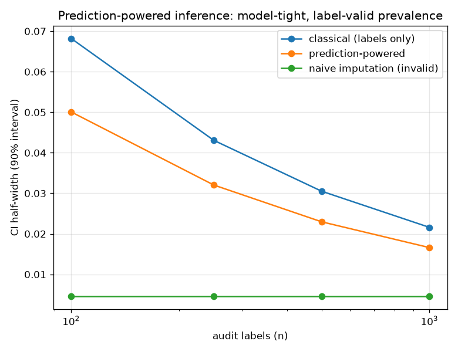

# NetSentry — Prediction-Powered Inference (attack prevalence)

_Synthetic stand-in. Stratified/binary model; the 12,000-flow test set is the
scored population, a random audit of it is labelled, and every interval is a
90% CI. Widths and coverage are averaged over 300 random
audit draws per budget. True test prevalence: **0.221**._

## Why this report exists

A SOC scores every flow but labels almost none. It still needs a defensible estimate of how
much of today's traffic is malicious, with an honest interval. Labelling a small audit and
ignoring the model (classical) is valid but wide; letting the model label everything (naive
imputation) is tight but biased and blind to label uncertainty. Prediction-powered inference
(Angelopoulos, Bates, Fannjiang, Jordan & Zrnic, *Science* 2023) keeps the model's tightness
and the classical validity by correcting the model's estimate with its **measured bias on the
labelled audit** — the rectifier ``mean(f - y)``. The estimate is unbiased whether or not the
model is calibrated, and tighter than classical because a useful model's residual is
lower-variance than the label itself.

## Interval width and coverage vs the audit budget

| audit labels | classical HW | PPI HW | naive HW | classical cov. | PPI cov. | labels saved (x) |
|---|---|---|---|---|---|---|
| 100 | 0.0682 | 0.0501 | 0.0046 | 91% | 91% | 1.8 |
| 250 | 0.0431 | 0.0320 | 0.0046 | 86% | 92% | 1.9 |
| 500 | 0.0305 | 0.0230 | 0.0046 | 90% | 91% | 1.8 |
| 1,000 | 0.0216 | 0.0166 | 0.0046 | 91% | 91% | 1.8 |

At 1,000 audit labels the prediction-powered interval is **23% narrower** than the classical one (0.0166 vs 0.0216) — the model's residual carries information the raw label does not, worth about **1.8x the labels** at this budget. Both classical and PPI cover the true prevalence at roughly the nominal 90% (91% for PPI) — the tightening is free of validity cost. Naive imputation is the cautionary column. Its point estimate is the model's own mean score, 0.273 against a true prevalence of 0.221 (a +0.053 bias), and its interval — the same every audit because it never looks at a label — is far too narrow at 0.0046, so it misses the truth. It treats model outputs as ground truth; PPI treats them as a lead to be checked against real labels, which is exactly why only PPI's confidence is earned.

## Scope

The estimand here is a **mean** (prevalence); PPI extends to quantiles, regression
coefficients and other convex M-estimation problems by the same rectifier construction, but
the mean is the SOC-relevant one and keeps the demonstration exact. The study runs on the
exchangeable stratified split on purpose: PPI's validity assumes the labelled audit is a
random sample of the scored population, so under the temporal split — where the audit day and
the scored day differ — the rectifier estimated on one distribution would not correct the bias
on another, and the guarantee would not hold. That is not a limitation of PPI so much as a
restatement of this project's thesis: the honest interval is only as honest as the
exchangeability behind it.