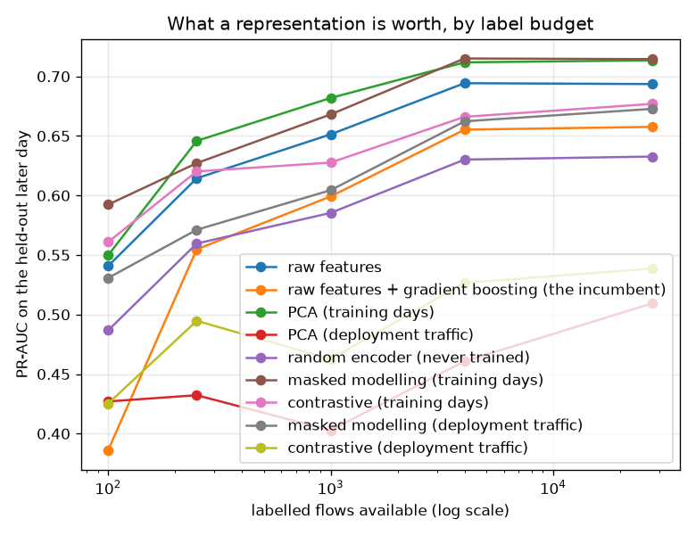

# NetSentry — Self-Supervised Pretraining, With the Controls Attached

_Masked-feature modelling (VIME, Yoon et al. 2020) and contrastive learning (SCARF, Bahri et al.
2022) against PCA, an untrained encoder and the deployed boosted trees, over label budgets from
100 to 28,034. Evaluated on 15,300 held-out later-day
flows (38.6% attacks)._

## Why this report exists

Four studies here already attack the label shortage — [active learning](active_learning.md),
[self-training](selftrain.md), [weak supervision](weak_supervision.md), [PU
learning](pu_learning.md) — and all four take the representation as given. Self-supervised
pretraining is the fifth answer and the only one that changes the *inputs*: learn from
unlabelled flows, of which a network has an unlimited supply, then fit a small head on whatever
labels exist.

Both pretext tasks share one corruption operator: replace a random subset of a row's features
with values drawn from the same column elsewhere in the pool, so every corrupted row is
marginally plausible and jointly wrong. Masked modelling asks the encoder which features were
corrupted (and to reconstruct them); contrastive learning asks it to keep a row closer to its own
corrupted view than to 511 other flows in the batch.

## Label-efficiency curves

| representation | 100 labels | 250 labels | 1,000 labels | 4,000 labels | 28,034 labels |
|---|---|---|---|---|---|
| raw features | 0.541 | 0.614 | 0.651 | 0.694 | 0.694 |
| raw features + gradient boosting (the incumbent) | 0.386 | 0.555 | 0.599 | 0.655 | 0.658 |
| PCA (training days) | 0.550 | 0.646 | 0.682 | 0.712 | 0.713 |
| PCA (deployment traffic) | 0.427 | 0.432 | 0.403 | 0.461 | 0.510 |
| random encoder (never trained) | 0.487 | 0.560 | 0.585 | 0.630 | 0.633 |
| masked modelling (training days) | 0.592 | 0.627 | 0.668 | 0.715 | 0.715 |
| contrastive (training days) | 0.561 | 0.620 | 0.628 | 0.666 | 0.677 |
| masked modelling (deployment traffic) | 0.531 | 0.571 | 0.604 | 0.662 | 0.673 |
| contrastive (deployment traffic) | 0.425 | 0.495 | 0.463 | 0.527 | 0.539 |

At **100 labels** the best representation is `masked modelling (training days)` at 0.592 PR-AUC, against 0.541 for a linear probe on the raw features and 0.386 for the deployed gradient-boosting family. At **28,034 labels** the leader is `masked modelling (training days)` at 0.715.

The controls are the story, and they cut both ways. A **randomly initialised encoder** — never trained on anything — scores 0.487 at the smallest budget, which is *below* the raw features: the width alone does not help, so the gains above it are not an artifact of projecting 76 columns into 64. But **PCA on the same unlabelled pool** scores 0.550 at 100 labels and 0.713 at 28,034 — against 0.592 and 0.715 for the best self-supervised arm. Read those four numbers as a pair of gaps: **+0.043 at the small budget and +0.001 at the large one.**

That is the honest summary of what pretraining bought here: **label efficiency, not a better ceiling**. Thirty epochs of masked-feature modelling beat a matrix decomposition that costs forty milliseconds, by a margin that exists when labels are scarce and evaporates once they are not. A study reporting only the full-label column would conclude self-supervision does nothing; one reporting only the small-budget column, and omitting PCA, would conclude it does far more than it does.

Expressed as label efficiency: the raw-feature baseline needs about **1.9x** as many labels to reach what `masked modelling (training days)` achieves with 100. That is the number worth carrying, because a label budget is the thing a SOC actually negotiates.

## Which unlabelled pool?

The second variable is which unlabelled traffic the encoder sees. Pretraining on the **training days** (20,000 flows) is the standard setup; pretraining on **deployment traffic** (9,657 flows from the earlier test day, inputs only, labels never touched) is the one that should matter here, because this project's temporal gap is concept shift and unlabelled deployment traffic is the only free thing that sees it. At the smallest budget, masked modelling scores 0.592 on the training pool against 0.531 on the deployment pool; contrastive scores 0.561 against 0.425.

**Every deployment-pool arm loses, and the premise is what failed rather than the method.** The argument for pretraining on fresher traffic assumes 'later in time' is a proxy for 'the distribution you will be scored on'. On this capture it is not: Thursday carries Web Attack and Infiltration, Friday carries Bot, DDoS and PortScan, and the two share **no attack class at all** — the same structure the [open-set study](openset.md) found between training and test. A representation shaped by Thursday is shaped by the wrong day's traffic, and the PCA arm makes this legible: its components are the directions of greatest variance in Thursday's traffic, and fitting a linear probe in them collapses to 0.427. The deployment pool is also smaller (one capture day against three), so it is being asked to do more with less. The takeaway is not 'do not pretrain on deployment traffic'; it is that unlabelled *recency* is not the same asset as unlabelled *representativeness*, and on a capture whose attack mix turns over daily, only the second one is worth anything.

The evaluation split is worth stating precisely, because the tempting version of this experiment is invalid. The pool is **Thursday** and the evaluation set is **Friday** — strictly later, entirely disjoint, different attack families. Splitting the test days at random instead would have put flows from the same attack burst into both the pretraining pool and the evaluation set, and near-duplicate rows across a split boundary is the exact failure mode this project's [splitting rules](../../.claude/rules/ml.md) exist to prevent. It would also have produced a much better number.

## Detection at an operating point, and why the small columns are an upper bound

The detection table is at a **1%** false-positive budget rather than the project's usual 0.1%, and the small-budget columns come with a caveat that is arithmetic rather than judgement. Certifying `P(FPR > alpha) <= delta` from an order statistic needs at least `log(delta) / log(1 - alpha)` benign flows — **299** of them at this budget — so a practitioner with 100 labels cannot place this operating point at all, let alone certify it, whatever their representation. The numbers below are computed with the threshold read off the evaluation set itself, which makes them an upper bound and not a deployable figure. Reading them as achievable would repeat the mistake the [Neyman-Pearson study](neyman_pearson.md) exists to document.

| representation | 100 labels | 250 labels | 1,000 labels | 4,000 labels | 28,034 labels |
|---|---|---|---|---|---|
| raw features | 8.6% | 13.4% | 17.7% | 21.7% | 21.7% |
| raw features + gradient boosting (the incumbent) | 0.0% | 7.9% | 15.2% | 19.4% | 22.8% |
| PCA (training days) | 9.8% | 17.3% | 22.6% | 24.9% | 24.8% |
| PCA (deployment traffic) | 2.9% | 1.9% | 1.5% | 2.7% | 4.9% |
| random encoder (never trained) | 4.6% | 9.5% | 11.1% | 13.0% | 13.9% |
| masked modelling (training days) | 13.6% | 15.8% | 21.2% | 24.7% | 25.3% |
| contrastive (training days) | 12.1% | 16.0% | 19.6% | 21.7% | 22.6% |
| masked modelling (deployment traffic) | 6.1% | 7.7% | 14.5% | 18.7% | 20.1% |
| contrastive (deployment traffic) | 2.2% | 5.9% | 5.5% | 7.6% | 8.8% |

One row deserves attention on its own. The **deployed model family** — gradient boosting on raw features — detects 0.0% at 100 labels against 8.6% for a *linear* probe on the same features, and only reaches 22.8% with all 28,034. It is the worst arm in the table at small budgets and never clearly the best at large ones. That is not a bug in this study; it is the [leaderboard's](leaderboard.md) finding arriving again from the label-budget direction. On a split where the test days share no attack class with training, capacity spent fitting the training families precisely is capacity spent on families that will not reappear, and with a hundred labels there is nothing for a boosted forest to fit but noise. The practical reading for a team standing up detection with a small labelled set: the model family that wins at scale is not the one to start with.

## What each representation costs

| representation | unlabelled pool | dimensions | epochs | build time |
|---|---|---|---|---|
| raw features | none | 76 | - | n/a |
| raw features + gradient boosting (the incumbent) | none | 76 | - | n/a |
| PCA (training days) | training days | 64 | - | 0.0 s |
| PCA (deployment traffic) | deployment traffic | 64 | - | 0.0 s |
| random encoder (never trained) | none | 64 | - | n/a |
| masked modelling (training days) | training days | 64 | 30 | 13.0 s |
| contrastive (training days) | training days | 64 | 30 | 27.2 s |
| masked modelling (deployment traffic) | deployment traffic | 64 | 30 | 7.7 s |
| contrastive (deployment traffic) | deployment traffic | 64 | 30 | 16.0 s |

## Scope and honest limits

- **The probe is linear, deliberately.** That is the standard self-supervised evaluation
  protocol: it measures what the representation *separates*, not what a flexible model can
  recover from any representation. The boosted row is in the table so the comparison against
  what this project actually deploys is visible, but it is not a like-for-like head.
- **No fine-tuning arm.** Unfreezing the encoder and training end-to-end usually beats a linear
  probe and would need its own validation split carved out of an already tiny label budget —
  the honest version of that experiment is a separate study, not an extra column here.
- **One architecture, one corruption rate.** Both pretext tasks share the encoder and the
  corruption operator so the comparison is between *objectives*. A tuned corruption rate per
  method would very likely move the ordering; tuning it on the evaluation set would move it
  more, and dishonestly.
- **The pools are not the same size.** The deployment pool is one capture day and the training
  pool is three, so 'deployment traffic' is being asked to do more with less. The cost table
  carries the sizes.
- **This is a 60k-row synthetic stand-in.** Self-supervision is a data-hungry technique whose
  published gains come from pools orders of magnitude larger than anything here, so a null
  result on this data is evidence about this data, not about the technique.