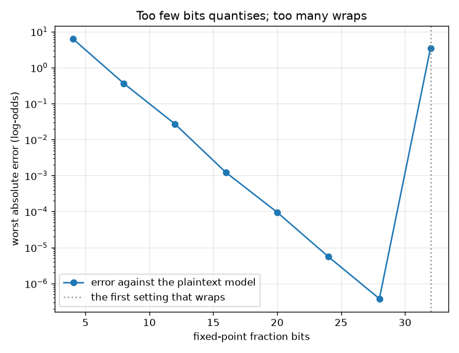
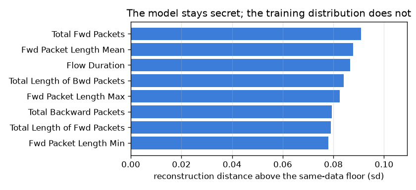

# NetSentry — Scoring a Flow Neither Party Will Show the Other

_Two-party additive secret sharing with Beaver triples, implemented on numpy over a
31-bit prime field, evaluating an additive model with 76
features and 16 bins each. Correctness, cost and leakage all measured; the attack
on it is executed. Regenerate with `netsentry privateinfer`._

## Why this report exists

`/predict` has a privacy structure nobody writes down. The client uploads 76
features of its own network traffic; the server replies with a verdict from a model it will not
share. Both sides give something up, and for a managed-detection provider that *is* the
commercial arrangement -- customers hand over telemetry, the vendor keeps the detector.

Secure two-party computation removes it. Every secret is split into two shares that are
individually uniform; multiplication uses a preprocessed random triple (Beaver, CRYPTO 1991) so
that the only values ever revealed are one-time-padded masks.

**Neither party has to show the other anything, and it costs 38 KB and one round.**

The client's flow becomes 76 one-hot selectors, the server's model stays 1,216 secret table entries, and a single batched opening of masked values produces additive shares of the score. The result matches the plaintext model to 4e-07, and every field element the server observes passes a uniformity test at p = 0.91 -- against a deliberately broken variant that fails the same test at p = 0.0000.

The reason it is this cheap is the *model*, not the protocol. An additive model is a sum of table lookups, a lookup is an inner product with a selector, and because one operand is a selector rather than a value the fixed-point scale survives the multiplication -- **no truncation step, and a circuit one multiplication deep**. The [glass box](gam.md) turns out to be the private box, for a structural reason rather than a coincidence.

Then the two things it does not protect, both measured. The bin edges must be public for a client to bin its own flow, and those edges are a quantile summary: reconstructing the training marginals from them lands **0.084 sd** above the floor two halves of the real data would show. The model stays secret; the training distribution does not. And against a *malicious* client the guarantee inverts entirely -- secret sharing hides the input so completely that the server cannot check it **is** an input, and 1,217 crafted queries (2.5 MB) read the whole model out to 5e-05.

Of the 8 encodings swept, 3 land inside 1e-3 of the plaintext score without wrapping. Both ends of the sweep fail, and they fail differently.

## Does it compute the right answer?

| fraction bits | worst error against the plaintext model | headroom before the sum wraps | verdict |
|---|---|---|---|
| 4 | 6.37e+00 | 2.05e+07x | safe |
| 8 | 3.62e-01 | 1.28e+06x | safe |
| 12 | 2.71e-02 | 8e+04x | safe |
| 16 | 1.21e-03 | 5e+03x | safe |
| 20 | 9.52e-05 | 312x | safe |
| 24 | 5.57e-06 | 19.5x | safe |
| 28 | 3.77e-07 | 1.22x | safe |
| 32 | 3.50e+00 | 0.0763x | **wraps** |

Fixed-point encoding has two failure modes and they are not the same failure.
At 4 bits the error is 6.37 -- the score is quantised past usefulness, but it is still
*approximately* right, and a system watching its own accuracy would notice.
At 32 bits the sum passes half the prime and **wraps**, which is not a large error but a different number entirely: a
benign flow can decode as a confident attack, silently, with no signal that anything went
wrong. The headroom column separates the two, and it is the reason this is swept rather than
picked.

Inside the window the protocol is **arithmetically exact** up to that quantisation, because
nothing here needs the usual probabilistic truncation. Multiplying two fixed-point numbers
doubles the scale and normally requires a correction that is either expensive or occasionally
wrong; here one operand of every product is a 0/1 selector, so the scale is preserved. That is a
property of evaluating an *additive* model, and it is the strongest practical argument this
project has found for the glass box.

## What it costs

| quantity | value | against |
|---|---|---|
| online traffic | **38.0 KB** | one round, 1,216 multiplications |
| preprocessing (Beaver triples) | **57.0 KB per flow** | delivered before the flow arrives, and usable once |
| latency | **1.2 ms** | 1.6x the plaintext model's 0.73 ms |
| rounds of interaction | **1** | the whole inference is one batched opening |

Worth putting beside the other end of the same trade: a [proof-carrying verdict](attestation.md)
costs 392 KB and answers "did the committed model produce this score". A private verdict costs
38 KB and answers "can this score be produced without either side
seeing the other's secret". **Privacy is an order of magnitude cheaper than verifiability
here**, and for the same underlying reason -- one scales with the number of *table entries*, the
other with the number of *trees*.

The latency ratio is the least interesting number in the table and is included so that it
cannot be quoted alone: the plaintext model is itself microseconds of numpy, so a
1.6x slowdown on a sub-millisecond baseline
says almost nothing. The bytes and the preprocessing are the real cost, and the preprocessing is
**single-use** -- a triple consumed on one flow cannot be reused on the next without destroying
the guarantee, which the next section demonstrates.

## What the server actually sees

| what is observed | field elements | uniformity p-value | reading |
|---|---|---|---|
| the masked values the server opens, over many flows | 72,960 | 0.9110 | uniform: consistent with a one-time pad |
| **a deliberately broken variant** that reuses one mask | 35,264 | 0.0000 | **not uniform**: differences of masked selectors leak the inputs |

Everything opened during an inference is a secret plus a fresh uniform field element, so it
should be uniform and carry nothing. It is
(p = 0.91 over 72,960 elements).

A clean result on its own would prove nothing -- a test that has never failed is
indistinguishable from one that cannot -- so the same test is run against a variant that reuses
one triple across flows, which is the single most common way this family of protocols is
broken in practice. It fails at
p = 0.0000: differences of masked selectors cancel the
shared mask and expose the inputs directly. The test can fail, and that is what makes the
passing row worth reading.

## What is not protected, one: the edges are public

| feature | reconstruction distance (sd) | same-data floor | excess |
|---|---|---|---|
| `Flow Duration` | 0.108 | 0.021 | **0.087** |
| `Total Fwd Packets` | 0.105 | 0.014 | **0.091** |
| `Total Backward Packets` | 0.093 | 0.014 | **0.079** |
| `Total Length of Fwd Packets` | 0.099 | 0.020 | **0.079** |
| `Total Length of Bwd Packets` | 0.097 | 0.013 | **0.084** |
| `Fwd Packet Length Max` | 0.096 | 0.013 | **0.083** |
| `Fwd Packet Length Min` | 0.098 | 0.020 | **0.078** |
| `Fwd Packet Length Mean` | 0.103 | 0.015 | **0.088** |

The client has to bin its own flow before it can build a selector, and it cannot do that
without the cut points. Those cut points are **quantiles of the training traffic**, so
publishing them publishes a quantile summary -- and a client can invert it by drawing uniformly
inside each bin.
The worst case here is `Total Fwd Packets`, reconstructed to 0.091 sd above the floor.

This is a real and separable leak: **the model stays secret and the training distribution does
not.** It is also fixable, at a price -- fixed public bins (a grid nobody derived from the
data), or moving the binning inside the protocol with an oblivious comparison, which trades the
one-round property away.

## What is not protected, two: the client can simply ask

The protocol's guarantee is against an **honest-but-curious** client, and that assumption is
doing far more work than it looks. Secret sharing hides the client's vector so completely that
the server cannot verify it is a *selector* rather than an arbitrary field vector. A client that
sends the unit vector on one feature and zeros everywhere else receives
`intercept + f_j[i]`: one table entry, in the clear, from a query the server has no way to
refuse.

**1,217 such queries recover the entire model**, to
5e-05, for 2.5 MB of traffic. The attack is
executed here rather than described, and it is strictly stronger than the query-only
[extraction attack](extraction.md) this project already measures -- there the adversary
approximates a model from valid flows; here it *reads* it, because the input space it is
allowed to use is the field rather than the space of flows.

The fix is not more secret sharing. It is malicious security: the client must **prove** its
input is well-formed, with a zero-knowledge argument that each block is one-hot. That is
implementable and it is a different protocol with a different cost, and naming it is more useful
than pretending the honest-but-curious model covers a paying customer.

## Scope and honest limits

- **Honest-but-curious, with a trusted dealer.** Triples are generated by a third party here.
  A deployment would produce them with oblivious transfer or homomorphic encryption during a
  preprocessing phase, which changes the cost of the offline column and nothing about the
  online one.
- **The model is the additive one, and it detects less.** The [glass-box study](gam.md) prices
  that: PR-AUC 0.480 against the deployed ensemble's 0.529 on the honest split. Privately
  evaluating the ensemble would need secure comparisons -- garbled circuits or an oblivious
  tree traversal -- and is a much larger protocol.
- **The verdict is revealed, which is the point and also a channel.** The client learns the
  score, which is what it came for and also what makes the extraction attack above possible at
  all. No protocol in this family hides its own output.
- **Nothing here hides that a query happened**, or when, or how often. Traffic analysis over the
  query stream is outside the model and is a real channel for a detection service, whose query
  volume is itself a signal about the customer's incidents.
- **The field is 31 bits**, chosen so products stay inside a signed 64-bit
  integer and the whole protocol runs in numpy. A production implementation would use a larger
  field and a constant-time backend; the accounting scales, the argument does not change.