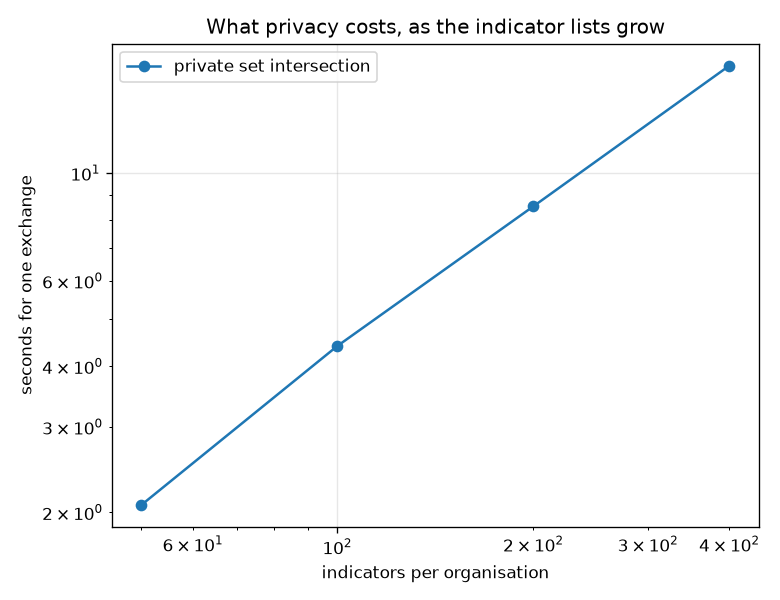

# NetSentry — Asking Without Telling: Private Indicator Sharing

_Diffie-Hellman private set intersection over RFC 3526 group 14, run between two organisations'
indicator lists (400 and 370 addresses), with the
dictionary attack on hash-based sharing executed and the inflation attack on PSI executed too._

## Why this report exists

This project already exports what it detects — [Sigma rules](sigma/README.md) for a SIEM, STIX
2.1 bundles for an intel platform — and both assume the decision to share has been made. The
step before it is the one nobody instruments: **asking a peer whether they have seen an
indicator tells them you are interested in it**, which is a statement about your incident.

## Does it work?

Organisation A holds 400 indicators derived from its own detections on Friday; organisation B holds 370 from Thursday, of which 40 are infrastructure the same actor reused against both. The protocol recovers the intersection **exactly** — every shared indicator found, nothing else reported: 40 of 40 shared indicators, in 17.16 seconds.

What B learns is nothing. What A learns is which of *its own* indicators B also holds — not how many others B has beyond the list size, not what they are. Every value B sends is `M(y)^beta` for a secret `beta` A does not have, which is a uniform element of a 2048-bit prime-order subgroup: there is no dictionary attack against it, because the attacker cannot compute the blinded form of a guess.

## What the usual practice leaks

The practice this replaces is exchanging **hashes** of indicators, which feels private and is not. A hash is only one-way when the input is unguessable, and an IPv4 address is a 32-bit number. Enumerating addresses against a hashed list runs at 151,749 candidates a second here — measured with the address formatting included, because a bare `sha256` benchmark (290,127/s) overstates what the attacker gets — so the **entire IPv4 space costs 7.9 hours on one laptop core**, after which every address in the list is recovered with certainty. Not probably: certainly, because the space is finite and the map is deterministic. A compiled implementation or a GPU turns hours into minutes, and neither is exotic.

The table runs the *complete* attack against a smaller space so the machinery is visible rather than argued, plus a real timed slice of the address space:

| hashed indicator space | universe | preimages recovered | time | verdict |
|---|---|---|---|---|
| TCP/UDP port (2^16) | 65,536 | 50 / 50 | 0.41 s | **fully recovered** (the space was exhausted) |
| TCP/UDP port (2^16) — **salted** | 65,536 | 50 / 50 | 0.28 s | **fully recovered** (the space was exhausted) |
| IPv4, 400,000 consecutive addresses | 400,000 | 1 / 400 | 2.64 s | a 0.0093% slice of the space, so the rest is arithmetic rather than an obstacle |

The salted row is the one worth dwelling on, because 'just salt it' is the standard response and it does not work here. A salt defeats precomputation by an *outsider*; in an indicator-sharing group every participant must use the **same** salt or no two hashes would ever match, so every participant — and anyone who joins, or who obtains the group's documentation — can run exactly the attack above. The salted list falls in 0.28 seconds, the same as the unsalted one.

## The attack on the protocol itself

The protocol is secure against an honest-but-*curious* participant and says nothing about a dishonest one, so the obvious attack is to lie about the input. A party that submits 1,600 candidate indicators instead of the 40 it actually holds gets back every one of them that the peer also has — 370 hits, a **100% yield** on the reachable indicators and no signal to the peer that anything unusual happened. The cryptography performs perfectly throughout. Nothing was broken; the assumption that inputs are truthful was never in force.

One thing this table is *not* measuring, and the distinction matters: how good an attacker's guesses are. That depends entirely on how enumerable the indicator type is — trivial for addresses, hopeless for long random tokens — and on this stand-in, whose addresses are drawn independently per flow, a genuine guess would hit nothing at all. The candidate universes below are constructed to contain a known share of the peer's list precisely so the measured quantity is the *protocol's* response to inflation: it has none. The yield is total at every size.

| indicators submitted | genuinely held | reachable in the universe | learned | yield | share of the peer's list |
|---|---|---|---|---|---|
| 115 | 40 | 40 | 40 | **100%** | 11% |
| 400 | 40 | 100 | 100 | **100%** | 27% |
| 1,600 | 40 | 370 | 370 | **100%** | 100% |

The mitigations are all outside the protocol, which is the honest way to state them: cap the input size and make both parties commit to it before the exchange; use a cardinality-only variant (PSI-CA) so the initiator learns *how many* indicators are shared and not which; or require indicators to be signed by a source that will not sign a guess. A sharing agreement that specifies none of these has adopted a protocol and not a policy.

## What it costs

| indicators each | modular exponentiations | PSI wire bytes | hash-exchange bytes | overhead | seconds |
|---|---|---|---|---|---|
| 50 | 200 | 38,400 | 3,200 | 12x | 2.07 |
| 100 | 400 | 76,800 | 6,400 | 12x | 4.40 |
| 200 | 800 | 153,600 | 12,800 | 12x | 8.55 |
| 400 | 1,600 | 307,200 | 25,600 | 12x | 16.66 |

Privacy costs 12x the bandwidth of a hash exchange (a 2048-bit group element against a 256-bit digest) and 16.7 seconds of CPU at 400 indicators a side, against 2.07 seconds at 50. The scaling is linear in the list size and entirely dominated by modular exponentiation — every other step is a hash or a set lookup.

The honest engineering note is that this group is the slow choice. A 2048-bit finite-field exponentiation is roughly an order of magnitude more work than the equivalent operation on a 256-bit elliptic curve, and the same protocol runs unchanged on one; it is used here because the group is already verified in this repository's test suite and because a from-scratch curve implementation would be a much larger surface to get subtly wrong. Read the seconds as an upper bound on a laptop, not as the cost of the idea.

## Scope and honest limits

- **The overlap is constructed, and it has to be.** This stand-in draws each flow's addresses
  independently, so two organisations' indicator lists intersect in exactly zero elements — a
  measured intersection here would be a measurement of the generator. The lists are built from
  real attack destinations in the capture and then given a documented overlap, standing in for
  the scenario that makes sharing worth doing: two victims of one actor, sharing the
  infrastructure that actor reused.
- **One-sided output, honest-but-curious model.** A learns the intersection and B learns
  nothing; making it two-sided is one extra message. Neither party is protected against the
  other lying about its input, which is the inflation attack above, and neither is protected
  against a party that simply publishes the result afterwards.
- **Set sizes leak.** Both parties learn the other's list size, which is not nothing: a peer
  whose indicator list triples overnight is a peer having an incident. Padding to a fixed size
  is the standard fix and costs exactly what the padding costs.
- **This is set intersection, not intelligence.** Two organisations sharing an IP address are
  sharing the weakest possible indicator; the [MITRE mapping](mitre.md) and
  [incident reports](incident_demo.md) are where behaviour rather than infrastructure gets
  described, and behaviour does not fit in a set-intersection protocol.
- **The group is verified, the implementation is not certified.** The modulus and generator are
  checked by Miller-Rabin in the test suite, the exponents come from the seeded project RNG so
  the report is reproducible, and a deployment would need an OS CSPRNG, an authenticated
  channel, and constant-time arithmetic — none of which is what this report measures.