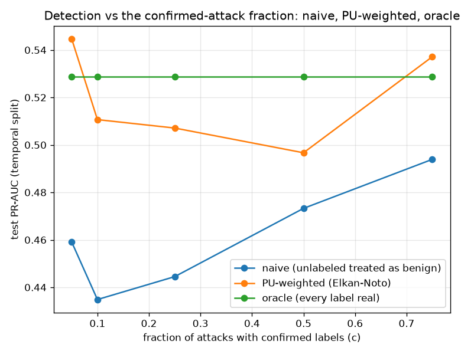

# NetSentry — Positive-Unlabeled Learning (the labels a SOC actually has)

_Synthetic stand-in. Honest temporal/binary split: 28,034 training flows
(attack prevalence 0.200), 24,957 test flows. Confirmed
labels are drawn SCAR from the attacks; everything else is unlabeled, never "benign"._

## Why this report exists

Every supervised number in this suite assumes someone verified the benign side of the
training pool. A real deployment has confirmed attacks (incident tickets) and an unlabeled
remainder that *contains the attacks nobody caught*. Treating that remainder as benign is
what a team does implicitly; PU learning (Elkan & Noto, KDD 2008) does it explicitly: under
SCAR, the labeled-vs-unlabeled classifier `g` relates to the true posterior through one
estimable constant `c = p(labeled | attack)`, which buys corrected scores, a hidden-attack
prevalence estimate, a principled weighted retrain, and a de-contaminated FPR denominator.

## The sweep: estimator recovery and detection

| confirmed fraction c | labeled attacks | c_hat | est. prevalence | naive PR-AUC | PU-weighted PR-AUC |
|---|---|---|---|---|---|
| 0.05 | 280 | 0.017 | 0.412 | 0.459 | 0.545 |
| 0.10 | 559 | 0.033 | 0.462 | 0.435 | 0.511 |
| 0.25 (headline) | 1,398 | 0.126 | 0.360 | 0.445 | 0.507 |
| 0.50 | 2,796 | 0.269 | 0.355 | 0.473 | 0.497 |
| 0.75 | 4,195 | 0.418 | 0.353 | 0.494 | 0.537 |

`c_hat` misses the true confirmed fraction by 0.157 on average — the estimator inherits `g`'s calibration (Elkan & Noto's stated dependence), and an uncalibrated gradient-boosted `g` pays for it here; the same failure axis the [label-shift](label_shift.md) study found for MLLS vs BBSE. The prevalence estimate `E[g]/c` inherits that same bias — it overshoots the true training attack rate (0.200) by 0.189 on average, in the direction the underestimated `c_hat` forces (dividing `E[g]` by too small a constant). The point estimates that divide by `c_hat` therefore read as an order-of-magnitude sanity check on the hidden-attack mass, not a calibrated prior — while the *ranking* product below (the weighted retrain) survives the same `c_hat` error, because it never divides by it as sharply.

At the headline fraction (c = 0.25, 1,398 confirmed attacks), the naive model lands PR-AUC 0.445 against the oracle's 0.529 — a 0.084 cost of training with the missed attacks planted on the benign side. The Elkan-Noto weighted retrain recovers 0.063 of it (PR-AUC 0.507) by letting each unlabeled flow be partly positive instead of definitely benign.

Ranking note, stated plainly: the Elkan-Noto *score correction* `g/c` is monotone, so it
cannot move PR-AUC by construction — the correction buys calibration (thresholds,
prevalence, costs), and only the *weighted retrain* can move ranking.

## The operating point: three cuts on one model

Thresholds chosen on validation at the 1.0% FPR budget; realized on the
temporal test split against true benign traffic. Apparent FPR under naive bookkeeping:
0.0093.

| threshold policy | realized FPR (true benign) | detection (TPR) |
|---|---|---|
| naive bookkeeping (unlabeled = benign) | 0.0006 | 0.9% |
| PU-corrected denominator | 0.0210 | 15.0% |
| oracle (true validation labels) | 0.0090 | 9.1% |

At the 1.0% budget the naive bookkeeping believes its cut costs 0.0093 FPR, but the hidden attacks in its 'benign' denominator are doing part of the scoring: against *true* benign traffic the same cut realizes 0.0006 — over-tightened 14.5x, silently spending detection: it alerts on just 0.9% of attacks where the oracle cut, at the same true budget, reaches 9.1%. That waste is the headline: a contaminated denominator makes a SOC believe it has spent a budget it has barely touched. Re-pricing the denominator with the estimated benign mass (same model, same scores) fixes the direction — detection climbs to 15.0%, but *overshoots* the budget to 0.0210 realized FPR (2.1x over), because the same underestimated `c_hat` understates the benign mass and relaxes the cut too far. The correction moves the operating point the right way; landing it *on* budget needs the calibrated `g` (the isotonic step the calibration module already ships) this deliberately withholds to keep `c` estimable — the honest limit, named.

## Scope

SCAR is an assumption, stated: confirmed labels arrive independently of the flow's features.
Real triage is biased toward the obvious (the loud DDoS gets a ticket, the quiet
exfiltration does not), which violates SCAR in the direction of overestimating `c` on the
easy attacks — the SAR generalisation is the named next step. `c_hat` inherits `g`'s
calibration, and this report audits rather than assumes it. The oracle column is the ceiling
this suite reports everywhere else; the honest reading of this study is the *gap* a
confirmed-only labeling regime opens, and how much of it the PU machinery closes with zero
additional labels.