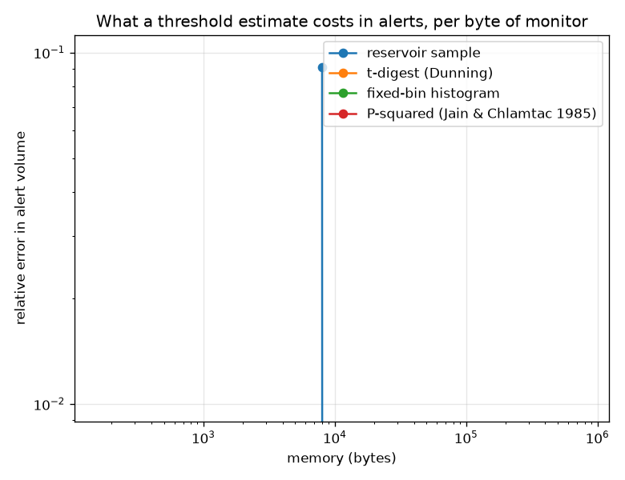

# NetSentry — Estimating the Threshold's Quantile at Line Rate

_Four streaming quantile estimators built from scratch and graded against the exact
0.999 quantile of a 200,000-score benign stream, then re-graded in the
unit that matters: the alert volume each threshold actually delivers on 18,720
held-out benign flows._

## Why this report exists

Every operating point here is a quantile — the score below which 99.9% of benign flows sit —
and every study that re-derives one assumes the scores can be collected, sorted and indexed.
That is true of a test split and false of a stream: sorting requires storing. The
[sketches study](sketches.md) counts in fixed memory but does not estimate quantiles.

## What each estimator buys

| estimator | setting | memory | threshold | realised FPR | alert volume vs target | update |
|---|---|---|---|---|---|---|
| exact (sort everything) | all scores retained | 1.6 MB | 0.98754 | 0.059% | **1.00x** | — |
| reservoir sample | 1,000 samples | 8,000 B | 0.98552 | 0.064% | **1.09x** | 10,483 ns |
| reservoir sample | 10,000 samples | 80,000 B | 0.98754 | 0.059% | **1.00x** | 7,752 ns |
| reservoir sample | 50,000 samples | 400,000 B | 0.98754 | 0.059% | **1.00x** | 7,829 ns |
| P-squared (Jain & Chlamtac 1985) | 5 markers | 160 B | 0.98715 | 0.059% | **1.00x** | 4,465 ns |
| t-digest (Dunning) | compression 50 | 5,376 B | 0.98754 | 0.059% | **1.00x** | 3,798 ns |
| t-digest (Dunning) | compression 200 | 19,056 B | 0.98754 | 0.059% | **1.00x** | 7,633 ns |
| t-digest (Dunning) | compression 1000 | 79,088 B | 0.98754 | 0.059% | **1.00x** | 27,594 ns |
| fixed-bin histogram | 1,000 bins | 8,000 B | 0.98736 | 0.059% | **1.00x** | 2,016 ns |
| fixed-bin histogram | 10,000 bins | 80,000 B | 0.98754 | 0.059% | **1.00x** | 1,759 ns |
| fixed-bin histogram | 100,000 bins | 800,000 B | 0.98754 | 0.059% | **1.00x** | 1,960 ns |

Storing the stream costs 1.6 MB for 200,000 scores and gives the threshold exactly. **9 of the 10 approximations deliver the identical alert volume** — not close, identical, because a threshold anywhere inside the gap between two adjacent benign scores alerts on exactly the same flows.

The cheapest of them is `P-squared (Jain & Chlamtac 1985)` at 5 markers: **160 bytes**, 10,000x smaller than keeping the stream, with no operational error at all. The fastest is `fixed-bin histogram` at 10,000 bins (1,759 ns per update against 4,465). Neither is the t-digest, which is the most sophisticated thing in the table and buys nothing here.

## The error that matters is not the one you measure

The column to read is the alert ratio, not the threshold. A threshold is a number nobody has intuition about; alert volume is what a SOC lead notices on Monday, and the map between them is violently non-linear at this end of the distribution.

`reservoir sample` at 1,000 samples is the worst row here: a threshold of 0.98552 against the exact 0.98754. The estimate is wrong in the **third decimal** and shifts the alert volume by 9%. Every other estimator's error is smaller than the gap between two adjacent benign scores near the threshold, so it changes nothing at all — which is the other half of the same point. Near the 99.9th percentile the score density is minute: errors below the inter-score gap are free, and errors above it move a disproportionate share of the alerts.

That is why this report grades in alert volume rather than in quantile error. A ranking by absolute quantile error would have separated estimators that are operationally identical and understated the one that is not, and it is the same asymmetry the [Neyman-Pearson study](neyman_pearson.md) found from the sample-size side and the [DP-release study](dp_synth.md) found from the noise side: a fixed-FPR operating point is decided entirely in the thin tail.

## The baseline that beats the sketch

**Neither of the two winners is the sophisticated one.** A fixed-bin histogram over [0, 1] delivers the exact alert volume at 8,000 bytes and 2,016 ns per update — the cheapest update in the table by a factor of 1.9 over the t-digest — while P-squared delivers the same volume in **160 bytes**, 50x less memory, for 2.2x the update cost. The t-digest is beaten on both axes at once.

That is an argument about *this quantity* rather than against t-digests. A model's score is bounded in [0, 1] by construction, so a histogram needs no range estimation, no merging and no scale function; a t-digest earns its complexity on unbounded, heavy-tailed streams where the range is unknown and the tail is where the answer lives — request latencies, for instance. Boundedness is exactly the assumption the cheap option needs, and it is free here.

The engineering reading is a question to ask before reaching for a sketch: is the quantity bounded, and is the error budget in the units of the *decision* rather than of the statistic? Both answers here point at an array of counters or five floats, neither of which has failure modes worth debugging at three in the morning.

## What happens when the stream moves

| estimator | threshold after the shift | correct threshold | realised FPR |
|---|---|---|---|
| reservoir sample | 0.98318 | 0.97767 | 0.069% |
| P-squared (Jain & Chlamtac 1985) | 0.98481 | 0.97767 | 0.064% |
| t-digest (Dunning) | 0.98552 | 0.97767 | 0.064% |
| fixed-bin histogram | 0.98551 | 0.97767 | 0.064% |

None of these estimators forgets. Every one integrates the whole stream from the moment it starts, which is the correct behaviour for a stationary quantity and the wrong one for a traffic mix that changes. The drift here is not synthetic: the first half of the stream is validation-day benign traffic and the second half is *test*-day benign traffic, the same distribution change the deployed model already lives with. Each estimator is then asked for the threshold of the second regime alone: `reservoir sample` lands closest (0.98318 against a true 0.97767) and `t-digest (Dunning)` furthest (0.98552), and all of them are anchored by history nobody asked them to keep.

The fix is not a better estimator, it is a **window**: run the sketch over a sliding or exponentially-decayed horizon and accept the variance that comes with a shorter memory. That is a design decision with a cost — the [threshold-refresh study](refresh.md) prices the same trade in labels — and the reason it belongs here is that a monitor which silently averages over a regime change is worse than one that is noisy and current.

## Scope and honest limits

- **The stream is a replayed validation split**, not a capture. It is drawn from the real score
  distribution the deployed model produces and then permuted and repeated to reach a stream
  length worth measuring, which keeps the *distribution* honest and makes the arrival order
  synthetic. Order matters for P-squared and for nothing else here.
- **P-squared estimates one quantile per instance.** Tracking 0.9, 0.99 and 0.999 costs three
  independent estimators, which is still nothing, but the constant-memory claim is per
  quantile rather than per stream.
- **The t-digest is a faithful simplification, not a port.** Merging with the `q(1-q)` scale
  function is the mechanism that matters; the published algorithm has buffer strategies and
  interpolation refinements this does not, so read its row as a lower bound on what a good
  implementation achieves.
- **Nothing here forgets**, and the drift section is about exactly that. A production monitor
  needs a window; every number above describes an estimator integrating from time zero.
- **Update cost is measured in Python**, where a per-element loop costs more than the
  arithmetic inside it. The *ordering* between estimators is meaningful and the absolute
  nanoseconds are an artifact of the language, not of the algorithms.