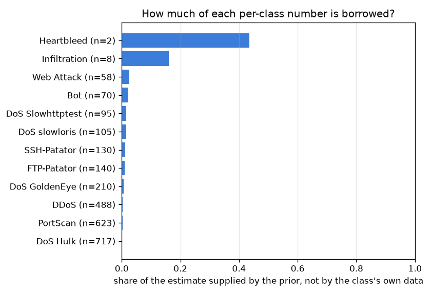

# NetSentry — Rare-Class Detection Rates, Estimated Honestly

_Synthetic stand-in. Per-class detection at the deployed 0.1%-FPR operating
point. Shared Beta prior fitted across all 12 attack classes by empirical Bayes:
`Beta(0.15, 1.39)`, pooled rate 9.7%. Intervals at
95%._

## Why this report exists

The per-class table is the most-read output here and the most easily misread. A detection rate
computed over thousands of flows and one computed over 2 are printed in the same
column, in the same font, with nothing to say that the first is a measurement and the second is
a rumour. Put an interval on them and the problem becomes visible but not solved: a frequentist
interval on a dozen flows spans most of the unit interval, which is honest and useless.

Partial pooling uses what the per-class view discards — the other classes. Each class's rate is
modelled as a draw from a shared Beta prior fitted across all of them, so each posterior is a
compromise between that class's own data and the population it belongs to, weighted by how much
data it actually has. Classes with thousands of flows barely move; classes with a dozen are
pulled most of the way to the pooled rate, which is the right answer, because a dozen flows
genuinely do not distinguish that class from its population.

## Every class, three ways

| class | detected / total | naive rate | Wilson 95% | posterior mean | posterior 95% | borrowed |
|---|---|---|---|---|---|---|
| `DoS Hulk` | 337 / 717 | 47.0% | [43.4%, 50.7%] | 46.9% | [43.3%, 50.6%] | 0% |
| `PortScan` | 96 / 623 | 15.4% | [12.8%, 18.5%] | 15.4% | [12.7%, 18.3%] | 0% |
| `DDoS` | 257 / 488 | 52.7% | [48.2%, 57.1%] | 52.5% | [48.1%, 56.9%] | 0% |
| `DoS GoldenEye` | 4 / 210 | 1.9% | [0.7%, 4.8%] | 2.0% | [0.6%, 4.2%] | 1% |
| `FTP-Patator` | 0 / 140 | 0.0% | [0.0%, 2.7%] | 0.1% | [0.0%, 0.9%] | 1% |
| `SSH-Patator` | 0 / 130 | 0.0% | [0.0%, 2.9%] | 0.1% | [0.0%, 1.0%] | 1% |
| `DoS slowloris` | 0 / 105 | 0.0% | [0.0%, 3.5%] | 0.1% | [0.0%, 1.2%] | 1% |
| `DoS Slowhttptest` | 1 / 95 | 1.1% | [0.2%, 5.7%] | 1.2% | [0.0%, 4.1%] | 2% |
| `Bot` | 0 / 70 | 0.0% | [0.0%, 5.2%] | 0.2% | [0.0%, 1.8%] | 2% |
| `Web Attack` | 0 / 58 | 0.0% | [0.0%, 6.2%] | 0.3% | [0.0%, 2.1%] | 3% |
| `Infiltration` | 0 / 8 | 0.0% | [0.0%, 32.4%] | 1.6% | [0.0%, 13.2%] | 16% |
| `Heartbleed` | 0 / 2 | 0.0% | [0.0%, 65.8%] | 4.2% | [0.0%, 34.6%] | 43% |

The prior is fit to 12 classes at once and lands at a pooled detection rate of 9.7% with a concentration of 1.5 pseudo-flows — that concentration is the whole model, because it is what decides how hard each class is pulled. `Heartbleed`, with 2 test flows, takes 43% of its estimate from the other classes; `DoS Hulk`, with 717, takes 0% and is effectively left alone. That is the behaviour to want: pooling is not a smoothing knob applied uniformly, it is a weighting that vanishes exactly where the data is sufficient. The contrast with the frequentist column is stark on `Heartbleed`, whose Wilson interval spans 66% of the unit interval — technically correct, and useless to anyone deciding whether that class is covered.

## Does the ranking survive?

**8 of 12 classes change position** when the point estimates are replaced by posterior means: `DoS GoldenEye` (4 to 5), `DoS Slowhttptest` (5 to 7), `Bot` (6 to 9), `DoS slowloris` (7 to 10). The largest move is `Heartbleed`, from rank 9 to 4. A per-class leaderboard built on raw rates is, to that extent, a leaderboard of sample sizes — the rare classes swing to the top or the bottom because one flow either way is worth tens of percentage points to them, and nothing to a class with thousands.

## Do the intervals cover what they claim?

A credible interval that does not cover at its stated rate is worse than no interval at all, so
the procedure is tested against data generated from the model it assumes.

| interval | simulated coverage | mean width |
|---|---|---|
| posterior (partial pooling) | 94.9% | 9.7% |
| Wilson score (no pooling) | 96.0% | 13.9% |

Simulating from the fitted prior and re-estimating, the credible interval covers at 94.9% against its nominal 95%, and Wilson's covers at 96.0%. Both are honest; the difference is the price. The Bayesian interval averages 9.7% wide against Wilson's 13.9% — **1.4x narrower for the same coverage** — because it is allowed to use the other classes and Wilson is not. That is the entire argument for pooling, stated as a measurement rather than a preference. The caveat is equally concrete: this coverage is *conditional on the prior being right*, since the simulation draws from the same Beta the estimator assumes. A class that genuinely does not belong to the population — a novel family the detector has no purchase on at all — would be shrunk toward a rate it does not have, and the interval would understate the error.

## What would it take to know?

Sample size required for a class's *own* data to support a plus-or-minus five-point claim at
95%, against what the split actually provides.

| class | test flows | flows needed for +/-5 points | shortfall |
|---|---|---|---|
| `Heartbleed` | 2 | 63 | 61 |
| `Infiltration` | 8 | 24 | 16 |
| `Web Attack` | 58 | 4 | — |
| `Bot` | 70 | 4 | — |
| `DoS Slowhttptest` | 95 | 19 | — |
| `DoS slowloris` | 105 | 3 | — |
| `SSH-Patator` | 130 | 2 | — |
| `FTP-Patator` | 140 | 2 | — |
| `DoS GoldenEye` | 210 | 30 | — |
| `DDoS` | 488 | 384 | — |
| `PortScan` | 623 | 201 | — |
| `DoS Hulk` | 717 | 383 | — |

The rows where the shortfall runs to thousands are the useful ones. They say that no amount of
care in the modelling will produce a trustworthy per-class number for those families on this
dataset — the flows do not exist. The options are to pool (as here), to report the class only as
part of a group, or to collect more data; quietly printing a point estimate is not among them.

## Scope

Empirical Bayes plugs a *point* estimate of the hyperparameters into the posterior, so the
intervals are mildly too narrow — they ignore uncertainty in `(alpha, beta)` itself. A full
hierarchical treatment would put a hyperprior on those and integrate, which with
12 classes would widen the intervals somewhat and change no conclusion here. The
prior is fitted on the same counts it is then applied to, the standard empirical-Bayes
compromise; the shrinkage is therefore slightly optimistic for the class that most influences the
fit. This is the estimation-side complement of the [seed-variance study](seed_variance.md), which
measures the *training* noise under a metric, and of the [per-class slice
report](slices.md), whose point estimates this report is arguing should be read with the
intervals attached.