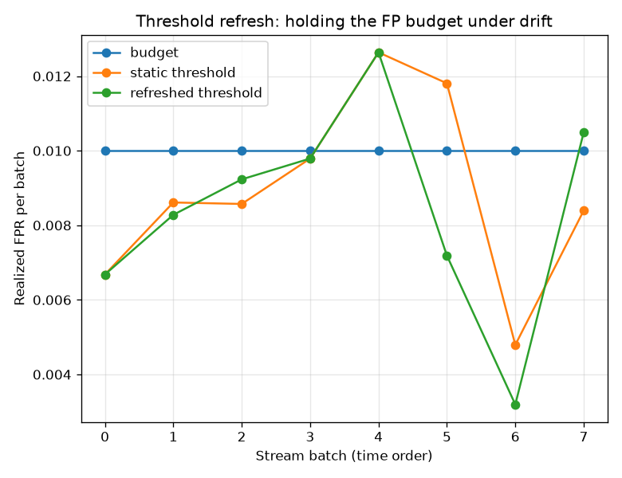

# NetSentry — Threshold Refresh (the cheap lever, priced)

_Synthetic stand-in. Temporal split; the later-day test flows replayed as
8 prequential batches at the 1.0%-FPR
operating point. Refreshed thresholds are re-chosen before each batch on the
trailing 2 labeled batches, always from the **emitted**
(pre-update) scores — the evidence a real alert stream provides — so no model
ever picks its cut on flows it trained on._

## The question

Retraining recovers what drift costs (the streaming study), but it is the
expensive lever: full labels, a fit, a redeploy, a promotion decision. The lever
every team reaches for first is nearly free — keep the model, re-choose the
threshold on recent labels. How much of the retraining recovery does that
actually buy, and what does it reliably own?

## Results (means over the stream)

| policy | model | threshold | mean detection | mean realized FPR |
|---|---|---|---|---|
| static | frozen | frozen | 14.5% | 0.891% |
| **refresh** | frozen | trailing 2-batch window | 14.6% | 0.844% |
| retrain | per batch | frozen | 26.1% | 0.775% |
| retrain+refresh | per batch | trailing window | **27.5%** | 0.886% |

## Read

The decomposition is clean on this stream: refreshing the threshold moves detection by **+0.1%** while the full retrain+refresh ceiling moves it +13.0% — the cheap lever buys ~1% of the recovery. Most of what drift costs here is *ranking* (the frozen model cannot score the later-day attack types), and no threshold can un-blind a model.

The honest wrinkle: on this stream the refresh does **not** win budget compliance either — the frozen cut sits 0.109% from the 1.0% target on average while the refreshed cut sits 0.156%, because the benign score distribution barely moves across these days and a 2-batch quantile estimate carries its own sampling noise. The lever's value case is the one the unit tests construct — a material shift in the *score distribution* (the failure the PSI monitor flags), where a frozen cut's realized FPR runs multiples over budget and the refresh pulls it back. When the distribution is stable, the refresh is insurance that costs a little estimator noise.

## Scope

The refresh consumes labels too — a trailing window of them — but orders of
magnitude fewer effective bits than retraining (one quantile vs a model). It
composes with, rather than replaces, the retrain-policy machinery: a deployment
would refresh continuously and retrain on the drift/calendar trigger that study
prices. And it inherits the streaming study's caveat: batches here are labeled
in full; in production the labels come from the analyst queue, which is what the
active-learning study budgets.
