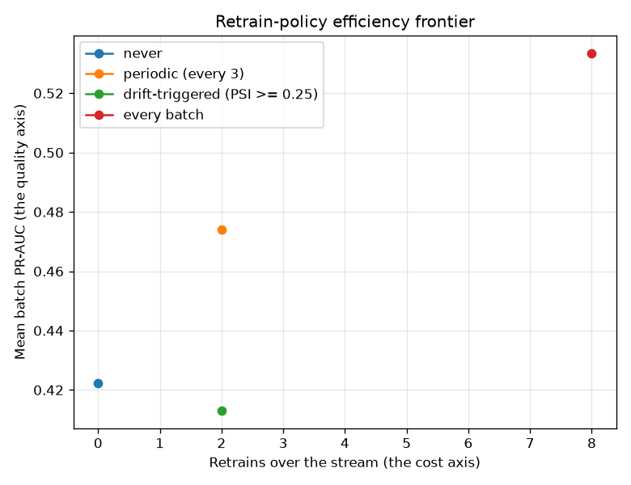

# NetSentry - Retrain-Trigger Policy (when to retrain)

_Synthetic stand-in; the method is the point. The later-day (temporal test) flows
replayed as 8 time-ordered batches, scored prequentially at one operating
threshold (1%-FPR, chosen once on clean validation). Each
policy's drift signal is its **own** deployed model's score-PSI against a reference
that resets on redeploy - the same mechanics as the serving drift monitor._

## The question

The [streaming study](streaming.md) shows retraining recovers what drift costs; this
prices **when**. Every retrain costs labels (the analyst budget the
[active-learning study](active_learning.md) prices), compute, re-validation, and
deployment risk - so the operational question is which *trigger* buys the
every-batch ceiling's quality at a fraction of its retrains.

| policy | retrains | mean batch PR-AUC | mean detection @ 1% FPR | retrained after batches |
|---|---|---|---|---|
| never | 0 | 0.422 | 14.5% | - |
| periodic (every 3) | 2 | 0.474 | 21.0% | 2, 5 |
| drift-triggered (PSI >= 0.25) | 2 | 0.413 | 14.1% | 0, 2 |
| every batch | 8 | 0.534 | 26.1% | 0, 1, 2, 3, 4, 5, 6, 7 |

Per-batch PR-AUC, in time order (where each policy's quality actually diverges):

| policy | b0 | b1 | b2 | b3 | b4 | b5 | b6 | b7 |
|---|---|---|---|---|---|---|---|---|
| never | 0.06 | 0.05 | 0.06 | 0.61 | 0.65 | 0.64 | 0.67 | 0.66 |
| periodic (every 3) | 0.06 | 0.05 | 0.06 | 0.59 | 0.63 | 0.62 | 0.90 | 0.89 |
| drift-triggered (PSI >= 0.25) | 0.06 | 0.05 | 0.06 | 0.59 | 0.63 | 0.62 | 0.65 | 0.65 |
| every batch | 0.06 | 0.05 | 0.05 | 0.59 | 0.84 | 0.87 | 0.90 | 0.90 |

## Read

- **The trigger under-delivers here, and that is the finding.** It fired early (after batch 0, 2 - the deployment saw major drift the moment later-day traffic arrived), then went quiet: once those batches were folded in, its own score-PSI stayed under the line for the rest of the stream while the every-batch policy kept improving (0.413 vs 0.534 mean PR-AUC, -8% of the headroom captured). PSI watches the score *distribution*, and a distribution can settle while labeled quality is still being bought - an unsupervised drift trigger is a cost-saver against covariate shift, **not a substitute for labels**. The honest pairing is a PSI trigger for the fast alarm plus a periodic labeled cadence for the slow decay - which is exactly what the periodic row prices.
- The trigger threshold (PSI >= 0.25) is **the same major-drift line the
  Prometheus alert rule fires on**, so measurement, alert, and action share one
  number: what pages the on-call is literally what schedules the retrain.
- The periodic policy is the calendar default most teams start with; the frontier
  shows what it buys relative to reacting to evidence. Where periodic and triggered
  tie on quality, the trigger's advantage is cost; where they tie on cost, quality.

## Honest limits

A trigger tuned on one stream can misfire on another (PSI is sensitive to batch
size), labels are assumed to arrive with the batch (in a SOC they arrive late and
partially - the active-learning study is the mitigation), and retraining on the
freshest batches inherits whatever poisoning risk the
[poisoning study](poisoning.md) measures. The frontier here is a method for pricing
the policy, not a promise about its numbers.
