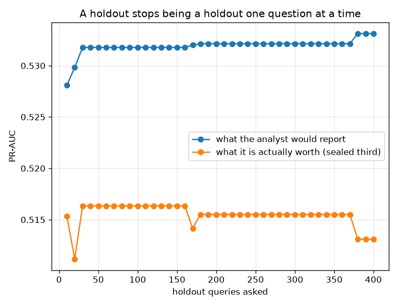

# NetSentry -- How Many Times Has the Holdout Been Asked?

_A static count of every split read in `netsentry/`, and an adaptive-analyst simulation over 400 candidate detectors with the later days cut three ways: 8,319 queryable flows, 8,319 for the mechanism that needs a reference, and 8,319 sealed. Regenerate with `netsentry reuse`._

## Why this report exists

`.claude/rules/ml.md` says the test set is touched **once**, at the end, and that tuning against it is leakage. Every study in this repository reads it. Both cannot be true, and the resolution is not obvious, so it is worth doing properly rather than asserting.

The failure in question is not the syntactic one. `scaler.fit(X_test)` is a bug in the source and [`netsentry mlint`](mlint.md) already refuses it. What no linter can see is the statistical failure (Dwork et al., *Science* 349, 2015): a holdout queried **adaptively** -- where the next thing you try depends on what it said last time -- stops being a holdout. Nothing is fitted. No column leaks. The number is just wrong, by an amount that grows with the number of questions.

**The rules say the sealed split is touched once. It is read 103 times, from 98 modules. That turns out not to be the question.**

Reading a holdout and *selecting* on it are different acts, and only the second one burns it -- so the second one was priced directly, on this project's own scores. An analyst who tries 400 detector variants and keeps whichever scores best on 8,319 held-out flows pays **+0.0093 PR-AUC** in optimism beyond what a finite sample costs anyway -- reporting 0.5331 for a detector worth 0.5131 on a third of the same days that nothing ever queried.

The detail that makes it concrete: the selected detector is **worse than the one it replaced** (0.5131 against the incumbent's 0.5162) while reporting a better number. Selection on noise does not merely inflate the estimate; it degrades the thing being estimated.

**But that only happens when the candidates are indistinguishable.** Run the identical search over 400 detectors that genuinely differ -- the same score nudged along random feature directions rather than by per-flow noise -- and the cost of selection is **-0.0006**, while the winner is genuinely better on the sealed third (0.5541 against 0.4916). Four hundred questions, no burn, six points of real detection quality found.

**So a holdout is not burned by being read. It is burned by being asked to choose between things it cannot tell apart.** That is the reading that resolves the count above: 103 reads that report a number, or compare a model against a baseline that differs from it by far more than sampling noise, do not spend the split. A tuning loop over near-identical variants would spend it fast -- and this project does its tuning on validation, which is a different split, for exactly this reason.

## The count

| split partition | reads | modules |
|---|---|---|
| `test` | **103** | **98** |
| `train` | 91 | 86 |
| `val` | 79 | 74 |

The pass is deliberately conservative: it counts only `load_split` calls whose partition is a string literal, so a read behind a loop variable or a config value is missed. An audit that inflated its own finding would be worth nothing, so it undercounts by construction.

The modules that ask the most questions of held-out data:

| module | held-out reads |
|---|---|
| `netsentry/evaluation/openset.py` | 4 |
| `netsentry/evaluation/uncertainty.py` | 4 |
| `netsentry/monitoring/covariate_shift.py` | 4 |
| `netsentry/robustness/poisoning.py` | 4 |
| `netsentry/robustness/hardening.py` | 3 |

Reading `val` is not a problem -- that is what a validation split is for, and it is read 79 times precisely so the sealed split does not have to be. The count is exposure, not damage; the rest of this report is about telling those apart.

## The harm: selecting among candidates the holdout cannot distinguish

Every candidate here is the deployed score plus independent per-flow noise, so all 401 have the *same* true quality and every apparent winner is an accident of this particular sample. The incumbent is simply the first draw, not a privileged one -- a pool with a privileged incumbent is not exchangeable, and a winner's-curse experiment on a non-exchangeable pool measures nothing.

| strategy | reported PR-AUC | true (sealed) | optimism | queries answered | adopted |
|---|---|---|---|---|---|
| no selection (report the incumbent) | 0.5270 | 0.5162 | **+0.0107** | 0 | 0 |
| select on the holdout (the failure mode) | 0.5331 | 0.5131 | **+0.0200** | 400 | 9 |
| Thresholdout, exchangeable reference | 0.5427 | 0.5205 | **+0.0222** | 36 | 3 |
| Thresholdout, validation as reference | 0.7620 | 0.5162 | **+0.2457** | 20 | 0 |
| confidence gate (adopt only past the noise) | 0.5270 | 0.5162 | **+0.0107** | 400 | 0 |

The incumbent's **+0.0107** is the floor: a finite holdout scores any rule slightly differently than a fresh sample would, whether or not anyone selected on it. Everything above that line is the price of asking. The naive analyst pays **+0.0093** for 400 questions -- roughly 44% of the **0.0211** bootstrap half-width a single PR-AUC estimate carries at this sample size, which is the honest way to read it: real, measurable, and smaller than the interval most comparisons in this repository are quoted without.

## The power: can a mechanism still find a real improvement?

A strategy that reports honestly by never adopting anything is not a fix, so the same pool is rerun with one genuinely better detector hidden in it, worth **+0.0418** PR-AUC on the sealed third.

| strategy | found the planted detector | true quality of what it chose | adopted |
|---|---|---|---|
| no selection (report the incumbent) | no | 0.5162 | 0 |
| select on the holdout (the failure mode) | **yes** | 0.5685 | 9 |
| Thresholdout, exchangeable reference | no | 0.5205 | 3 |
| Thresholdout, validation as reference | no | 0.5162 | 0 |
| confidence gate (adopt only past the noise) | **yes** | 0.5685 | 1 |

The confidence gate is the only mechanism that is both honest and useful: it costs +0.0000 over the incumbent on the noise pool -- it adopted 0 of 400 candidates there -- and still finds the planted detector, because a real improvement clears the bootstrap interval and noise does not. It is three lines and needs no budget, no injected noise and no second dataset.

## Thresholdout, and the two ways it does not fit here

**Thresholdout** answers a query from a *reference* set unless the reference and the holdout disagree by more than a noisy tolerance, spending budget only on genuine surprises. The idea is exactly right, and the implementation refuses to answer at all once the budget is gone -- serving reference answers past exhaustion would keep the analyst working while quietly dropping the guarantee.

It fails here twice, for two different and instructive reasons. With an **exchangeable reference** -- a second third of the same later days -- the mechanism protects the holdout but not the reported number: its answers are individually accurate, and the analyst then takes a **maximum** over 36 of them, which is still a maximum. Optimism +0.0222, worse than the naive analyst's. The mechanism bounds per-query error; it does not debias an argmax, and nothing that answers queries can.

With **validation as the reference** -- which is what a practitioner on a temporal split actually has -- it fails harder and earlier. Validation comes from the training days, so its PR-AUC sits +0.235 above the later days' by construction; every query is a 'surprise', the budget is gone in 20 questions, and the reported number (0.7620) is a validation score wearing a test score's clothes. This is the [covariate-shift study](covariate_shift.md) arriving from a different direction: a mechanism whose guarantee assumes exchangeability cannot be pointed at two sets separated by time.

## Scope and honest limits

- **The count is exposure, not damage.** Distinguishing a read that reports from a read that selects requires knowing what the number is *used for*, which is a human judgement no static pass can make. The count is the upper bound on how much adaptivity could have happened.
- **The harm is measured on a synthetic pool, deliberately.** Real candidate detectors are rarely exactly equal in quality; the noise pool is the worst case, constructed so that the entire measured gap is attributable to selection. The contrast pool is the realistic case and it costs nothing.
- **Adaptivity across reports is real but weak.** The strongest form of the failure needs a tight loop -- try, look, adjust, repeat. Studies here are written once and run once; the loop that exists is between waves, slow and mediated by prose, which is the least harmful form.
- **One split's worth of noise.** The gap is measured on a single random three-way cut of the later days. The direction and the order of magnitude are the claim, not the fourth decimal. The [seed-sensitivity study](seed_variance.md) measures the other half of the same noise floor, the part that comes from training rather than sampling.
- **A confidence gate slows the burn; it does not stop it.** It bounds what any single query can change. The only real fix is a split nobody has looked at, which is why the sealed third here is used once and discarded.
