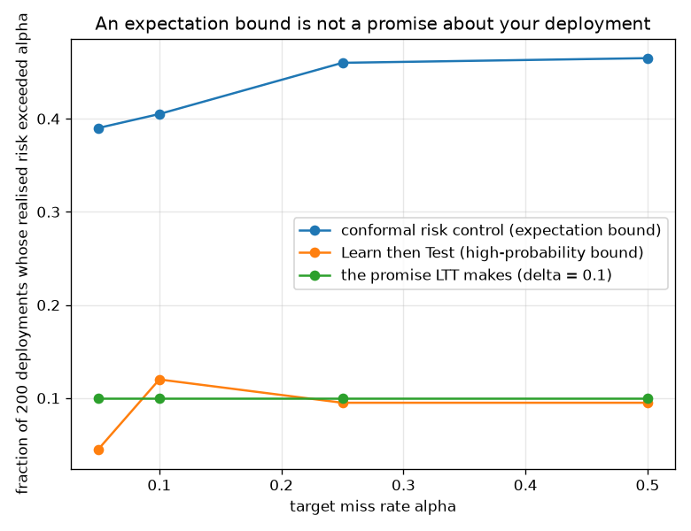

# NetSentry — Controlling the Risk the Contract Names

_Conformal risk control (Angelopoulos et al. 2022) and Learn-then-Test (Angelopoulos et al.
2021) over a 200-point threshold grid, calibrated on 3,118
attacks and validated by simulating 200 calibrate-and-deploy cycles._

## Why this report exists

Every operating point in this project is chosen by fixing a **false-positive** budget. That is
the right instrument for "how much noise can my analysts absorb" and the wrong one for the
sentence detection contracts are actually written in: *you may miss at most one attack in ten*.
[Conformal prediction](conformal.md) guarantees coverage, [alert FDR](alert_fdr.md) guarantees
the false-discovery rate of a batch, [Neyman-Pearson](neyman_pearson.md) certifies the
false-positive rate. None of them bounds the miss rate.

Two instruments do, and they differ in a way that matters more than the algorithms.

## An expectation bound is not a promise about your deployment

| target miss rate | selector | threshold | realised miss rate | mean over 200 deployments | exceeded target | realised FPR | alerts/day | analysts |
|---|---|---|---|---|---|---|---|---|
| 5% | conformal risk control | 0.0114 | 4.9% | 4.8% | **39%** | 91.59% | 686,982 | — |
| 5% | Learn then Test | 0.0106 | 4.2% | 4.2% | **4%** | 92.69% | 695,276 | 16,554 |
| 10% | conformal risk control | 0.0174 | 9.9% | 9.9% | **40%** | 83.86% | 629,042 | — |
| 10% | Learn then Test | 0.0161 | 8.8% | 8.9% | **12%** | 85.50% | 641,343 | 15,270 |
| 25% | conformal risk control | 0.0418 | 24.9% | 24.9% | **46%** | 59.40% | 445,526 | — |
| 25% | Learn then Test | 0.0383 | 23.3% | 23.5% | **10%** | 62.21% | 466,643 | 11,111 |
| 50% | conformal risk control | 0.1356 | 49.5% | 49.7% | **46%** | 25.40% | 190,488 | — |
| 50% | Learn then Test | 0.1269 | 48.2% | 48.1% | **10%** | 26.97% | 202,308 | 4,817 |

**Conformal risk control keeps its promise and it is not the promise an operator hears.** Across 200 simulated calibrate-and-deploy cycles its mean realised miss rate lands under target at every level — that is the theorem — while the *individual* deployment exceeds target on up to 46% of draws. An expectation bound says the average deployment is fine. Roughly half of all deployments are above average in the wrong direction, and each of those is somebody's quarter.

Learn then Test buys the statement operators think they are getting — `P(miss rate > alpha) <= 0.1` — and the exceedance column confirms it empirically at every level. The price is a lower threshold and more alerts: at a 5% target it demands 695,276 alerts a day against conformal risk control's 686,982.

## What a miss-rate promise costs

The alerts-per-day column is the one to take to a budget meeting. The deployed operating point — chosen at a 0.06% realised false-positive rate — misses **90.9%** of attacks and generates 441 alerts a day at 1,000,000 flows. Certifying a 5% miss rate instead requires 695,276 alerts a day — about 16,554 analysts at 10 minutes per alert and 420 productive minutes each. Even the loosest target here (50% misses) costs 202,308 alerts a day and 4,817 analysts.

That is not a criticism of the method; the method is doing its job, which is to make the exchange rate explicit instead of letting a false-positive budget imply a miss rate nobody wrote down. The uncomfortable reading is the honest one: **on this detector, a miss-rate guarantee at any interesting level is unaffordable**, and the options are a better detector, a narrower promise (per class, below), or a contract written in the units the detector can actually deliver.

## Two promises at once

| miss rate <= | alert rate <= | thresholds certified | realised miss | realised alert rate |
|---|---|---|---|---|
| 10% | 0.1% | **none (infeasible)** | — | — |
| 10% | 1.0% | **none (infeasible)** | — | — |
| 10% | 5.0% | **none (infeasible)** | — | — |
| 25% | 0.1% | **none (infeasible)** | — | — |
| 25% | 1.0% | **none (infeasible)** | — | — |
| 25% | 5.0% | **none (infeasible)** | — | — |
| 50% | 0.1% | **none (infeasible)** | — | — |
| 50% | 1.0% | **none (infeasible)** | — | — |
| 50% | 5.0% | **none (infeasible)** | — | — |

A real detection contract has two clauses, not one: miss at most this much, *and* do not drown the queue. Learn-then-Test handles that natively — each threshold becomes a single null hypothesis whose p-value is the maximum of the two constraints' p-values (an intersection-union test, which assumes nothing about how the risks relate), with Bonferroni across the grid because the two risks move in opposite directions and the fixed-sequence shortcut is only valid when they do not.

9 of the 9 pairs come back **empty**, and an empty set is the most useful output in this report. It is not a failure to find a threshold; it is a certificate that no threshold on the grid can keep both promises at this confidence, delivered before anybody signs the contract rather than during the first incident review. None of the pairs is feasible, which says the two clauses in the contract cannot both be met by thresholding this model at all.

## The promise that is affordable is per class

| attack class | attacks in test | promise certified | FPR it costs | alerts/day | times the largest analyst budget |
|---|---|---|---|---|---|
| DDoS | 2,442 | yes | 8.5% | 63,750 | **25x** |
| Web Attack | 288 | yes | 73.8% | 553,191 | **221x** |
| Bot | 351 | yes | 77.1% | 578,515 | **231x** |
| PortScan | 3,114 | yes | 77.1% | 578,515 | **231x** |
| Infiltration | 42 | yes | 93.8% | 703,610 | **281x** |

Every class can be *certified* at the 25% target, which makes the feasibility column useless and the price column the whole point. `DDoS` costs 8.5% false positives; `Infiltration` costs 93.8% — a **11x** difference in alert volume for the identical promise. The global number in the table above is an average over these, weighted by whichever attack mix the test days happened to contain, so it describes a contract no single class is actually operating under.

This is the [open-set study's](openset.md) finding in contractual form. That study found the deployed novelty rule's entire lead carried by `DDoS` while it was blind to `PortScan`; here the same asymmetry reappears as a price list. The engineering conclusion is that a miss-rate SLA should be written **per attack family**, because a global one silently subsidises the classes the detector cannot see with the alert budget of the one it can — and the subsidy is invisible until the mix changes.

## Scope and honest limits

- **Both guarantees are conditional on exchangeability**, and this calibration set is drawn
  from the same capture days it is evaluated on. Flows inside one attack burst are near
  duplicates, so the *effective* sample is smaller than 3,118 and the bound
  is correspondingly optimistic — the same caveat the [conformal study](conformal.md) carries,
  for the same reason.
- **Calibrating on production attacks requires labelled production attacks.** This report
  assumes a SOC that confirms incidents (which is what a SOC does) and can therefore calibrate
  on its own history; a greenfield deployment has no such set and must inherit a threshold,
  which the [threshold-transfer study](threshold_transfer.md) prices.
- **The risk is a miss rate over flows, not over incidents.** Missing nine flows of a
  thousand-flow DDoS is not the same event as missing the only flow of an exfiltration, and
  the [campaign study](campaigns.md) is where that distinction is measured. A per-incident
  risk is the better contract and needs incident-level labels to calibrate.
- **The grid is finite.** Both selectors return thresholds from a 200-point
  quantile grid; a finer grid costs Bonferroni power in the multi-risk arm and changes
  nothing for the monotone single-risk one.
- **The alert-volume figures assume 1,000,000 flows a day** and a fixed
  10-minute triage cost. Both are the project's standing
  assumptions, kept here so this table is comparable with the
  [alert-queue study](alert_queue.md) rather than because either is a measurement.