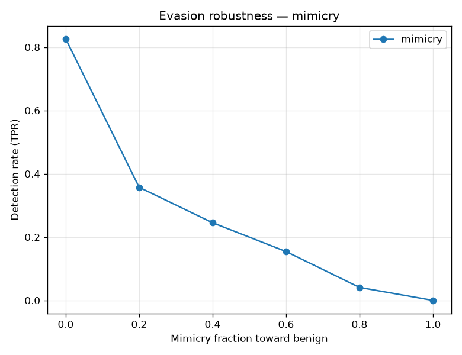
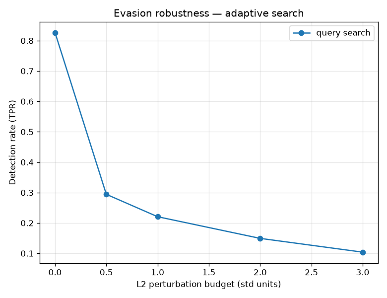

# NetSentry — Adversarial Evasion Robustness

_Synthetic stand-in; the methodology is the point. Operating point: **fpr_1pct**
(threshold 0.800 on the calibrated attack probability). 3000
attack flows, 39 attacker-controllable features._

## Threat model

An attacker shapes the **controllable** parts of a malicious flow — volume, timing,
packet sizes (padding, dummy packets, added delay) — to look benign, while the
protocol-structural fields stay fixed. We measure how far that pushes the
detection rate **down** from its un-attacked baseline of **82.6%**. This
is white-box on the feature space (the strong case for a defender to assume).

## Mimicry attack (shape controllable features toward benign)

Move the controllable features a fraction toward the benign centroid; `1.0` makes
them exactly average-benign. No model queries — this is "look normal" made numeric.

| mimicry fraction | 0 | 0.2 | 0.4 | 0.6 | 0.8 | 1 |
|---|---|---|---|---|---|---|
| detection (TPR) | 82.6% | 35.7% | 24.5% | 15.4% | 4.1% | 0.0% |

At full mimicry, detection falls to **0.0%** (from 82.6%).

## Adaptive query search (L2 budget on controllable features)

A random-restart search for the perturbation (bounded in L2, on controllable
features only) that minimizes the model's score — a realistic adaptive attacker,
since trees are non-differentiable.

| L2 budget (std units) | 0 | 0.5 | 1 | 2 | 3 |
|---|---|---|---|---|---|
| detection (TPR) | 82.6% | 29.4% | 22.1% | 14.9% | 10.4% |

At the largest budget, detection falls to **10.4%**.

## Most exploitable features

Detection drop when the attacker fully mimics **one** controllable feature alone —
where the detector is most spoofable (cross-reference the SHAP global importances):

| feature | detection drop |
|---|---|
| Flow Duration | +38.1 pts |
| Total Fwd Packets | +27.3 pts |
| Flow Packets/s | +24.6 pts |
| Flow Bytes/s | +20.4 pts |
| Total Backward Packets | +14.0 pts |
| Down/Up Ratio | +3.8 pts |
| Fwd Packet Length Min | +3.0 pts |
| Subflow Fwd Bytes | +2.9 pts |

## Defensive takeaways

- The supervised classifier leans on attacker-controllable volume/timing features,
  so a determined evader degrades it — exactly why NetSentry pairs it with a
  **benign-only anomaly detector**: mimicry that flattens an attack toward the
  benign manifold is the regime where reconstruction error and isolation depth
  still carry signal the classifier has lost.
- Robust hardening directions: adversarial training (augment with mimicry samples),
  feature-set restriction away from the most spoofable columns above, and
  monotonic/known-direction constraints (an attacker can usually only *inflate*
  volume, not reduce it below the real attack footprint).
- This converts the model card's "not adversarially robust" caveat from an
  assertion into a measured curve — the honest way to state a limitation.
