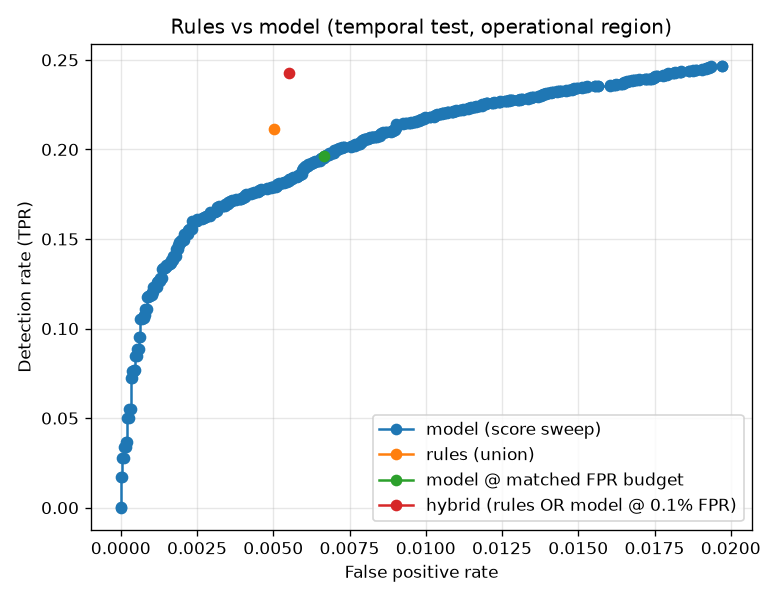

# NetSentry — Rules-vs-Model Baseline

_Synthetic stand-in. The configured signature ruleset (`rules.definitions`) and the
temporal-split binary classifier, evaluated on the same honest temporal test split.
The model's comparison threshold is chosen on **validation** at the ruleset's own
false-positive budget (0.71% on validation), so neither system
touches test before the comparison._

## Why compare against rules

A signature engine is the incumbent, and it is genuinely hard to beat on the
patterns it encodes: rules are auditable, port-scoped (they may use `Destination
Port` — the very context the ML model deliberately drops to avoid memorising it),
and free of training data, so there is nothing to leak. An ML detector that cannot
beat six hand-written thresholds at the same false-positive cost has no business in
the pipeline.

## Per-rule performance (temporal test)

| rule | encodes | fired | precision | recall (all attacks) | dominant hit |
|---|---|---|---|---|---|
| `volumetric-flood` | High packet- and byte-rate flood (DoS Hulk / DDoS style) | 679 | 99.3% | 10.8% | DDoS |
| `port-scan-sweep` | Short, SYN-heavy, low-volume probe (PortScan style) | 678 | 95.1% | 10.3% | PortScan |
| `slow-drip-dos` | Connection held open with sparse traffic (slowloris style) | 11 | 0.0% | 0.0% | — |
| `ftp-bruteforce` | Rapid repeated connections to FTP (Patator style) | 0 | 0.0% | 0.0% | — |
| `ssh-bruteforce` | Rapid repeated connections to SSH (Patator style) | 44 | 0.0% | 0.0% | — |
| `tls-heartbeat-exfil` | Oversized TLS responses to tiny requests (Heartbleed style) | 1 | 0.0% | 0.0% | — |

## Systems at a matched false-positive budget

| system | detection (TPR) | FPR | precision | alerts/day @ 1M flows |
|---|---|---|---|---|
| rules (union) | **21.1%** | 0.50% | 93.3% | 3,766 |
| model @ matched FPR budget | **19.6%** | 0.67% | 90.7% | 5,009 |
| hybrid (rules OR model @ 0.1% FPR) | **24.3%** | 0.55% | 93.6% | 4,127 |

## Per-class detection

| attack class | test support | rules | model (matched budget) |
|---|---|---|---|
| DDoS | 2,442 | 27.6% | 49.6% |
| PortScan | 3,114 | 20.7% | 0.2% |
| Bot | 351 | 0.0% | 1.1% |
| Infiltration | 42 | 0.0% | 4.8% |
| Web Attack | 288 | 0.0% | 1.0% |

## Read

At the matched budget the tuned signatures edge out the model (21.1% vs 19.6%) on this attack mix — unsurprising where the mix is dominated by exactly the patterns the rules encode. Coverage is where signatures lose, not the single operating point.

Every attack class without a signature is invisible to the rules: **Bot**, **Infiltration**, **Web Attack** have ~0% rule detection. The deeper differences are structural: a ruleset has **no dial** (its
FPR is fixed by whoever wrote the thresholds, while the model trades precision for
recall along a curve), no probability (so no cost-optimal or conformal layer can
sit on top), and a maintenance loop measured in analyst time per rule. The hybrid
row shows the two are complements, not rivals: rules OR model detects
24.3% at 0.55% FPR — signatures give cheap
precision on known tools, the model covers the space between signatures, and the
anomaly detector covers what neither has seen.
