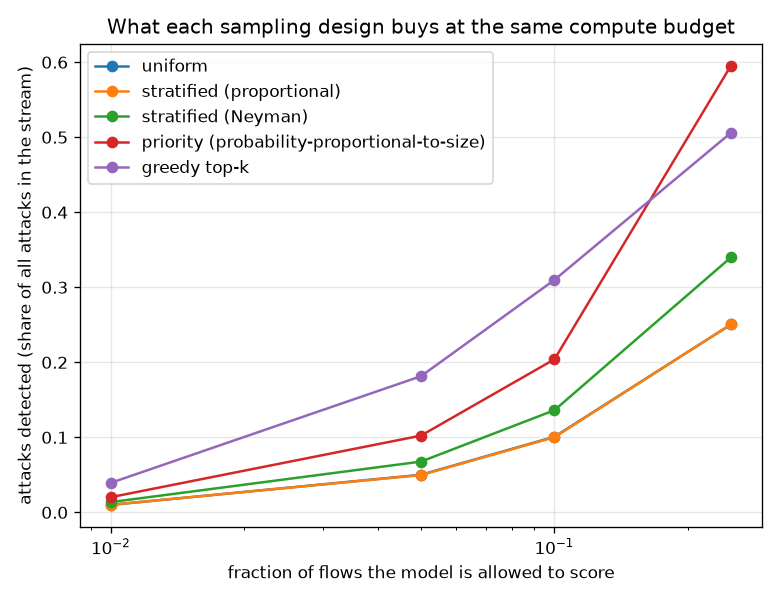

# NetSentry — Scoring a Fraction of the Stream, and Estimating the Rest

_Four sampling designs over 24,957 test-day flows containing 6,237 attacks,
each simulated 200 times per budget. The cheap pre-filter that drives the
adaptive designs reaches 0.575 PR-AUC against the full model's
0.529._

## Why this report exists

Every measurement in this project assumes the model sees every flow. At line rate it does not.
The [cascade](cascade.md) makes scoring cheaper while keeping full coverage and the
[sketches](sketches.md) count without scoring at all; neither answers the question that arrives
when the budget is genuinely hard — **if one flow in twenty can be scored, which twenty, and
what can be said about the nineteen that were not?**

## What each design detects

| design | 1% budget | 5% budget | 10% budget | 25% budget |
|---|---|---|---|---|
| uniform | 1.0% | 5.0% | 10.1% | 25.0% |
| stratified (proportional) | 1.0% | 5.0% | 10.0% | 25.1% |
| stratified (Neyman) | 1.4% | 6.8% | 13.6% | 34.0% |
| priority (probability-proportional-to-size) | 2.0% | 10.2% | 20.4% | 59.6% |
| greedy top-k | 3.9% | 18.1% | 31.0% | 50.6% |

At a **1% compute budget** — one flow in 100 reaches the model — uniform sampling finds 1.0% of the attacks, which is the budget and nothing more. Priority sampling finds **2.0%** by spending its draws where a cheap logistic pre-filter says attacks are, and greedy top-k finds 3.9% by removing the randomness altogether.

Read only that column and the answer is obvious: take the top k. The next columns are why it is wrong.

## The nineteen flows nobody looked at

| design | attacks detected | HT estimate of the total | relative error | 95% CI width | CI coverage | naive estimate | naive error |
|---|---|---|---|---|---|---|---|
| uniform | 1.0% | 6,226 | -0.2% | 3,071 | 94% | 6,227 | -0.2% |
| stratified (proportional) | 1.0% | 6,333 | +1.5% | 3,097 | 96% | 6,333 | +1.5% |
| stratified (Neyman) | 1.4% | 6,289 | +0.8% | 2,725 | 96% | 8,554 | +37.2% |
| priority (probability-proportional-to-size) | 2.0% | 6,149 | -1.4% | 3,805 | 96% | 12,642 | +102.7% |
| greedy top-k | 3.9% | **none exists** | — | — | **undefined** | 24,558 | +293.7% |

A sampled detector answers a different question from a full one. It cannot say *these were the attacks*; it can only say *these are the attacks we looked at*, and the operational question — was the budget enough? — is about the ones nobody looked at. Horvitz-Thompson answers it: weight each observed flow by the reciprocal of its inclusion probability and the sum is unbiased for the population total, whatever the design, provided every probability is strictly positive.

Every randomised design is unbiased, and they are unbiased to within a percent or two of the true 6,237 — uniform at -0.2%, priority at -1.4%. The interval widths are where they part company, and the ordering is the opposite of the detection column:

- **Neyman-allocated stratification** produces the *narrowest* interval (2,725) while also improving detection to 1.4%;
- **priority sampling** detects the most of any randomised design (2.0%) and produces the *widest* interval (3,805), wider than plain uniform sampling's 3,071.

That inversion is worth understanding rather than tuning away. Probability-proportional-to-size sampling is variance-optimal when the size measure is proportional to the quantity being totalled — and here the quantity is a 0/1 attack indicator, so the optimal design would take every attack with certainty and no benign flow at all. The pre-filter is a *noisy* stand-in for that, and its mistakes are expensive in a specific way: an attack the pre-filter scores low is sampled with a tiny probability and therefore arrives carrying an enormous `1 / pi` weight. The variance of the estimate is dominated by exactly the attacks the sampler is worst at recognising. A better pre-filter narrows this interval; a confident and wrong one widens it without warning.

Coverage is measured rather than asserted — 94% for uniform and 96% for priority across 200 draws against a nominal 95%. That check is not a formality: the interval is a normal one around a statistic whose distribution is skewed by a handful of enormous weights, so it is the kind of interval that can quietly miss its level, and the only way to know is to draw the sample a few hundred times and count.

## The estimator everybody writes instead

The naive columns are the trap. Counting the attacks you found and dividing by the sampling rate is correct under uniform sampling — its error is -0.2% — and catastrophically wrong under any design that deliberately oversamples the thing being counted. The priority design's naive estimate is 12,642 against a true 6,237, an error of **+103%**. The better the sampler, the worse the naive estimate, because the bias *is* the sampler's skill counted twice. Any dashboard that reports 'attacks seen / sampling rate' on a smart sampler is reporting a number with this bias baked in.

## Why the best detector is the worst design

Greedy top-k detects 3.9% at this budget against priority sampling's 2.0% — a real advantage, and it costs the estimator entirely. Every flow below the cut has inclusion probability exactly zero, so its Horvitz-Thompson weight is `1/0` and **no unbiased estimator of the total exists**. This is not a limitation of the technique used here; it is a theorem about the design. Nothing observed can speak for a region that could never have been observed.

The consequence is operational rather than statistical. A greedy sampler cannot tell you whether its budget is adequate, because the evidence that would say so lives exactly where it never looks — and when the traffic mix shifts underneath it, the alert count stays flat and looks like stability. The fix is cheap: a floor on the inclusion probability (here 0.002) makes every flow reachable, costs a sliver of the budget, and turns 'we found this many' into 'there were about this many'. It is the same exploration budget the [off-policy evaluation study](ope.md) found was the difference between a log that can be evaluated and one that cannot.

**And greedy's detection lead is not even permanent.** By a 25% budget the randomised priority design overtakes it — 59.6% against 50.6% — because greedy spends its entire budget inside the region where the pre-filter is already confident, and the attacks the pre-filter does not recognise are unreachable by construction no matter how large the budget grows. Randomisation is not only what makes the stream estimable; past a certain budget it is also what finds more attacks.

## Which design to actually run

There is no single winner here, and pretending otherwise is how sampling gets designed badly. The three columns rank the designs differently, so the choice is a statement about which question the deployment has to answer:

| if the job is... | run | because |
|---|---|---|
| catch as many attacks as the budget allows, and nothing else is asked | greedy top-k | 3.9% detection, and no answer to 'what did we miss' at any price |
| catch attacks *and* report coverage | priority sampling with a floor | 2.0% detection, unbiased totals, the widest interval |
| estimate the threat level in the stream | Neyman-allocated strata | 2,725-wide interval, 1.4% detection |

The middle row is the default worth arguing for. At this budget it gives up 1.9% of detection — 52% of greedy's rate — and buys back the ability to say *there were about this many attacks, plus or minus this much*, which is the sentence a capacity decision is made from and the one a greedy sampler can never produce. At larger budgets it gives up nothing at all, because it overtakes greedy outright.

## Scope and honest limits

- **Poisson sampling, not fixed-size.** Each flow is an independent Bernoulli draw, so the
  realised sample size varies around the budget; that is what makes the variance estimator a
  one-liner with no joint inclusion probabilities. A fixed-size design (systematic or
  conditional Poisson) removes the size variation and needs second-order probabilities the
  operator would then have to track.
- **The pre-filter is trained on the training days** and applied to the test days, so its
  quality carries the same temporal-shift discount as everything else here. A pre-filter that
  degrades makes the priority design's inclusion probabilities wrong — which costs variance,
  not bias, because Horvitz-Thompson is unbiased for *any* strictly positive design.
- **The total estimated here is a flow count.** A SOC cares about incidents, and flows within
  one attack burst are near-duplicates, so the effective sample behind the interval is
  smaller than the flow count suggests. The [campaign study](campaigns.md) is where the
  incident-level unit is measured.
- **Neyman allocation uses the pre-filter's scores as its variance proxy**, because the labels
  it formally requires are exactly what the sampling exists to avoid needing. That makes it an
  approximation of the optimal allocation rather than the optimal allocation.
- **Compute is modelled as a flow count.** Real scoring cost varies per flow (SHAP is ~73% of
  request latency, per the [serving benchmark](../../README.md)), so a budget in flows is a
  budget in the average case rather than the worst one.