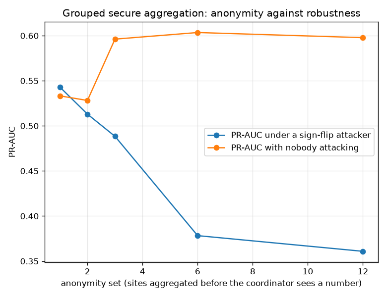
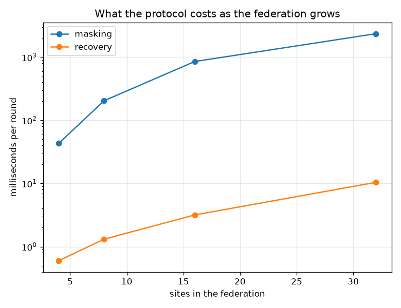

# NetSentry — Secure Aggregation: Federating Without a Trusted Coordinator

_Bonawitz et al. (CCS 2017) implemented from scratch over RFC 3526 group 14 and the field
`2^61 - 1`, run across 12 sites for 6 rounds with a
6-of-12 recovery threshold._

## Why this report exists

The [federated study](federated.md) rests on one claim: raw flows never leave the site, only
weights do. That claim is true, and it is not privacy. An update is a function of the data that
produced it, and the coordinator collects one per site per round. So the first measurement here
is not of a protocol, it is of the channel the current design leaves open.

| what the coordinator holds | attack recovers | chance | how |
|---|---|---|---|
| plaintext update (what FedAvg sends today) | **81%** | 33% | one local pass, cosine against per-family references |
| masked vector (what the coordinator receives) | **25%** | 33% | a one-time pad: uniform in the field, independent of the input |
| the aggregate (what the protocol does release) | resolves to `DoS Hulk` | 33% | not protected by this protocol and never was -- that is what DP is for |

The attack is the cheapest one available -- cosine similarity against a reference update per attack family, no model inversion, no auxiliary data beyond the family labels a coordinator running a detection consortium already has. On the plaintext update it names the family a site is holding **81%** of the time against a 33% chance rate. This is the channel FedAvg leaves open in exchange for not moving the flows: it does not reveal a flow, it reveals what kind of incident the site is having. On the masked vector the same attack lands at 25% against the 33% chance rate — indistinguishable from guessing, and it has to be. Each masked vector is a one-time pad, so the coordinator's view is *independent of the input* and no attack, present or future, extracts anything from it. That is an information-theoretic statement about a single round, not a measured one; the measurement is here because a protocol nobody ran is a protocol nobody has debugged.

The third row is the one that keeps this honest. Secure aggregation protects the **individual** update and does nothing whatsoever for the sum, which is released by design -- and the sum of a federation that happens to contain one attacked site still carries that site's signal. The identification attack run on the released aggregate still lands on a family a site is genuinely holding. With 12 sites the aggregate is a weak channel; with three it is a strong one, and with two it is barely a channel at all in the sense that each participant can subtract itself and read the other. Secure aggregation buys anonymity within the cohort; **differential privacy** bounds what the cohort's output says about any member. The [DP-FedAvg arm of the federated study](federated.md) is the other half of this, and neither substitutes for the other.

## The sites

Capture days are the natural silo — Monday holds no attacks at all, Tuesday holds the patators,
Wednesday the DoS family — but three participants cannot say anything about a recovery threshold
or an anonymity set, so each day is sharded. The skew that makes federation hard is preserved.

| site | flows | attack share | family it holds |
|---|---|---|---|
| `Wednesday-1` | 2,991 | 37.3% | DoS Hulk |
| `Wednesday-2` | 2,990 | 37.8% | DoS Hulk |
| `Wednesday-3` | 2,990 | 38.5% | DoS Hulk |
| `Wednesday-4` | 2,990 | 37.3% | DoS Hulk |
| `Monday-1` | 1,878 | 0.0% | none (benign only) |
| `Monday-2` | 1,878 | 0.0% | none (benign only) |
| `Monday-3` | 1,878 | 0.0% | none (benign only) |
| `Monday-4` | 1,877 | 0.0% | none (benign only) |
| `Tuesday-1` | 2,141 | 12.4% | FTP-Patator |
| `Tuesday-2` | 2,141 | 13.1% | FTP-Patator |
| `Tuesday-3` | 2,140 | 12.9% | FTP-Patator |
| `Tuesday-4` | 2,140 | 12.1% | FTP-Patator |

## Does it still train?

| | PR-AUC | TPR @ 0.1% FPR |
|---|---|---|
| plaintext FedAvg | 0.598 | 10.8% |
| secure aggregation | 0.598 | 10.8% |

| fixed-point scale | headroom to wraparound | max weight error vs plaintext | PR-AUC |
|---|---|---|---|
| 2^0 | 45.2 bits | 1.06e-04 | 0.598 |
| 2^8 | 37.2 bits | 5.51e-07 | 0.598 |
| 2^20 | 25.2 bits | 1.10e-10 | 0.598 |
| 2^32 | 13.2 bits | 2.65e-14 | 0.598 |
| 2^40 | 5.2 bits | 2.22e-16 | 0.598 |
| 2^44 | 1.2 bits | 1.11e-16 | 0.598 |
| 2^46 | **wrapped** | 3.43e+00 | 0.222 |
| 2^48 | **wrapped** | 1.31e+00 | 0.238 |

The recovered sum is **bit-identical** to the plaintext sum in the field at every round -- not close, equal, because the masks are group elements and they cancel. After decoding, the largest single-weight difference between the secure model and the plaintext one is **1.10e-10** — one quantization step at 2^20 — and PR-AUC agrees to 0.0000. The usable window runs from 2^0 to 2^44, and at 2^46 the encoded sum passes the field's half-point and wraps: PR-AUC 0.222 against the plaintext model's 0.598. Nothing warns you. The decoded weights are well-formed floats of the wrong sign and magnitude, the training loop continues, and the model that comes out is not an approximation of anything.

The *lower* end is the surprise: detection is unchanged even at a scale of 2^0, one step per unit, where the quantization step is larger than the weights being encoded. It survives because the payload is not the weight vector, it is the **size-weighted** one — FedAvg's numerator — so each coordinate arrives pre-multiplied by a site's few thousand rows, which is eleven bits of scale the encoding gets for free. That is a property of this aggregation, not of fixed-point arithmetic, and it flips the usual advice: the risk here is not too little precision, it is a scale chosen 'generously' and then meeting a larger federation.

## Dropout: the reason this is not just a one-time pad

A mask that only cancels when *everybody* arrives is useless on a real network. Each site
secret-shares two values with `t`-of-`n` recovery: its self-mask seed, released only for sites
confirmed **alive**, and its Diffie-Hellman exponent, released only for sites confirmed **gone**.

| sites dropped | survivors | threshold | aggregate recovered | max error | recovery |
|---|---|---|---|---|---|
| 0 | 12 | 6 | yes | 0.00e+00 | 1 ms |
| 1 | 11 | 6 | yes | 0.00e+00 | 61 ms |
| 3 | 9 | 6 | yes | 0.00e+00 | 142 ms |
| 6 | 6 | 6 | yes | 0.00e+00 | 157 ms |
| 7 | 5 | 6 | **no (round lost)** | n/a | 0 ms |

Below the threshold the round is lost — a liveness failure, and the right one: the coordinator
ends up with a masked sum it cannot open rather than a partial result it can.

## The attack the self-mask exists to stop

The self-mask looks like redundancy until the attack is run. A coordinator that wants one site's update in the clear does not have to break anything: it waits until the masked vector has arrived, **declares that site dropped**, and asks the others for the shares that reconstruct the victim's pairwise masks -- which the protocol is obliged to hand over, because that is exactly the recovery path a genuine dropout needs. Executed here, with the self-mask removed, it recovers the victim's update to a maximum error of **4.76e-07** -- the quantization step, i.e. exactly. With the self-mask in place the same attack leaves the coordinator holding a residual whose error against the true update is 1.04e+12: uniform noise, because the shares it collected unmask the pairs and not the site's own pad. The invariant that makes this work is that a site answers **one** of the two questions -- self-seed if it is alive, exponent if it is not -- and never both.

## The cost nobody advertises: robustness

| aggregation | coordinator sees | attack | PR-AUC | robust rule available |
|---|---|---|---|---|
| plaintext FedAvg (mean) | every site's update | none | 0.598 | yes |
| plaintext FedAvg (mean) | every site's update | sign flip | 0.361 | yes |
| plaintext + coordinate median | every site's update | sign flip | 0.543 | yes |
| plaintext + Krum | every site's update | sign flip | 0.533 | yes |
| secure aggregation (mean is the only option) | the sum, and nothing else | sign flip | 0.361 | **no** |

The [byzantine study](byzantine.md) shows one lying site destroys a mean (0.361 against 0.598 clean) and that a coordinate median recovers most of it (0.543). Every one of those defences is a function of the **individual** update vectors. Secure aggregation delivers the coordinator one vector: the sum. There is no median of one number, no Krum among one candidate, no norm to inspect -- the last row is the mean, because under this protocol the mean is the only rule that exists, and it therefore reproduces the undefended number exactly. The privacy property and the robustness property are not merely hard to have together; they ask for opposite things from the same channel, which is why the work that gets both (Prio, RoFL, secure aggregation with verifiable norm bounds) is a separate line of research rather than a configuration flag.

### Escape 1: an ideal range proof

The first escape keeps the privacy and buys back some robustness by assuming what the protocol cannot check: that each site can prove, in zero knowledge, that every coordinate of its input lies inside a certified interval. The attacker then plays the strongest move the proof still permits — every coordinate pinned to the far end of the interval — and the question becomes what the bound is worth.

| certified coordinate bound | as a multiple of the honest maximum | PR-AUC under the strongest in-bound attack |
|---|---|---|
| 0.02 | 0.06x | 0.605 |
| 0.05 | 0.14x | 0.604 |
| 0.1 | 0.28x | 0.595 |
| 0.25 | 0.69x | 0.600 |
| 1 | 2.77x | 0.334 |

The honest sites' largest coordinate in the first round is 0.361, and that is the number the bound has to be set against. A bound of 0.02 (0.06x the honest maximum) holds detection at 0.605 against the clean 0.598. A bound of 1 (2.77x) gives back 0.264 PR-AUC — **worse than the unbounded sign-flip attack it was meant to stop** (0.361), because the honest updates are small and a 'reasonable-looking' per-coordinate limit is enormous relative to them. A range proof is not a defence on its own; it is a defence *plus* a calibration problem, and the calibration has to be done against measured honest updates rather than against a round number that looks conservative.

### Escape 2: grouped aggregation

| anonymity set | groups the median runs over | PR-AUC (no attacker) | PR-AUC (sign flip) |
|---|---|---|---|
| 1 site (no aggregation privacy: today's FedAvg) | 12 | 0.533 | 0.543 |
| 2 sites | 6 | 0.528 | 0.513 |
| 3 sites | 4 | 0.596 | 0.488 |
| 6 sites | 2 | 0.603 | 0.378 |
| 12 sites | 1 | 0.598 | 0.361 |

Sites are aggregated in groups and the coordinator applies a robust rule *across the group sums*. The anonymity set is no longer the federation, it is the group. At the top of the table the group is one site, which is not anonymity at all — that row is today's plaintext FedAvg with a median bolted on, and it is the most robust (0.543 under attack) and the *least* accurate when nobody attacks (0.533 against 0.598), which is the price of a median that the byzantine study already charged. At the bottom the group is the whole federation: maximum anonymity, no visibility, and 0.361 under the same attacker.

The interesting rows are the middle ones. Groups of 2 give the coordinator 2-anonymised partial sums and hold 0.513 under attack at 0.528 clean — strictly more privacy than plaintext and strictly more robustness than a single aggregate. Neither end of this table is the answer; the frontier is, and an operator picks a point on it by naming which adversary they actually fear — the coordinator, or a member.

## What it costs

| sites | plaintext upload | secure upload | overhead | masking | recovery |
|---|---|---|---|---|---|
| 4 | 624 B | 1,282 B | 2.1x | 43 ms | 1 ms |
| 8 | 624 B | 1,818 B | 2.9x | 204 ms | 1 ms |
| 16 | 624 B | 2,890 B | 4.6x | 852 ms | 3 ms |
| 32 | 624 B | 5,034 B | 8.1x | 2347 ms | 10 ms |

Upload grows because every site shares two secrets with every peer: 1,282 bytes at 4 sites against 5,034 at 32, an overhead of 2.1x rising to 8.1x. Compute grows faster: the pairwise masks are O(n^2) modular exponentiations across the federation, 43 ms at 4 sites and 2347 ms at 32. Against a round of local training that costs 48 ms across all sites, the protocol is not free and is not the bottleneck either -- which is the honest summary at this scale. At a thousand sites it would be, and the standard answer is the one Bonawitz et al. give: mask against a sampled *subset* of peers rather than all of them, which turns the quadratic term linear at the cost of a probabilistic security argument.

## Scope and honest limits

- **This is the masking protocol, not the whole system.** Bonawitz et al. run key agreement
  over an authenticated channel and encrypt the shares to their recipients; here the shares are
  handed to the coordinator in the clear because the study measures what the *aggregation*
  reveals, not what a network attacker does. A deployment needs both, and needs the keys drawn
  from an OS CSPRNG rather than the seeded generator that makes this report reproducible.
- **The security argument is per round, and the rounds are not independent.** Masks are
  re-derived per round from the KDF, so no two rounds share a pad; what a coordinator learns
  across rounds is the *sequence of aggregates*, and that is a differential-privacy question
  (composition), which the DP-FedAvg arm of the federated study accounts for and this does not.
- **The model is linear** for the same reason it is in the federated study: FedAvg averages
  parameters, and a boosted forest does not have any to average. Secure aggregation is
  architecture-agnostic — it sums vectors — but the study inherits the linear arm's ceiling.
- **The ideal range proof is assumed, not implemented.** The sweep prices what an attacker
  could still do *given* such a proof; building one (Prio-style secret-shared range checks, or
  RoFL's norm bounds) is a substantially larger piece of engineering and is named here rather
  than hand-waved as a config option. Treat those rows as an upper bound on what the technique
  buys, since a real proof also costs bandwidth and verification time this does not model.
- **The anonymity set is the federation, not the world.** A coordinator that already knows
  eleven of twelve sites' data learns the twelfth exactly from the sum. That is not a flaw in
  the protocol; it is the definition of what the protocol promises, and it is why the frontier
  above is about group *size* rather than about a binary.