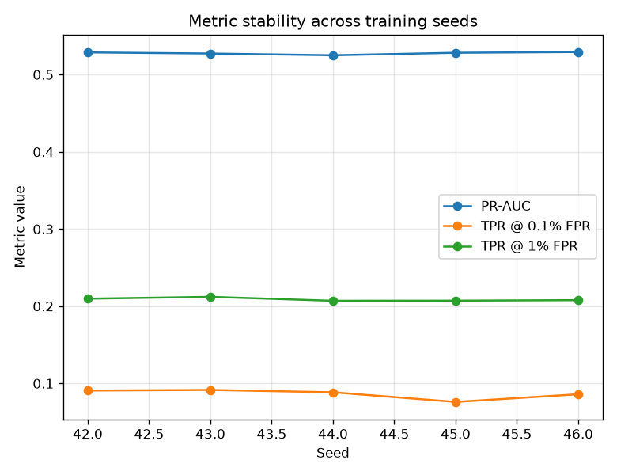

# NetSentry — Seed Sensitivity (the training-noise floor)

_Synthetic stand-in; the method is the point. The honest temporal/binary model refit
at 5 consecutive seeds (42-46); FPR thresholds re-chosen
on each run's own validation scores, exactly as the evaluation report does — so each
row is what **shipping that seed** would report, not just a re-scored model._

## Reproducibility vs stability

Two different properties, often conflated:

- **Reproducibility (guarantee).** Refit at the same seed, the numbers must be
  identical. Verified on this run: max |score delta| between two same-seed fits =
  **0.00e+00** — exact reproduction.
- **Stability (measurement).** Refit at a *different* seed and the numbers move by
  the training noise measured below. This spread is a property of the model class
  and data, not a bug — but any comparison that ignores it will promote on luck.

## Per-seed results

| seed | PR-AUC | TPR @ 0.1% FPR | TPR @ 1% FPR |
|---|---|---|---|
| 42 | 0.529 | 0.091 | 0.210 |
| 43 | 0.527 | 0.092 | 0.212 |
| 44 | 0.525 | 0.089 | 0.207 |
| 45 | 0.528 | 0.076 | 0.207 |
| 46 | 0.529 | 0.086 | 0.208 |

## Spread across seeds

| metric | mean | sd (training noise) | min | max |
|---|---|---|---|---|
| PR-AUC | 0.528 | 0.0017 | 0.525 | 0.529 |
| TPR @ 0.1% FPR | 0.087 | 0.0063 | 0.076 | 0.092 |
| TPR @ 1% FPR | 0.209 | 0.0022 | 0.207 | 0.212 |

- **Data noise dominates**: the bootstrap CI half-width (0.0116) is more than twice the seed sd (0.0017). The evaluation set, not the training run, is the main source of uncertainty here — the bootstrap CIs the evaluation report already carries are the binding error bar.
- **The consequence for model comparison:** a challenger model must beat the champion
  by more than the noise floor before the delta means anything. The champion/challenger
  promotion gate (`netsentry promote`) uses a non-inferiority margin calibrated
  against this measurement — deltas inside the noise band hold the champion.

## Why this matters

Single-run leaderboard numbers invite over-reading; the difference between two
models is only real once it clears both noise sources. This audit prices the one
bootstrap CIs cannot see (retraining), keeps the determinism guarantee honest by
re-asserting it on every run, and hands the promotion gate an evidence-based margin
instead of a hand-picked one.
