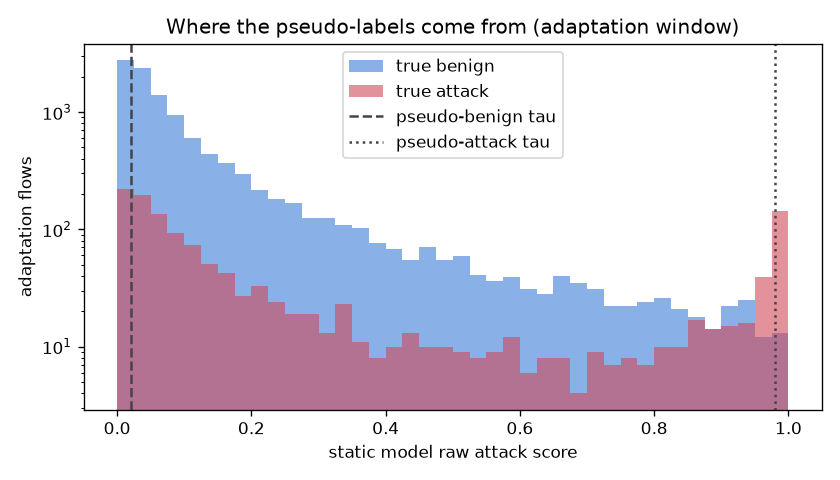

# NetSentry — Self-Training on the Unlabeled Stream

_Synthetic stand-in. Temporal split; the later-day test stream is cut in time
order into an adaptation window (12,478 flows, seen **unlabeled**) and an
evaluation window (12,479 flows, the untouched future). Confidence band: raw
score ≥ 0.98 pseudo-attack, ≤ 0.02 pseudo-benign,
abstain between. Detection at each model's own validation-chosen
1%-FPR threshold._

## The question

Labels are the expensive input: the streaming study shows labeled retraining
recovers what drift costs, and the active-learning study prices the analyst
budget it takes. Self-training is the tempting shortcut — retrain on the model's
own confident opinions about the unlabeled stream. Under temporal drift it has a
known failure mode: the flows the model is most wrong about are novel attacks it
scores as benign, so its confident opinions *encode its blind spots*.

## Result

| model | eval PR-AUC | detection @ threshold | FPR | threshold (val) |
|---|---|---|---|---|
| static (deploy-frozen) | 0.653 | 22.3% | 0.94% | 0.867 |
| self-trained (pseudo-labels) | 0.650 | 22.2% | 0.77% | 0.883 |
| oracle retrain (true labels) | 0.844 | 37.8% | 1.02% | 0.830 |

## Pseudo-label audit (the part the model cannot see)

| | |
|---|---|
| adaptation flows | 12,478 (of which 1,390 true attacks) |
| pseudo-labeled attack | 143 (precision 92.3%) |
| pseudo-labeled benign | 2,318 (precision 92.2%) |
| abstained (never trained on) | 10,017 |
| **true attacks absorbed as benign** | **180** |
| true attacks correctly claimed | 132 |

## Read

The shortcut under-delivers: self-training recovers -0.003 of the +0.190 PR-AUC that true labels buy (-2% of the headroom). The reason is in the audit: **180** of the window's 1,390 true attacks (12.9%) were confidently pseudo-labeled *benign* and trained on as benign — the confirmation-bias loop in one number: flows the model was already blind to are exactly the ones it teaches itself to ignore. Pseudo-labels can only reinforce what the model already believes — they sharpen the boundary it has, they cannot teach it a boundary it lacks. Novel later-day attacks are precisely the flows self-training mislabels, which is why the analyst labels the active-learning study budgets for cannot be replaced by confidence.

## Scope

The oracle row is a *ceiling*, not a proposal — it assumes same-day perfect
labels. The taus are the study's operating knobs (`selftrain.*`): tighter bands
absorb fewer attacks but adapt on fewer flows. Pipeline statistics stay fit on
the original training split throughout; the adaptation window's true labels are
used only by this audit, never by a model.
