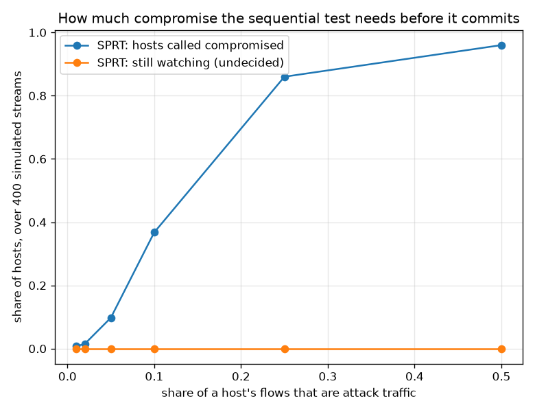

# NetSentry — Sequential Host Decisions (Wald's SPRT)

_Synthetic stand-in. Honest temporal/binary split. Likelihoods taken from the deployed
operating point measured on **validation** (TPR 28.2%, FPR 0.089% at the
1%-alpha / 10%-beta design), then run over 400
simulated host streams of up to 1,000 flows each, composed from real test-set
scores._

## Why this report exists

Every threshold in this project decides one flow; a SOC responds to a **host**. The gap
between them is not free. At a per-flow false-positive rate of 0.089%, a benign host
with 1,000 flows trips at least one alert with probability
44.4% — the model is behaving exactly as calibrated, and the
host-level false-alarm rate is still nearly certain, because a fixed rate over an unbounded
number of trials is not a guarantee. Demanding *k* alerts before escalating fixes the
arithmetic and replaces it with an unpriced guess at `k`.

Wald's **sequential probability ratio test** (1945) is the principled version: accumulate
log-likelihood evidence flow by flow and stop at the first boundary crossing, with both error
rates controlled by construction and — among all tests achieving those rates — the smallest
expected number of observations (Wald & Wolfowitz 1948). It needs no new model here: reduce
each flow to "did it alert?", and the two hypotheses are the detector's own measured rates.

## Do the error guarantees hold?

| host population | called compromised | called clean | still watching | median flows to decide | naive policy flags it |
|---|---|---|---|---|---|
| clean hosts (benign only) | 0.0% | 100.0% | 0.0% | 81 | 45.2% |
| compromised hosts (10% attack) | 38.8% | 61.3% | 0.0% | 81 | 100.0% |
| compromised hosts, test-calibrated (10% attack) | 87.2% | 11.0% | 1.8% | 253 | 100.0% |

The boundaries were set from the operator's stated tolerances (alpha = 0.01, beta = 0.1), giving an upper boundary of 4.50 and a lower of -2.29 nats of evidence, over the hypothesis pair `p1 = 0.02899` (a 10%-compromised host) against `p0 = 0.00089` (a clean one). Wald's bounds say the realized errors cannot exceed 0.011 and 0.101. Measured over 400 simulated hosts of each kind: **0.0%** of clean hosts were escalated and **61.3%** of compromised hosts were missed. The false-alarm side holds comfortably. The miss side does **not**: 61.3% against a bound of 0.101. That is worth being precise about, because it is not a failure of Wald's construction — his bound is conditional on the assumed likelihood being the true one, and here it is not.

The design took its detection rate from **validation** (28.2% TPR), which is carved from the Mon-Wed training days. The host streams are drawn from Thu-Fri, where the same detector detects 9.1% — this project's headline temporal gap, arriving in a new place. So the test was designed expecting a compromised host to alert at `p1 = 0.02899` and was handed streams that alert at `0.00960`, roughly 3.0x less evidence per flow than it was promised. A guarantee bought with an optimistic likelihood is worth exactly what the likelihood was.

The third row settles it. Re-deriving the same test from the rate the streams actually realise drops the miss rate to 12.7% — much closer to the bound, with no change to the algorithm, the boundaries, or the data. The lesson is operational rather than theoretical: a sequential test's error control is only as good as the operating point it is calibrated on, so it belongs on the same refresh schedule as the [threshold](refresh.md) it inherits, and it degrades under drift in exactly the way the [conformal](adaptive_conformal.md) guarantees do.

## How fast is the decision?

Speed is the reason to use a sequential test rather than a fixed window. Wald's expected-sample-number formula predicts 52 flows to a decision on a compromised host and 88 on a clean one; the simulation lands at a median of 81 and 81. The asymmetry is structural and worth reading carefully: an alerting flow carries 3.5 nats of evidence toward compromise, while a quiet flow carries 0.0285 nats toward innocence, so 2 alerts convict and about 80 consecutive quiet flows are needed to acquit. That is the right shape for a SOC: a compromised host is escalated in a burst of flows, and a quiet host simply stays under observation rather than being declared clean on thin evidence.

## Against the policy most deployments actually run

The comparison that matters is against what most deployments actually run: escalate a host the moment any of its flows is flagged. On these streams that policy escalates 45.2% of **clean** hosts — the closed form `1 - (1 - 0.00059)^1000` gives 44.4%, and the simulation agrees. The per-flow false-positive budget is intact; it is simply not a host-level guarantee, because the rate is fixed while the number of trials is not. A host with ten times the traffic gets ten times the chances to trip it, which is why the chattiest servers dominate every real alert queue and why analysts learn to ignore them. The sequential test escalates 0.0% of the same clean hosts, because it asks whether the *rate* of alerts is consistent with a clean host rather than whether any alert occurred at all. This is the [base-rate fallacy](base_rate.md) in the time dimension: there, the benign majority swamps precision across hosts; here, the benign majority swamps it across a single host's flows.

## How much compromise is enough?

| attack share of the host's traffic | called compromised | still watching | median flows to decide |
|---|---|---|---|
| 1% | 0.8% | 0.0% | 81 |
| 2% | 1.5% | 0.0% | 81 |
| 5% | 9.8% | 0.0% | 81 |
| 10% | 36.8% | 0.0% | 81 |
| 25% | 86.0% | 0.0% | 64 |
| 50% | 96.0% | 0.0% | 36 |

The sweep shows where the test's power comes from. A host whose traffic is only marginally
attack-flavoured accumulates evidence slowly and often reaches the end of the window still
undecided — correctly, because at that intensity the stream genuinely does not distinguish
the hypotheses. As the attack share rises the evidence per flow rises with it and the
decision arrives sooner and more often. "Still watching" is not a failure mode; it is the
test refusing to guess, and it is the outcome a fixed-window rule silently converts into a
false negative.

## Scope

The identifier columns that would carry a real host identity are dropped before modelling —
that is the project's leakage rule — so host streams are **composed** from the model's actual
test-set score distributions rather than replayed from capture. Every score is real; the
grouping is not, and a real host's flows would be correlated in ways an i.i.d. draw is not
(bursts, sessions, a single long-lived connection), which the SPRT's independence assumption
would feel. That assumption is the test's main structural caveat: correlated flows inflate the
apparent evidence and make the realized error rates optimistic, the standard remedy being to
thin the stream to one observation per session. The likelihoods are validation-measured, so
they inherit the [calibration](evaluation.md) quality and drift with it — a detector whose
real TPR falls below its assumed TPR will convict more slowly than designed, which the
[threshold refresh](refresh.md) job is the existing mechanism for. Finally, this decides
*compromise*, not *what happened*: the [host-graph](graph_demo.md) and
[campaign](campaigns.md) studies are what turn a compromised host into an incident.