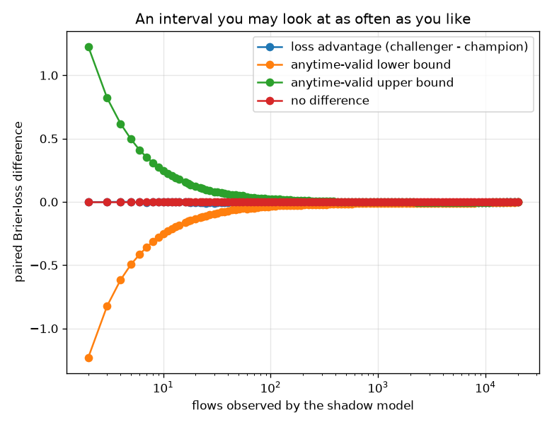

# NetSentry — When Can the Shadow Model Be Promoted?

_Synthetic stand-in. Honest temporal/binary split, 20,000 flows in deployment
order (not shuffled — a shadow test watches traffic as it arrives). Champion and challenger
score every flow, so the comparison is **paired**, which is the entire statistical advantage
of running a shadow rather than splitting traffic. Loss is per-flow Brier score: proper,
bounded, and therefore honest about its own variance. Error level
5%, mixture parameter rho = 1._

## Why this report exists

The serving stack already scores a shadow challenger silently, and the
[promotion](promotion.md) study compares two models with a paired bootstrap. Neither answers
the operational question: **when do you stop watching?** In practice someone checks the
dashboard each morning, sees the challenger ahead, and promotes. That habit invalidates the
test being consulted — a fixed-sample procedure earns its error rate by being evaluated once,
at a sample size fixed in advance, and evaluating it repeatedly turns a 5% guarantee into
something much worse.

A **confidence sequence** is the interval that survives this: valid simultaneously at every
sample size, so an operator may look as often as they like and stop whenever they like with
the stated coverage intact. This uses Robbins' normal mixture (1970), the canonical
construction and the foundation of the modern treatment in Howard, Ramdas, McAuliffe & Sekhon
(2021).

## Three procedures, one stream

| procedure | may you peek? | decides after | measured error rate under the null |
|---|---|---|---|
| fixed-n test, evaluated once | no | 23,050 flows (power calculation) | 5% by construction |
| fixed-n test, checked 20x as data arrives | no (but everyone does) | first green light | **23.2%** |
| confidence sequence (Robbins mixture) | **yes, always** | 1,121 flows | 3.2% |
| _(the whole stream, fixed-n verdict)_ | — | 20,000 flows | significant |

The peeking row is measured, not asserted: 400 streams were drawn from a genuine null — two models with no real difference — and the fixed-n test was applied at 20 checkpoints along each one, exactly as a team that checks the dashboard periodically would. It fired on **23.2%** of them, against the 5% it advertises: a 4.7x inflation of the false-positive rate, achieved without a single line of bad code. The mechanism is not subtle — under the null the test statistic random-walks, and given enough looks it will cross any fixed boundary eventually — but it is invisible in practice, because the promotion that follows a peeked-at result looks exactly like a promotion that followed a valid one. The confidence sequence, run through the identical peeking behaviour, fired on 3.2%.

## The decision

On the real paired stream the challenger's mean Brier loss is 0.1586 against the champion's 0.1575, a paired advantage of -0.00115 per flow. The anytime-valid interval first excluded zero after **1,121 flows** (running advantage -0.00552 at that point), so the **champion** wins and the shadow test could have been stopped there. A fixed-n design targeting the same effect at 80% power would have committed to 23,050 flows in advance — more than the sequence needed, which is the usual result: fixed-n sizing must budget for the effect being exactly as small as specified, while a sequential procedure stops early when the effect is larger than feared.

One detail deserves stating rather than smoothing over: by the end of the stream the interval has drifted back to [-0.00251, +0.00021], which contains zero again. A confidence sequence is not monotone — the interval narrows, but the running mean keeps moving, and here it moves because the stream is ordered by capture day and the later day is a different distribution. The guarantee still holds and is not weakened by this: it attaches to the **stopped decision**, so a team that stopped at the crossing made a valid call at the stated error rate. What the re-widening says is something else, and operationally more useful — the advantage was real on the traffic seen up to that point and did not persist, which is a drift signal about the models, not a defect in the test. Pairing this with the [exchangeability martingale](exchangeability.md) is the natural response: one decides which model is better, the other notices when the question has changed.

## What anytime validity costs

Nothing here is free. The mixture boundary is strictly wider than a fixed-n interval at the
sample size that fixed-n design committed to, because it must hold at *every* sample size
simultaneously — that width is the premium paid for the right to stop whenever the evidence
justifies it. The mixing parameter `rho` decides where the premium is cheapest: a small
`rho` tightens the boundary early (good for catching a large effect fast), a large one
tightens it late (good for resolving a small effect eventually), and no choice is uniformly
best. The practical reading is that a confidence sequence is the right default for a
*monitoring* process — a shadow model that runs indefinitely and might be promoted at any
time — while a fixed-n design remains more efficient for a genuine one-shot experiment where
the sample size can honestly be fixed in advance and honoured.

## Scope

The null used to measure the peeking inflation is a synthetic mean-zero stream rather than
two real equivalent models, because a real pair is never *exactly* equivalent and the
measurement needs a true null to be meaningful; the inflation it demonstrates is a property
of the procedure, not of these models. The confidence sequence assumes the per-flow
differences are independent with a bounded variance proxy — network flows arrive in bursts
and correlated bursts inflate the effective sample size, so a production deployment should
either thin the stream or use a bound that tolerates dependence. The comparison is on loss,
not on the operational metric: a challenger can win on Brier score and still lose on
detection at a fixed FPR, which is why [promotion](promotion.md) gates on the operational
number and this report answers only the question of *when there is enough evidence to
decide*. And a shadow test measures the challenger on the champion's traffic; a challenger
that would change what gets blocked, and therefore what traffic is subsequently seen, needs
an interleaved design this does not model.